---

```{r, include=FALSE,purl=F}
#https://www.rstudio.com/wp-content/uploads/2015/03/rmarkdown-reference.pdf
knitr::opts_chunk$set(echo = T,warning=F,message=F,size="small",cache=F)
```

```{r,eval=F,echo=F}
knitr::purl("slides/GettingStarted.Rmd",documentation = 2)
```


## [COURSE OBJECTIVES](http://uc-r.github.io/data_wrangling/week-1)

- Perform your data analysis in a literate programming environment
- Import and manage structured and unstructured data
- Manipulate, transform, and summarize your data
- Join disparate data sources
- Methodically explore and visualize your data
- Perform iterative functions
- Write your own functions

... all with R!

---

## Introduction round

### Please tell me shortly...

- Where are you from? What are you studying/working?
- What is your experience level in R/other programming languages?
- What are your expectations of this course?
- Where do you think you can use R in the future?

---

## Preliminaries

- Usually we have big differences in knowledge and abilities of the participants - please tell, if it is too fast or slow.
- We have lots of hands-on coding [**exercises**](http://web.math.ku.dk/~helle/R-intro/exercises.pdf) - later you can only learn on your own
- We have many [**examples**](https://www.showmeshiny.com/) - try them
- If there are questions - always ask
- R is more fun together - ask your neighbor - strong proponent of
collaborative work!

---

## Sources of this course

### Sources for figures, text, exercises etc:

- If the source is a website, the links are often in the header or in bold somewhere on the slide.
- At the end of a chapter, we often have additional links to read on. 
- Please ask us, if something is unclear.


---

## Reasons for using R...

- ... because it is an [**open source language**](https://stackoverflow.com/questions/1546583/what-is-the-definition-of-an-open-source-programming-language)
- ... outstanding graphs - [**graphics**](http://matthewlincoln.net/2014/12/20/adjacency-matrix-plots-with-r-and-ggplot2.html), [**graphics**](https://www.r-bloggers.com/3d-plots-with-ggplot2-and-plotly /), [**graphics**](https://procomun.wordpress.com/2011/03/18/splomr/)
- ... relates to other languages - [**R can be used in combination with other programs**](https://github.com/Japhilko/RInterfaces) - e.g. [**data linking**](https://github.com/Japhilko/RInterfaces/blob/master/slides/Datenimport.md)
- ...R can be used [**for automation**](https://cran.r-project.org/web/packages/MplusAutomation/index.html)
 - ... Vast Community - [**you can use the intelligence of other people ;-)**](https://www.r-bloggers.com/)
- ...

---

## Advantages of R

- R can be downloaded for [**free**](http://mirrors.softliste.de/cran/).

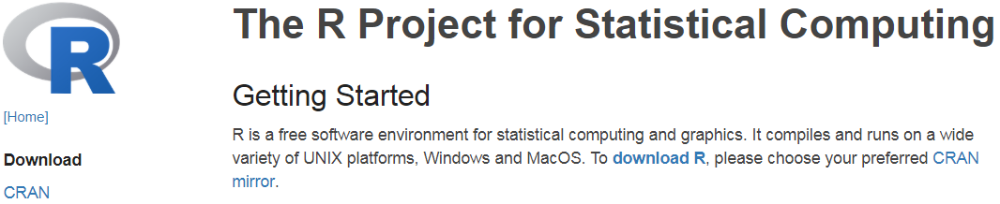

- R is a [**scripting language**](https://en.wikipedia.org/wiki/Scripting_language)


- R is becoming more [**popular**](https://twitter.com/josiahjdavis/status/559778930476220418)
- [**Good**](http://www.sr.bham.ac.uk/~ajrs/R/r-gallery.html) possibilities for [**visualization**](http://research.stowers.org/mcm/efg/R/) 

---

## R can be used in combination... 


- Interface to: [**Python**](https://cran.r-project.org/web/packages/reticulate/vignettes/calling_python.html), [**Excel**](https://www.springer.com/de/book/9781441900517), [**SPSS**](https://www.ibm.com/support/knowledgecenter/en/SSFUEU_7.2.0/com.ibm.swg.ba.cognos.op_capmod_ig.7.2.0.doc/t_essentials_for_r_statistics.html), [**SAS**](https://cran.r-project.org/web/packages/SASmixed/index.html), [**Stata**](https://cran.r-project.org/web/packages/RStata/index.html)  

<!--
- [**Calling Python from R**](https://cran.r-project.org/web/packages/reticulate/vignettes/calling_python.html)

- [**R Through Excel**](https://www.springer.com/de/book/9781441900517) - A Spreadsheet Interface for Statistics, Data Analysis, and Graphics

- [**Installing the Essentials for R for Statistics plug-in SPSS**](https://www.ibm.com/support/knowledgecenter/en/SSFUEU_7.2.0/com.ibm.swg.ba.cognos.op_capmod_ig.7.2.0.doc/t_essentials_for_r_statistics.html)

- [**SASmixed: Data sets from "SAS System for Mixed Models"**](https://cran.r-project.org/web/packages/SASmixed/index.html)

- [**RStata: A Bit of Glue Between R and Stata**](https://cran.r-project.org/web/packages/RStata/index.html)

- [**Getting Started in R Stata Notes on Exploring Data**](https://www.princeton.edu/~otorres/RStata.pdf)
-->

<!--
## [Use R because other programs have big bugs:](https://www.bloomberg.com/news/articles/2013-04-18/faq-reinhart-rogoff-and-the-excel-error-that-changed-history)

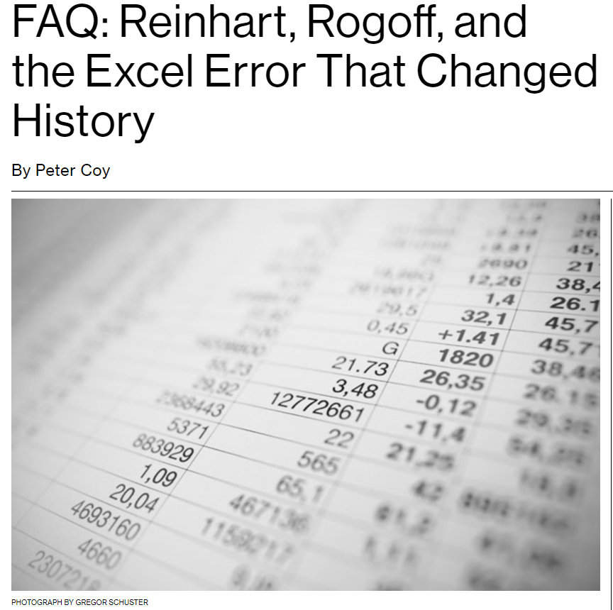
-->

<!--
Reinhart, Rogoff and the Excel Error that changed history


https://www.nytimes.com/2013/04/19/opinion/krugman-the-excel-depression.html


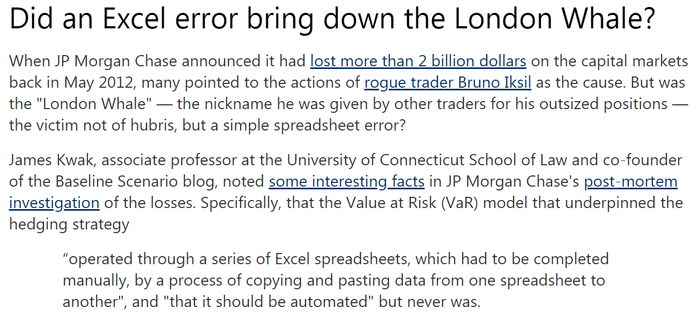


- [**A lack of seriation and automation as well as too much manuality may lead to serious problems**](http://blog.revolutionanalytics.com/2013/02/did-an-excel-error-bring-down-the-london-whale.html)

- [**It becomes particularly complicated when working with time data. **](https://coffeehouse.dataone.org/2014/04/09/abandon-all-hope-ye-who-enter-dates-in-excel/)

](figure/Abandon.PNG)
-->

<!--
### [**Problems with Excel**](http://www.biomedcentral.com/1471-2105/5/80)

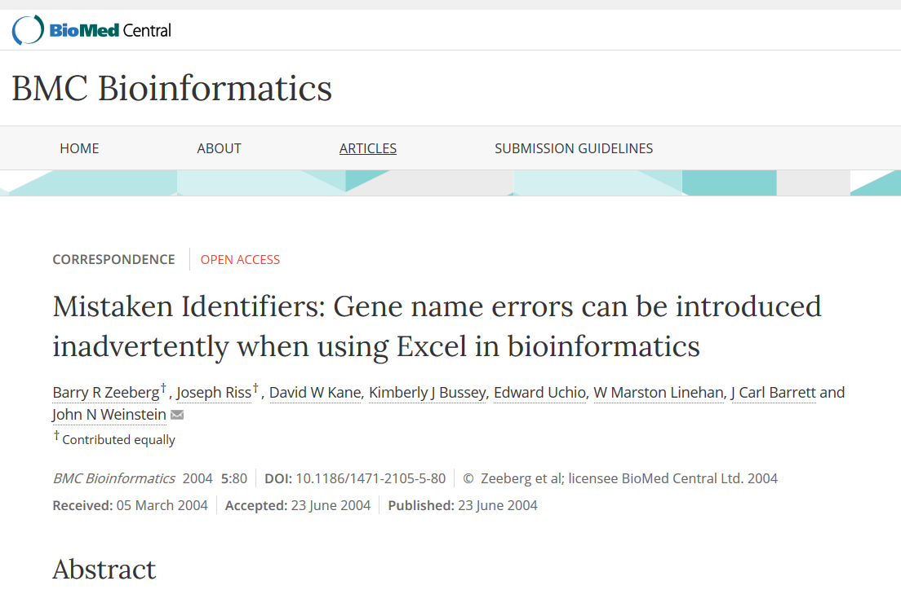
-->

---

## [**The popularity of R-packages**](https://gallery.shinyapps.io/cran-gauge/)

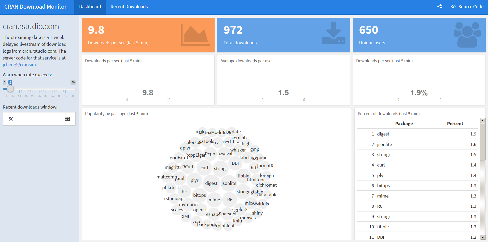


---

## Download R:

<http://www.r-project.org/>

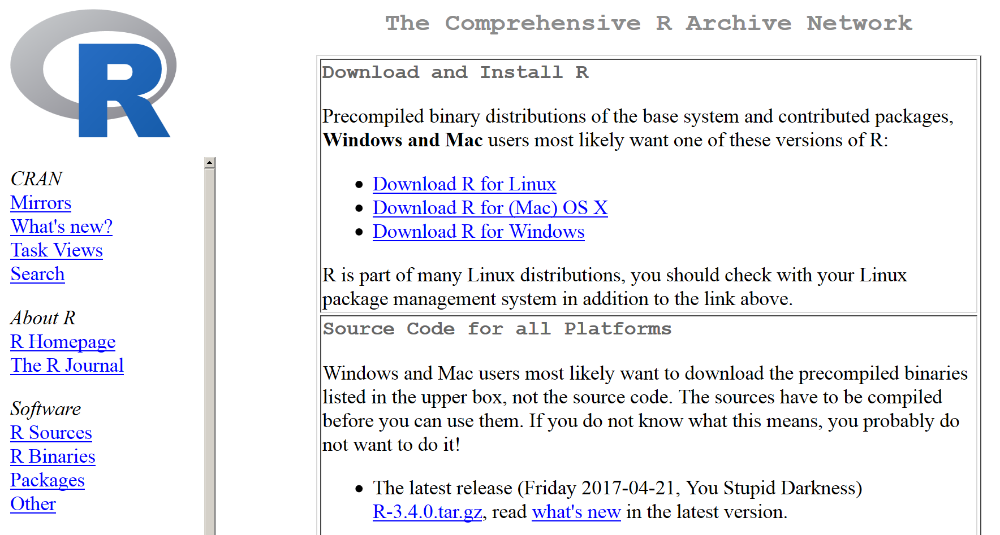

---

## Open Source Programm R

- R is a free, non-commercial implementation of the S programming language (by AT&T Bell Laboratories)
- Free participation - modular structure 

<!--
(growing number of packages)
-->


### This is base R:

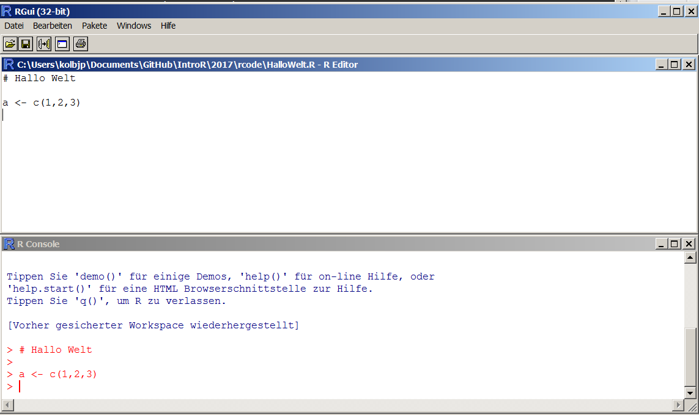

---

## Graphical user interface

But many people use a graphical user interface (GUI) or a integrated development interface (IDE).

For the following reasons:

- Syntax highlighting
- Auto-completion
- Better overview on graphics, libraries, files, ...

---

## Various text editors / IDEs

- [**Gedit**](https://projects.gnome.org/gedit/) with R-specific Add-ons for Linux

- [**Emacs**](http://www.gnu.org/software/emacs/) and ESS (Emacs speaks statistics)- An extensible, customizable, free/libre text editor — and more.

- I use [**Rstudio!**](https://www.rstudio.com/)

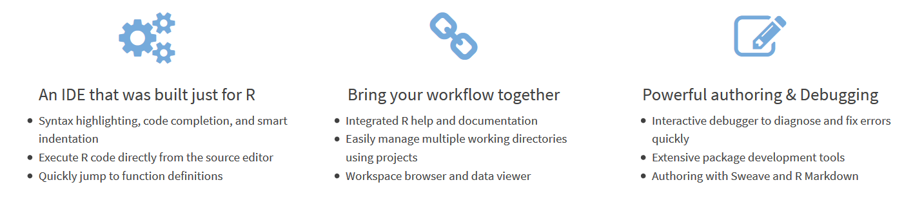{width=130%}

---

## [RStudio](http://uc-r.github.io/introduction)

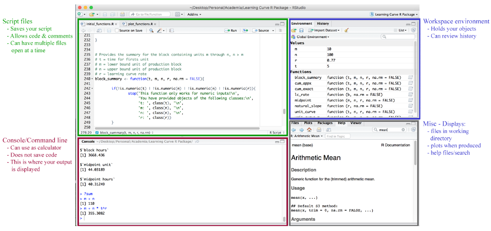{width=110%}

---

## Rstudio - script and console


---

## Rstudio - Environment and help

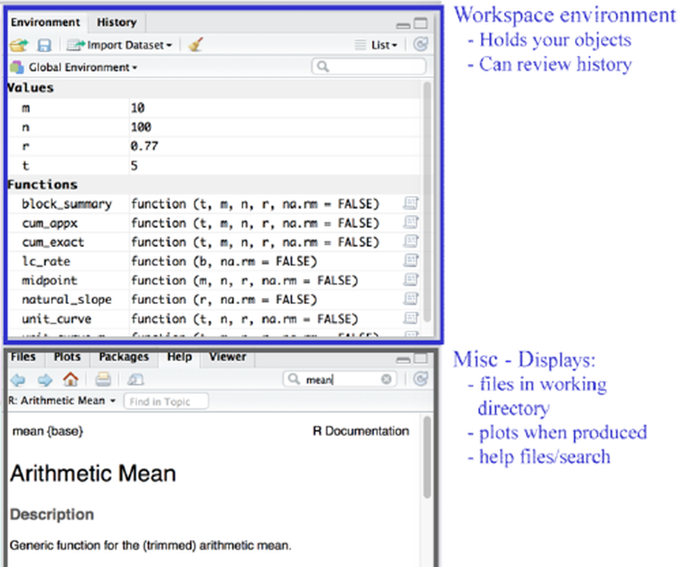


---

## Important Rstudio Buttons

  create a new script

 open an existing script

 run line where cursor is

---

## R as a calculator

```{r}
3 + 2 / 10^2 # Uses PEMDAS convention (order of operations)
3 + (2 / 10^2)
(3 + 2) / 10^2
```


```{r}
1 /19^4 # scientific notation is used for large numbers
1/0 # Undefined calculations
Inf - Inf
```

---

## Exercise: Preparation

- Check if R is installed on your computer.
- If not, download [**R**](r-project.org) and install it.
- Check if Rstudio is installed.
- If not - [**install**](http://www.rstudio.com/) Rstudio.
- Start RStudio. Go to the console (lower left window) and write

```{r,eval=F}
3+2
```

- If there is not already an editor open in the upper left window, then go to the file menu and open a new script. Check the date with `date()` and the R version with `sessionInfo()`.

```{R,eval=F}
date()
```

```{R,eval=F}
sessionInfo()
```

---

## Exercise: See where things happen

- Create a new `.R` script named `my_first_script.R`
- Write and execute the following code in the `.R` script and identify
where in Rstudio the outputs can be found.

```{r,eval=F}
mtcars
?sum
hist(mtcars$mpg)
random_numbers <- runif(40)
history()
```

---

## R is a object-orientiented language

### Vectors and assignments

-  R is a object-orientiented language
-  `<-` is the assignment operator

```{r}
b <- c(1,2) # create an object with the numbers 1 and 2
```
-  A function can be applied to this object:

```{r}
mean(b) # computes the mean
```

We can learn something about the properties of the object:

```{r}
length(b) # b has the length 2
sqrt(b) # the square root of b
```

---

## Functions in base-package

|Function |Meaning            |Example   |
|:--------|:------------------|:---------|
|str()    |Object structure   |str(b) |
|max()    |Maximum            |max(b)    |
|min()    |Minimum            |min(b)    |
|sd()     |Standard deviation |sd(b)     |
|var()    |Variance           |var(b)    |
|mean()   |Mean               |mean(b)   |
|median() |Median             |median(b) |

These functions only need one argument.

---

## Functions with more arguments

### Other functions need more arguments:

|Argument   |Meaning           |Example        |
|:----------|:-----------------|:--------------|
|quantile() |90 % Quantile     |quantile(b,.9) |
|sample()   |Draw a sample     |sample(b,1)    |

 

```{r}
quantile(b,.9)
sample(b,1) 
```

---

## Examples - Functions with more than one argument

```{r}
max(b); min(b)
sd(b); var(b)
```

### Functions with one argument

```{r}
mean(b)
median(b)
```

---

## Exercise: Assignments and functions

Create a vector `b` with the numbers from 1 to 5 and calculate ...


1. the mean

2. the variance

3. the standard deviation

4. the square root from the mean

---

## [**Overview commands**](http://cran.r-project.org/doc/manuals/R-intro.html)

<http://cran.r-project.org/doc/manuals/R-intro.html>

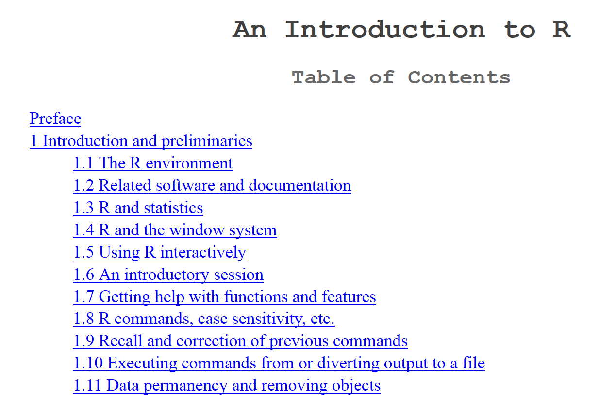

---

## Exercise: Economic Order Quantity Model

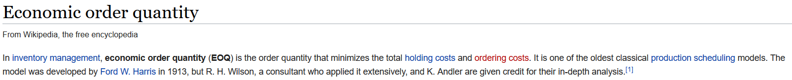

### Economic Order Quantity Model

$$
Q = \sqrt{\dfrac{2DK}{h}}
$$

### Calculate $Q$ where:

- D = 1000
- K = 5
- h = 0.25


---

## [R Data Types](https://www.stat.berkeley.edu/~nolan/stat133/Fall05/lectures/DataTypes4.pdf)

- R supports a  few basic data types: integer,  numeric,  logical, character/string, factor,  and complex

### Logical

– binary, two possible values represented by `TRUE` and `FALSE`

```{r}
x <- c(3,7, 1, 2)
x > 2
x == 2
!(x < 3)
which(x > 2)
```


---

## [Character vectors](https://www.stat.berkeley.edu/~nolan/stat133/Fall05/lectures/DataTypes4.pdf)

```{r}
y <- c("a","bc","def")
length(y)
nchar(y)
y == "a"
y == "b"
```


---

## Object structure

```{r}
str(b) # b is a numeric vector
```

### Variable type `character` 

```{r}
a <- letters
length(letters)
a[1:4]
str(a)
```


---

## Problems with character vector

```{r}
mean(b)
```

```{r,warning=T}
(b1 <- c(b,"a"))
mean(b1)
```


---

## Coercion

- All elements in a vector must be of the same type. R coerces the elements to a common type

- In the following case all elements are coerced to numeric.

```{r}
x <- c(TRUE,FALSE,TRUE)
c(1.2,x)
```


- To character:

```{r}
y <- c("2","3",".2")
c(1.2,y, x)
```


<!--
- Sometimes this coercion occurs to perform an arithmetic operation:
-->

- The arithmetic operation works:

```{r}
1 + x
```


---

## Perform the coercion

- Other times we need to perform the coercion

```{r}
c(1.2,y)
c(1.2,as.numeric(y))
```


---

## Information about Vectors 

<!--
- `length(x)`- number of elements in a vector
-->

- Aggregator functions - `sum`, `mean`, `range`, `min`, `max`, `summary`, `table`, `cut`, ...

- `class(x)` – returns the type of an object.

- `is.logical(x)` –  tells us whether the object is a  logical type.   There is also `is.numeric`, `is.character`, `is.integer` 

- `is.null` – determines whether an object is empty, i.e. has no content.
’NULL’ is used mainly to represent the lists with zero length, and
is often returned by expressions and functions whose value is undefined.


---

## Coerce objects from one to another

- `as.numeric(x)` – we use the as-type functions to coerce objects from one type (e.g. logical) to another, in this case numeric. 
- There are several of these functions, including `as.integer`, `as.character`, `as.logical`
<!--
, `as.POSIXct`.
-->

```{r}
x <- c("1",2,"one","1plus","2_and")
as.numeric(x)
```

---

## How to get help?

<!--
zenburn is a possibility for colour coding
http://deic.uab.es/~iblanes/beamer_gallery/index_by_color.html
-->

-  [**To get help in general:**](http://itfeature.com/tag/how-to-get-help-in-r)


```{r,eval=F}
help.start()
```

-  [**Online documentation for most of the functions:**](https://www.r-project.org/help.html)

```{r,eval=F}
help(name)
```

-  Use `?` to get help. 

```{r,eval=F}
?mean
```

-  `example(lm)` gives an example for a linear regression 

```{r,eval=F}
example(lm)
```

---

## Again, we get help with the question mark

```{r,eval=F}
?paste
```

Different sections in the help:

- Description
- Usage
- Arguments
- Value
- Author(s)
- See Also
- Examples

---

## Vignettes

- A vignette is a paper that present the most important functions of a package 
- You get many reproducible examples
- Vignettes are a rather new tool, that is why not every package has a vignette


```{r,eval=F}
browseVignettes()
```

- to get a vignette:

```{r,eval=F}
vignette("osmdata")
```

---

## An example for a vignette - package `osmdata`

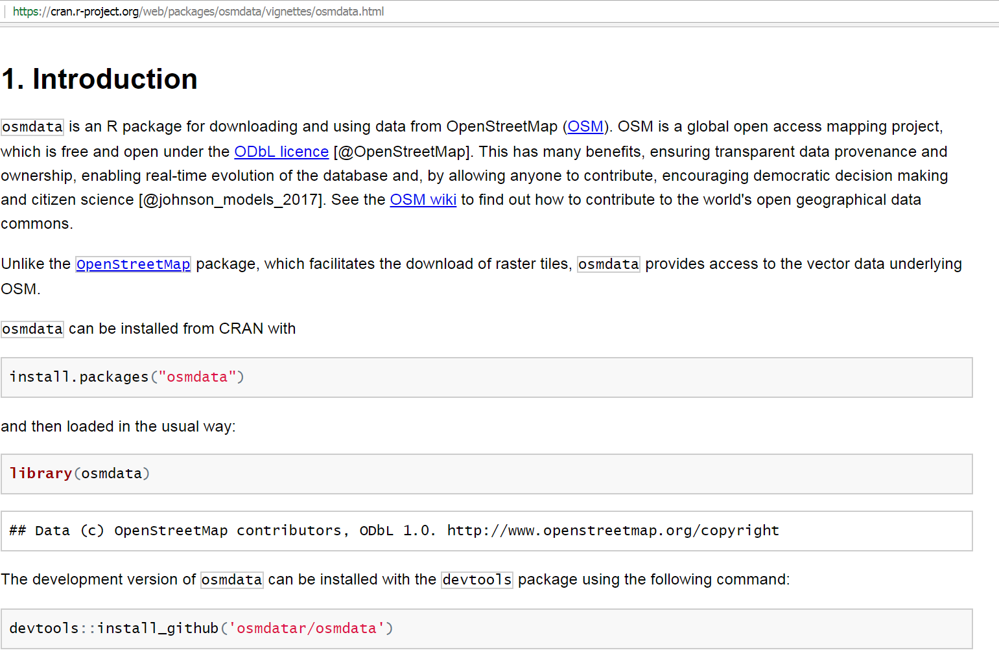

---

## [**Demos**](http://r-pkgs.had.co.nz/demo.html)

- for some packages you have demos:

```{r,eval=F}
demo() # shows all available demos
demo(package = "httr") # Show all demos in a package

# Run a specific demo:
demo("oauth1-twitter", package = "httr") 
```

- if you run a demo, the code is shown in the console


```{r,eval=F}
demo(nlm)
```

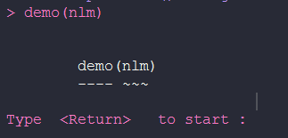

---

## The function `apropos`

- searches everything about the given string 

```{r}
apropos("lm")
```


---

## [**Search engine for the R-Site**](http://search.r-project.org/cgi-bin/namazu.cgi?query=glm&max=20&result=normal&sort=score&idxname=functions&idxname=vignettes&idxname=views)

```{r,eval=F}
RSiteSearch("glm")
```

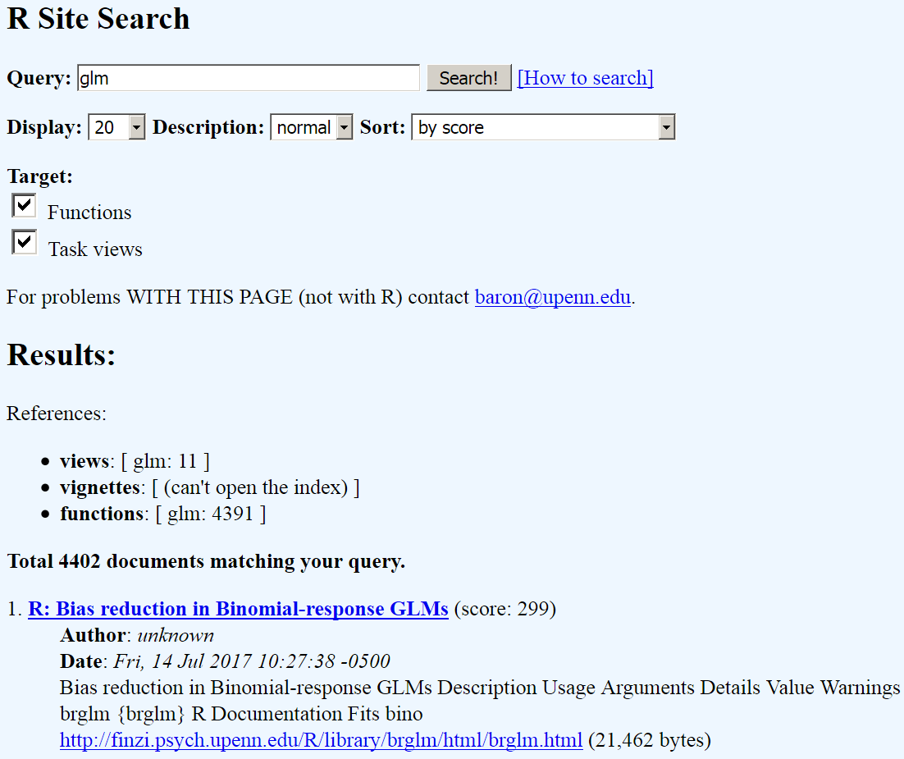

---

## Usage of search engines 

-  I use [**duckduckgo:**]()
- just add "with R" at the end of any search. Or:

```
R-project + "what I want to know" 
```
-  this works of course for all search engines!


{ height=80% }

---

## [**Stackoverflow**](http://stackoverflow.com/)

-  [A searchable Q&A site oriented toward programming issues.](http://uc-r.github.io/data_wrangling/week-1)
-  Is not focused on R - but [**many discussions on R**](https://stackoverflow.com/tags/r/info)
-  Very detailed discussions

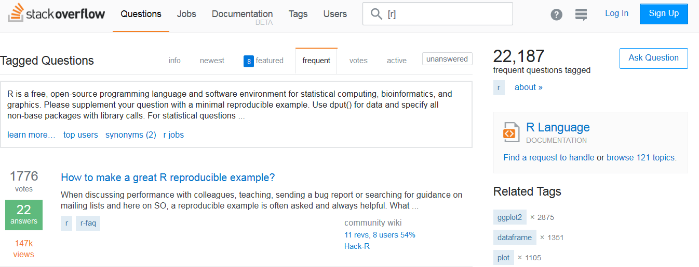

---

## A cheatsheet for base R

<https://www.rstudio.com/resources/cheatsheets/>

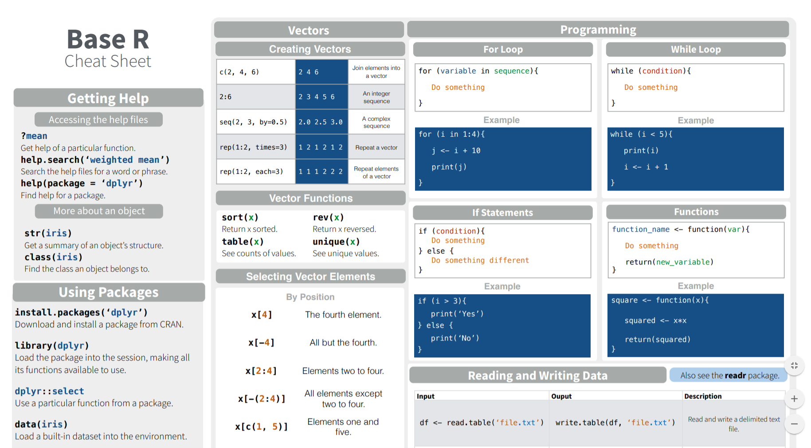

---

## More cheatsheets

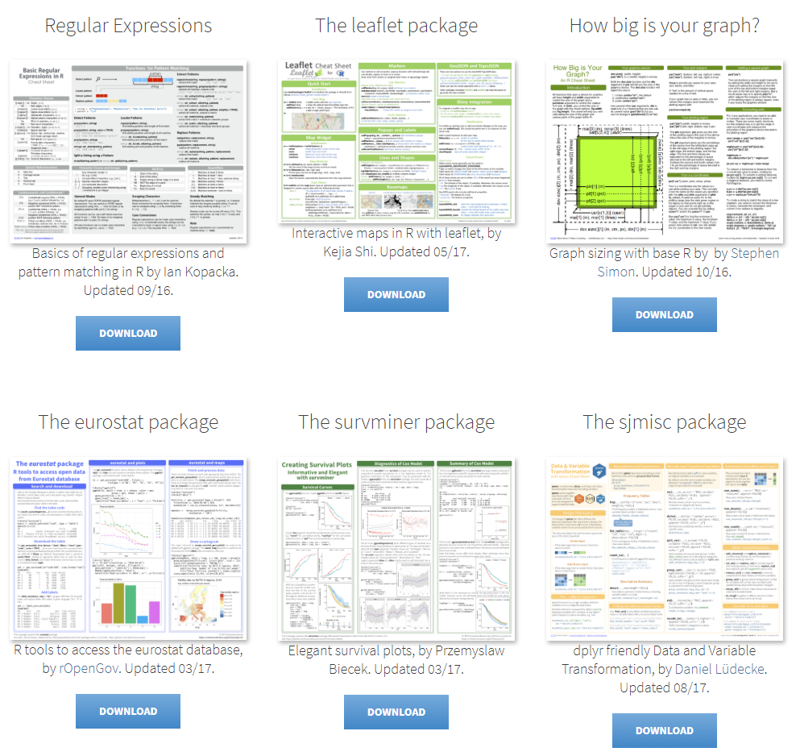


---

## [**Quick R**](http://www.statmethods.net/interface/help.html)

- Always a page with examples and help concerning a topic
- Example: [**Quick R - Getting Help**](http://www.statmethods.net/interface/help.html)

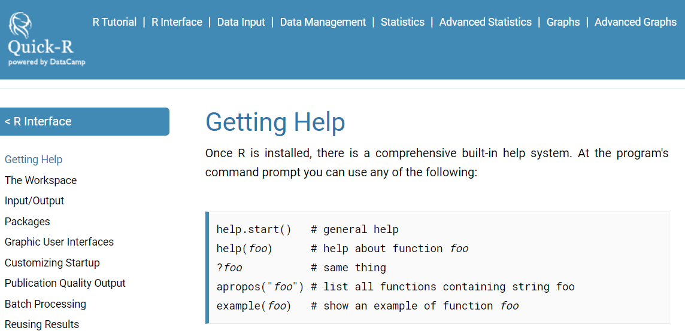

---

## Exercise: [**Getting help**](http://web.math.ku.dk/~helle/R-intro/exercises.pdf)

### [**Exercise on help**](http://web.math.ku.dk/~helle/R-intro/exercises.pdf)


- Try the command `?which.min` This opens a help page in the lower right window of
RStudio. What does the function do?

- You must know the name of the function in order to open the help page as above.
Sometimes you do not know the name of the R functions; then a [**search engine**](https://duckduckgo.com/) can often help you. Try, for example, to search the text `R minimum vector`.

---

## Structure your code


### Work with sections

- In a Rscript you can use  "Ctrl + Shift + R" to include a section

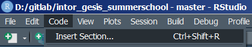

### Outline R-code

- Use as many comments as possible
- Use shortcut "Ctrl + Shift + R" to insert a new section

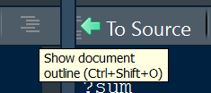

---

## [Save your Work](https://bouchat.github.io/IntroDataMgmt20Jan.html)

- When conducting research, keeping all of your code, data, and files in the same place is useful. 
- Many journals now require that you make, e.g., your data and code publicly available. 
- Now is the time to invest in file structures and versioning programs (e.g., Dropbox and Github).

- Save your script file often to prevent loss of your work. 
- Also save your workspace in R in order to save time. 
- If you do this, you will be able to load your console in the future as though you had already completed all of the operations that you ran from your script file. 


---

## [How to learn after this workshop](https://lgatto.github.io/2017_11_09_Rcourse_Jena/before-we-start.html#knowing-your-way-around-rstudio)

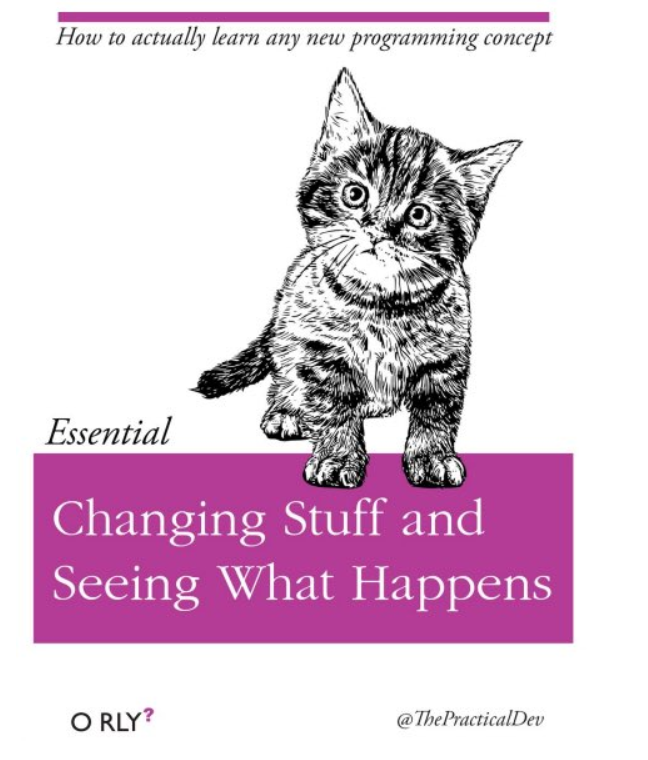

---

## The tutorial functionality in Rstudio

- You need RStudio v1.3.869-1 Preview for this:
- 


```{r,eval=F}
install.packages("learnr")
```


---

## Some links to read on

- Six [**reasons**](http://www.r-bloggers.com/top-6-reasons-you-need-to-be-using-rstudio/) to use [**Rstudio**](https://support.rstudio.com/hc/en-us/articles/200549016-Customizing-RStudio).

- [**Why you should learn R first for data science**](http://www.r-bloggers.com/why-you-should-learn-r-first-for-data-science/)

- [**RStudio – Infoworld 2015 Technology of the Year Award Recipient!**](http://www.r-bloggers.com/rstudio-infoworld-2015-technology-of-the-year-award-recipient/)

- [**Why the R programming language is good for business?**](http://www.fastcolabs.com/3030063/why the r programming language is good for business) 

- [**Have a look at R-bloggers**](http://www.r-bloggers.com/why-use-r/)
<!--
- [Intro R](http://www.ats.ucla.edu/stat/r/seminars/intro.htm)
- [Intro R II](http://www.ats.ucla.edu/stat/r/sk/)
-->

- [**Comparisson between python and R**](http://www.dataschool.io/python-or-r-for-data-science/)

- [**R and Stata Side-by-side**](http://economistry.com/2013/11/r-impact-evaluation-r-stata-side-side/)

- [**AWESOME R**](https://awesome-r.com/)

- [**1000 R tutorials/Links**](https://support.bioconductor.org/p/33781/)

- [**Learn R by watching two‐minute videos**](https://www.youtube.com/playlist?list=PLcgz5kNZFCkzSyBG3H-rUaPHoBXgijHfC)

### R for stata users

- Oscar Torres-Reyna - [**Exploring Data and Descriptive Statistics
(using R)**](https://www.princeton.edu/~otorres/sessions/s2r.pdf)


---

## Further Links

- [**Overview - how to get help in R**](https://www.r-project.org/help.html)

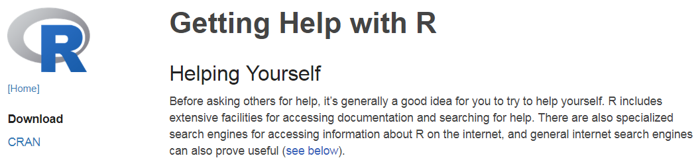

- [**A list with HowTo`s**](http://rprogramming.net/)

- [**A list with the most important R-commands**](https://www.personality-project.org/r/r.commands.html)

- [**R-bloggers**: a central hub of content from over 500 bloggers who provide news and tutorials about R.](https://www.r-bloggers.com/)


---

## Shiny App - Intro R

### www.intro-stats.com

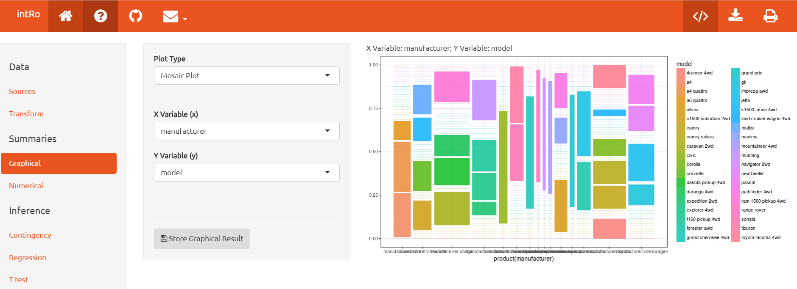


<!--
## Further resources
-->


<!--
https://www.r-bloggers.com/giving-r-the-strengths-of-stata/
-->


<!--
https://craigwang.shinyapps.io/rPackageStats/
-->

<!--
Cheatsheet:

Intro stats with mosaic
https://www.rstudio.com/resources/cheatsheets/

https://www.r-exercises.com/2019/07/29/creating-vectors/
https://www.r-exercises.com/2019/08/05/working-with-vectors/

https://github.com/jrnold/r4ds-exercise-solutions/blob/master/factors.Rmd

https://www.r-exercises.com/?s=glm

https://www.r-exercises.com/2018/07/19/basic-generalised-linear-modelling-part-1-exercises/

http://onlinestatbook.com/2/regression/intro.html
-->