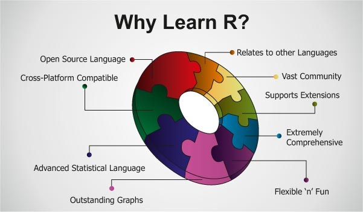
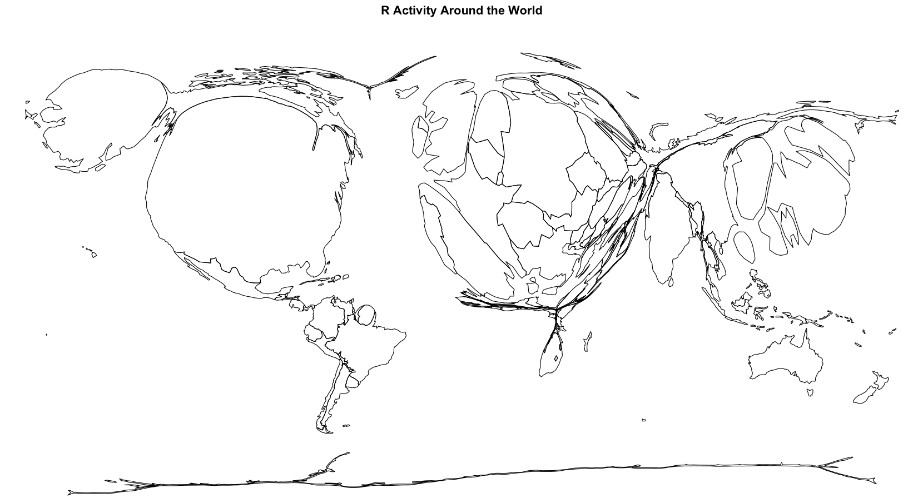
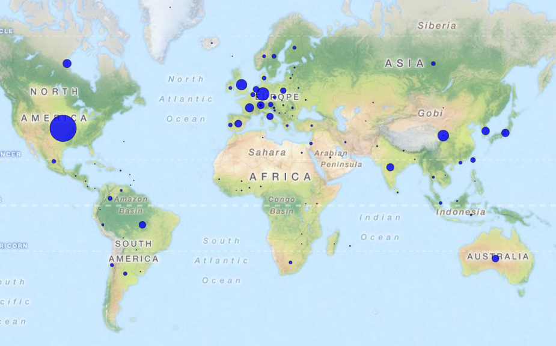

```{r, include=FALSE,purl=F}
#https://www.rstudio.com/wp-content/uploads/2015/03/rmarkdown-reference.pdf
knitr::opts_chunk$set(echo = T,warning=F,message=F,size="small",cache=F)
```

```{r,eval=F,echo=F}
knitr::purl("slides/GettingStarted.Rmd",documentation = 2)
```

## [COURSE OBJECTIVES](http://uc-r.github.io/data_wrangling/week-1)

- Perform your data analysis in a literate programming environment
- Import and manage structured and unstructured data
- Manipulate, transform, and summarize your data
- Join disparate data sources
- Methodically explore and visualize your data
- Perform iterative functions
- Write your own functions

... all with R!

<!--
- Get an introduction to machine learning  - 
-->


## Introduction round

### Please tell us shortly...

- Where are you from? What are you studying/working?
- What is your experience level in R/other programming languages?
- What are your expectations of this course?
- Where do you think you can use R in the future?


## Preliminaries

- Usually we have big differences in knowledge and abilities of the participants - please tell, if it is too fast or slow.
- We have lots of hands-on coding [**exercises**](http://web.math.ku.dk/~helle/R-intro/exercises.pdf) - later you can only learn on your own
- We have many [**examples**](https://www.showmeshiny.com/) - try them
- If there are questions - always ask
- R is more fun together - ask your neighbor - strong proponent of
collaborative work!

## Sources of this course

### Sources for figures, text, exercises etc:

- If the source is a website, the links are often in the header or in bold somewhere on the slide.
- At the end of a chapter, we often have additional links to read on. 
- Please ask us, if something is unclear.


<!--
## Outline for this part
-->


```{r,echo=F,eval=F}

c("A1 Getting started","A2 How to get help", "A3 Data import","A4 The GESIS panel data data","A5 data export")

c("B1 Basic data analysis","B2 The use of the survey package","B3 Graphics","B4 linear regression","B5 logistic regression")

c("C1 Understanding error messages","C2 Hierarchical/Multilevel models")
```

```{r,echo=F,eval=F}
library(knitr)
sched <- xlsx::read.xlsx2("../orga/schedule.xlsx",1)
dats <- sched[1:7,c(1,4,5)]
dats <- dats[-which(dats$Part=="Break"),]

kable(dats,row.names = F)
```

<!--
## Overview - advantages of R


-->


<!--
https://www.quora.com/What-is-R-programming-language

- [**Cross-Platform Compatible**](https://en.wikipedia.org/wiki/Cross-platform)
- [**Advanced Statistical Language**](http://rstatistics.net/)
- [**Outstanding graphs**](https://www.r-graph-gallery.com/)
- Relates to other languages
- Supports extensions
- Flexible and fun


-->

## Reasons for using R...


<!--
Outstanding Graphs
-->

- ... because it is an [**open source language**](https://stackoverflow.com/questions/1546583/what-is-the-definition-of-an-open-source-programming-language)
- ... outstanding graphs - [**graphics**](http://matthewlincoln.net/2014/12/20/adjacency-matrix-plots-with-r-and-ggplot2.html), [**graphics**](https://www.r-bloggers.com/3d-plots-with-ggplot2-and-plotly /), [**graphics**](https://procomun.wordpress.com/2011/03/18/splomr/)
- ... relates to other languages - [**R can be used in combination with other programs**](https://github.com/Japhilko/RInterfaces) - e.g. [**data linking**](https://github.com/Japhilko/RInterfaces/blob/master/slides/Datenimport.md)
- ...R can be used [**for automation**](https://cran.r-project.org/web/packages/MplusAutomation/index.html)
 - ... Vast Community - [**you can use the intelligence of other people ;-)**](https://www.r-bloggers.com/)
- ...


## Advantages of R

<!--
R is [freely available](http://www.inside-r.org/why-use-r).
-->

- R can be downloaded for [**free**](http://mirrors.softliste.de/cran/).


- R is a [**scripting language**](https://en.wikipedia.org/wiki/Scripting_language)


- R is becoming more [**popular**](https://twitter.com/josiahjdavis/status/559778930476220418)
- [**Good**](http://www.sr.bham.ac.uk/~ajrs/R/r-gallery.html) possibilities for [**visualization**](http://research.stowers.org/mcm/efg/R/) 

<!--
http://blog.revolutionanalytics.com/popularity/
-->


## R can be used in combination... 


- Interface to: [**Python**](https://cran.r-project.org/web/packages/reticulate/vignettes/calling_python.html), [**Excel**](https://www.springer.com/de/book/9781441900517), [**SPSS**](https://www.ibm.com/support/knowledgecenter/en/SSFUEU_7.2.0/com.ibm.swg.ba.cognos.op_capmod_ig.7.2.0.doc/t_essentials_for_r_statistics.html), [**SAS**](https://cran.r-project.org/web/packages/SASmixed/index.html), [**Stata**](https://cran.r-project.org/web/packages/RStata/index.html)  

<!--
- [**Calling Python from R**](https://cran.r-project.org/web/packages/reticulate/vignettes/calling_python.html)

- [**R Through Excel**](https://www.springer.com/de/book/9781441900517) - A Spreadsheet Interface for Statistics, Data Analysis, and Graphics

- [**Installing the Essentials for R for Statistics plug-in SPSS**](https://www.ibm.com/support/knowledgecenter/en/SSFUEU_7.2.0/com.ibm.swg.ba.cognos.op_capmod_ig.7.2.0.doc/t_essentials_for_r_statistics.html)

- [**SASmixed: Data sets from "SAS System for Mixed Models"**](https://cran.r-project.org/web/packages/SASmixed/index.html)

- [**RStata: A Bit of Glue Between R and Stata**](https://cran.r-project.org/web/packages/RStata/index.html)

- [**Getting Started in R Stata Notes on Exploring Data**](https://www.princeton.edu/~otorres/RStata.pdf)
-->

<!--
## [Use R because other programs have big bugs:](https://www.bloomberg.com/news/articles/2013-04-18/faq-reinhart-rogoff-and-the-excel-error-that-changed-history)


-->

<!--
Reinhart, Rogoff and the Excel Error that changed history


https://www.nytimes.com/2013/04/19/opinion/krugman-the-excel-depression.html


- [**A lack of seriation and automation as well as too much manuality may lead to serious problems**](http://blog.revolutionanalytics.com/2013/02/did-an-excel-error-bring-down-the-london-whale.html)

- [**It becomes particularly complicated when working with time data. **](https://coffeehouse.dataone.org/2014/04/09/abandon-all-hope-ye-who-enter-dates-in-excel/)

](figure/Abandon.PNG)
-->

<!--
### [**Problems with Excel**](http://www.biomedcentral.com/1471-2105/5/80)


-->


## [**The popularity of R-packages**](https://gallery.shinyapps.io/cran-gauge/)


<!--
## [**Where are the most active users?**](http://spatial.ly/)


-->


<!--
-[**where is R activity the most concentrated**](http://blog.revolutionanalytics.com/2014/04/a-world-map-of-r-user-activity.html)
-->


<!--
### [**R user around the world**](http://revolution-computing.typepad.com/)



-->

<!--
## Expectations and requirements

Things you can get in this course:

- A practical introduction to the statistical
Programming language R
- Learn a programming strategy
- Learn about good style
- Learn about benefits of graphical data analysis


## Expectations and requirements II

Things we can`t afford:

- An introductory course in statistics
- Communicate basic data analytic concepts
- This course can not replace practicing and exercise.
-->

## Download R:

<http://www.r-project.org/>


## Open Source Programm R

- R is a free, non-commercial implementation of the S programming language (by AT&T Bell Laboratories)
- Free participation - modular structure 

<!--
(growing number of packages)
-->


### This is base R:


## Graphical user interface

But many people use a graphical user interface (GUI) or a integrated development interface (IDE).

For the following reasons:

- Syntax highlighting
- Auto-completion
- Better overview on graphics, libraries, files, ...

## Various text editors / IDEs

- [**Gedit**](https://projects.gnome.org/gedit/) with R-specific Add-ons for Linux

- [**Emacs**](http://www.gnu.org/software/emacs/) and ESS (Emacs speaks statistics)- An extensible, customizable, free/libre text editor — and more.

- I use [**Rstudio!**](https://www.rstudio.com/)

](figure/0_overall.jpg)


<!--
## Download course files

All files (slides, r-code,...) are available on  [gitlab](https://github.com/Japhilko/IntroR/tree/master/2017).


[How to use gitlab?](https://guides.github.com/activities/hello-world/)
-->


## [RStudio](http://uc-r.github.io/introduction)

{width=110%}

<!--

-->

<!--
## Customizing RStudio


-->

<!--
- [**Customize Rstudio**](https://support.rstudio.com/hc/en-us/articles/200549016-Customizing-RStudio)

- Six [**reasons**](http://www.r-bloggers.com/top-6-reasons-you-need-to-be-using-rstudio/) to use Rstudio.

- RStudio Support - [**Using the RStudio IDE**](https://support.rstudio.com/hc/en-us/sections/200107586-Using-RStudio)


http://www.rstudio.com/ide/docs/using/customizing
-->

## Important Rstudio Buttons

  create a new script

 open an existing script

 run line where cursor is

 find and replace


## R as a calculator

```{r}
3 + 2 / 10^2 # Uses PEMDAS convention (order of operations)
3 + (2 / 10^2)
(3 + 2) / 10^2
```


```{r}
1 /19^4 # scientific notation is used for large numbers
1/0 # Undefined calculations
Inf - Inf
```

## Exercise: Preparation

- Check if R is installed on your computer.
- If not, download [**R**](r-project.org) and install it.
- Check if Rstudio is installed.
- If not - [**install**](http://www.rstudio.com/) Rstudio.
- Start RStudio. Go to the console (lower left window) and write

```{r,eval=F}
3+2
```

- If there is not already an editor open in the upper left window, then go to the file menu and open a new script. Check the date with `date()` and the R version with `sessionInfo()`.

```{R,eval=F}
date()
```

```{R,eval=F}
sessionInfo()
```


## Exercise: See where things happen

- Create a new `.R` script named `my_first_script.R`
- Write and execute the following code in the `.R` script and identify
where in Rstudio the outputs can be found.

```{r,eval=F}
mtcars
?sum
hist(mtcars$mpg)
random_numbers <- runif(40)
history()
```

## R is a object-orientiented language

### Vectors and assignments

-  R is a object-orientiented language
-  `<-` is the assignment operator

```{r}
b <- c(1,2) # create an object with the numbers 1 and 2
```
-  A function can be applied to this object:

```{r}
mean(b) # computes the mean
```

We can learn something about the properties of the object:

```{r}
length(b) # b has the length 2
sqrt(b) # the square root of b
```


## Functions in base-package

|Function |Meaning            |Example   |
|:--------|:------------------|:---------|
|str()    |Object structure   |str(b) |
|max()    |Maximum            |max(b)    |
|min()    |Minimum            |min(b)    |
|sd()     |Standard deviation |sd(b)     |
|var()    |Variance           |var(b)    |
|mean()   |Mean               |mean(b)   |
|median() |Median             |median(b) |

These functions only need one argument.

## Functions with more arguments

### Other functions need more arguments:

|Argument   |Meaning           |Example        |
|:----------|:-----------------|:--------------|
|quantile() |90 % Quantile     |quantile(b,.9) |
|sample()   |Draw a sample     |sample(b,1)    |

 

```{r}
quantile(b,.9)
sample(b,1) 
```

## Examples - Functions with more than one argument

```{r}
max(b); min(b)
sd(b); var(b)
```

### Functions with one argument

```{r}
mean(b)
median(b)
```


## Exercise: Assignments and functions

Create a vector `b` with the numbers from 1 to 5 and calculate ...


1. the mean

2. the variance

3. the standard deviation

4. the square root from the mean


## [**Overview commands**](http://cran.r-project.org/doc/manuals/R-intro.html)

<http://cran.r-project.org/doc/manuals/R-intro.html>


## Exercise: Economic Order Quantity Model

### Economic Order Quantity Model

$$
Q = \sqrt{\dfrac{2DK}{h}}
$$

### Calculate $Q$ where:

- D = 1000
- K = 5
- h = 0.25


## [R Data Types](https://www.stat.berkeley.edu/~nolan/stat133/Fall05/lectures/DataTypes4.pdf)

- R supports a  few basic data types: integer,  numeric,  logical, character/string, factor,  and complex

### Logical

– binary, two possible values represented by `TRUE` and `FALSE`

```{r}
x <- c(3,7, 1, 2)
x > 2
x == 2
!(x < 3)
which(x > 2)
```


## [Character vectors](https://www.stat.berkeley.edu/~nolan/stat133/Fall05/lectures/DataTypes4.pdf)

```{r}
y <- c("a","bc","def")
length(y)
nchar(y)
y == "a"
y == "b"
```

## Object structure

```{r}
str(b) # b is a numeric vector
```

### Variable type `character` 

```{r}
a <- letters
length(letters)
a[1:4]
str(a)
```

## Problems with character vector

```{r}
mean(b)
```

```{r,warning=T}
(b1 <- c(b,"a"))
mean(b1)
```


## Coercion

- All elements in a vector must be of the same type. R coerces the elements to a common type
- `c(1.2,3,TRUE)` – In this case all elements are coerced to numeric.

```{r}
x <- c(TRUE,FALSE,TRUE)
c(1.2,x)
y <- c("2","3",".2")
c(1.2,y, x)
```


- Sometimes this coercion occurs to perform an arithmetic operation:

```{r}
1 + x
```

## Perform the coercion

- Other times we need to perform the coercion

```{r}
c(1.2,y)
c(1.2,as.numeric(y))
```

## Information about Vectors 

<!--
- `length(x)`- number of elements in a vector
-->

- Aggregator functions - `sum`, `mean`, `range`, `min`, `max`, `summary`, `table`, `cut`, ...

- `class(x)` – returns the type of an object.

- `is.logical(x)` –  tells us whether the object is a  logical type.   There is also `is.numeric`, `is.character`, `is.integer` 

- `is.null` – determines whether an object is empty, i.e. has no content.
’NULL’ is used mainly to represent the lists with zero length, and
is often returned by expressions and functions whose value is undefined.


## Coerce objects from one to another

- `as.numeric(x)` – we use the as-type functions to coerce objects from one type (e.g. logical) to another, in this case numeric. 
- There are several of these functions, including `as.integer`, `as.character`, `as.logical`
<!--
, `as.POSIXct`.
-->

```{r}
x <- c("1",2,"one","1plus","2_and")
as.numeric(x)
```


## Data Frames

<!--
A data frame is more general than a matrix - different columns can have different modes (numeric, character, factor, etc.). This is similar to SAS and SPSS datasets.
-->

A data frame is a collection of vectors - different columns can have different modes (numeric, character, factor, etc.).

### Three example vectors

```{r}
d <- c(1,2,3,4)
e <- c("red", "white", "red", NA)
f <- c(TRUE,TRUE,TRUE,FALSE)
```


### Bind the example vectors together:

```{r}
mydata <- data.frame(d,e,f)
```

### Give the columns some names

```{r}
names(mydata) <- c("ID","Color","Passed") # variable names
```


## Identify the elements of a data frame

There are a variety of ways to identify the elements of a data frame .

```{r,eval=F}
myframe[3:5] # columns 3,4,5 of data frame
myframe[c("ID","Age")] # columns ID and Age from data frame
myframe$X1 # variable x1 in the data frame 
```


## [Matrices](https://www.statmethods.net/input/datatypes.html)

All columns in a matrix must have the same mode (numeric, character, etc.) and the same length. The general format is:

```{r,eval=F}
# generates 5 x 4 numeric matrix
y <- matrix(1:20, nrow=5,ncol=4)
```


- `byrow=TRUE` indicates that the matrix should be filled by rows. 
- `byrow=FALSE` - matrix should be filled by columns (the default). 

```{r}
# an example
cells <- c(1,26,24,68)
mymatrix <- matrix(cells, nrow=2, ncol=2, byrow=TRUE) 
```

## Matrix - dimnames


- `dimnames` provides optional labels for the columns and rows. 

```{r}
# another example
rnames <- c("R1", "R2")
cnames <- c("C1", "C2")
mymatrix <- matrix(cells, nrow=2, ncol=2, byrow=TRUE,
  dimnames=list(rnames, cnames)) 
```


## Matrices and subscripts

Identify rows, columns or elements using subscripts. 

```{r,eval=F}
x[,4] # 4th column of matrix
x[3,] # 3rd row of matrix
x[2:4,1:3] # rows 2,3,4 of columns 1,2,3 
```


## Lists

An ordered collection of objects (components). A list allows you to gather a variety of (possibly unrelated) objects under one name.

```{r,eval=F}
# example of a list with 4 components -
# a string, a numeric vector, a matrix, and a scaler
w <- list(name="Fred", mynumbers=a, mymatrix=y, age=5.3)

# example of a list containing two lists
v <- c(list1,list2)
```


Identify elements of a list using the [[ ]] convention.

```{r,eval=F}
mylist[[2]] # 2nd component of the list
mylist[["mynumbers"]] # component named mynumbers in list
```


## [**Where to find routines**](https://stats.idre.ucla.edu/r/seminars/intro/)

```{r,eval=T,echo=F}
# http://blog.revolutionanalytics.com/2015/06/how-many-packages-are-there-really-on-cran.html
CRANmirror <- "http://cran.revolutionanalytics.com"
cran <- contrib.url(repos = CRANmirror, 
                      type = "source")
info <- available.packages(contriburl = cran, type = "source")
# nrow(info)
```


- Many functions are included in basic R 
- Many specific functions are integrated in additional libraries
- R can be modularly extended by so-called packages or libraries
- Most important packages hosted on CRAN (`r nrow(info)` at `r format(Sys.time(), "%a %b %d")`)
- Further packages can be found e.g. at [**bioconductor**](www.bioconductor.org)


### Overview R packages

{ height=60% }

## Installation of packages

- The quotes around the package name are necessary for the command `install.packages`.
- They are optional for the command `library`.
- You can also use `require` instead of `library`.

```{r,eval=F}
install.packages("lme4")

library(lme4)
```

## Installation of packages with RStudio


## Existing packages and installation


## Exercise: Download packages

Download and install the following packages from CRAN:

- `tidyverse`
- `nycflights13`
- `cluster`
- `ggplot2`
- `tmap`

Have a look at the package documentation. What are these packages for?

## Overview of many useful packages:

- Luhmann - [**Table with many useful packages**](http://www.beltz.de/fileadmin/beltz/downloads/OnlinematerialienPVU/28090_Luhmann/Verwendete%20Pakete.pdf)

### Other interesting packages:

- Package for Import/Export - [**`foreign`**](http://cran.r-project.org/web/packages/foreign/foreign.pdf)

- [**`sampling`-package for survey Sampling**](http://iase-web.org/documents/papers/icots8/ICOTS8_4J1_TILLE.pdf)

- `xtable` Package for  integrating LateX in R ([**xtable Galerie**](http://cran.r-project.org/web/packages/xtable/vignettes/xtableGallery.pdf))

- [**`dummies` package for creating dummies**](http://cran.r-project.org/web/packages/dummies/dummies.pdf)

- [**Package `mvtnorm` for getting a multivariate normal distribution**](http://cran.r-project.org/web/packages/mvtnorm/index.html)

- [**Package `maptools` for creating maps**](http://www.r-bloggers.com/tag/maptools/)


## Install packages from various sources

### Install packages from CRAN Server

```{r,eval=F}
install.packages("lme4")
```

### Install packages from Bioconductor Server

```{r,eval=F}
source("https://bioconductor.org/biocLite.R")
biocLite(c("GenomicFeatures", "AnnotationDbi"))
```


### Install packages from Github

```{r,eval=F}
install.packages("devtools")
library(devtools)

install_github("hadley/ggplot2")
```

## Packages

```{r,eval=F}
# load the package to use in the current R session
library(tidyverse)

# use a particular function within a package 
# without loading the package
stringr::str_replace()
```

### Getting help on packages

```{r,eval=F}
# provides details regarding contents of a package
help(package = "tidyr")
# list vignettes available for a specific package
vignette(package="tidyr")
# view specific vignette
vignette("tidy-data")
```


## How do I get an overview

- [**Discover packages recently uploaded to CRAN**](https://mran.microsoft.com/packages/)

- Look at the Shiny web app that shows the [**packages recently downloaded from CRAN**](https://gallery.shinyapps.io/cran-gauge/)

- Have a look at a [**quick-list of useful packages**](https://support.rstudio.com/hc/en-us/articles/201057987-Quick-list-of-useful-R-packages),...

- ..., or at a list with the [**best packages for data processing and analysis**](http://www.computerworld.com/article/2921176/business-intelligence/great-r-packages-for-data-import-wrangling-visualization.html),...

- ..., or at [**the 50 most used packages**](https://www.r-bloggers.com/the-50-most-used-r-packages/)

## CRAN Task Views		
		
- For some topics all possibilities are arranged in R. ([**Overview of Task Views**](https://cran.r-project.org/web/views/))
- Currently there are 35 task views.
- All packages of a task view can be installed with the following [**command:**](https://mran.microsoft.com/rpackages/)

```{r,eval=F}
install.packages("ctv")
library("ctv")
install.views("Bayesian")
```


## Exercise:  additional packages 

### Go for example to: 

<https://cran.r-project.org/> 

<https://awesome-r.com/>

### or search for 

```
most interesting r packages
```

### and search for packages ...

- for descriptive data analysis.
- with functions to work with date-times and time-spans.
- to use an interface to `python`.
- to import foreign data (e.g. SPSS data).
- to handle large amounts of data


## [How to learn after this workshop](https://lgatto.github.io/2017_11_09_Rcourse_Jena/before-we-start.html#knowing-your-way-around-rstudio)


## Shiny App - Intro R

http://www.intro-stats.com/


## Some links to read on

- Six [**reasons**](http://www.r-bloggers.com/top-6-reasons-you-need-to-be-using-rstudio/) to use [**Rstudio**](https://support.rstudio.com/hc/en-us/articles/200549016-Customizing-RStudio).

- [**Why you should learn R first for data science**](http://www.r-bloggers.com/why-you-should-learn-r-first-for-data-science/)

- [**RStudio – Infoworld 2015 Technology of the Year Award Recipient!**](http://www.r-bloggers.com/rstudio-infoworld-2015-technology-of-the-year-award-recipient/)

- [**Why the R programming language is good for business?**](http://www.fastcolabs.com/3030063/why the r programming language is good for business) 

- [**Have a look at R-bloggers**](http://www.r-bloggers.com/why-use-r/)
<!--
- [Intro R](http://www.ats.ucla.edu/stat/r/seminars/intro.htm)
- [Intro R II](http://www.ats.ucla.edu/stat/r/sk/)
-->

- [**Comparisson between python and R**](http://www.dataschool.io/python-or-r-for-data-science/)

- [**R and Stata Side-by-side**](http://economistry.com/2013/11/r-impact-evaluation-r-stata-side-side/)

- [**AWESOME R**](https://awesome-r.com/)

- [**1000 R tutorials/Links**](https://support.bioconductor.org/p/33781/)

- [**Learn R by watching two‐minute videos**](https://www.youtube.com/playlist?list=PLcgz5kNZFCkzSyBG3H-rUaPHoBXgijHfC)

<!--
## Further resources
-->


### R for stata users

- Oscar Torres-Reyna - [**Exploring Data and Descriptive Statistics
(using R)**](https://www.princeton.edu/~otorres/sessions/s2r.pdf)

<!--
https://www.r-bloggers.com/giving-r-the-strengths-of-stata/
-->


<!--
https://craigwang.shinyapps.io/rPackageStats/
-->

<!--
Cheatsheet:

Intro stats with mosaic
https://www.rstudio.com/resources/cheatsheets/

https://www.r-exercises.com/2019/07/29/creating-vectors/
https://www.r-exercises.com/2019/08/05/working-with-vectors/

https://github.com/jrnold/r4ds-exercise-solutions/blob/master/factors.Rmd

https://www.r-exercises.com/?s=glm

https://www.r-exercises.com/2018/07/19/basic-generalised-linear-modelling-part-1-exercises/

http://onlinestatbook.com/2/regression/intro.html
-->