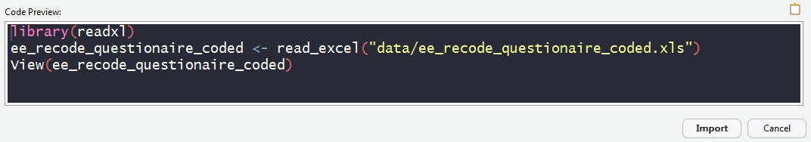
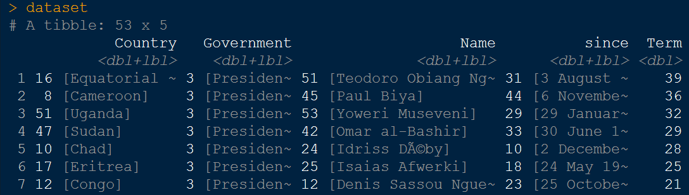
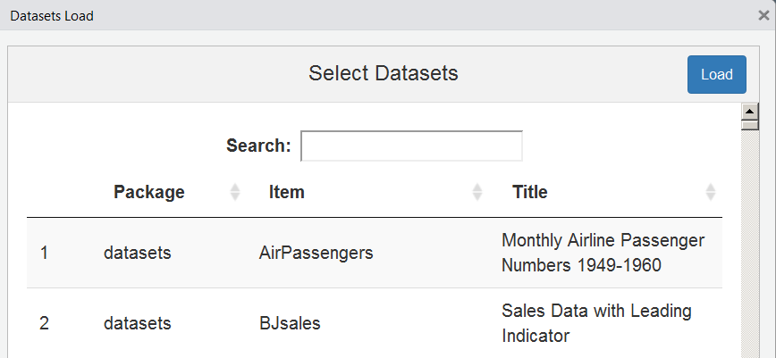

```{r setup, include=FALSE}
knitr::opts_chunk$set(echo = TRUE, warning = F,message = F)
ex_count <- 0
```


## [FIRST THINGS TO DO](http://uc-r.github.io/data_wrangling/week-3)

Don’t try to kiss your data on the first date; rather, you just want
to get to know the data:

1. **Import the data**
2. Review the codebook
3. Learn about the data
4. Quick visual understanding of the data

---

## Data import


---

## Import data with Rstudio

### Rstudio functionality to import data

- Environment - Import Dataset - choose file type


---

## Where to find data

### Browse Button in RStudio
<!--
- You have a Browse Button in RStudio
-->


### Code preview in Rstudio

<!--
- Here you can copy the code
-->



- You can change the object name under Import Options
- Use short object names like e.g. `dat`


---

## Import of csv data

- `read.csv` is a command available in base package
- Excel data can be saved as `.csv` in Excel
- Then `read.csv()` can be used to read in the data.
- For German data, you may need `read.csv2()` because of the comma separation.

<!--
```{r,eval=F}
?read.csv
?read.csv2
```
-->

```{r,eval=F}
dat <- read.csv("../data/ZA5666_v1-0-0.csv")
```

If it's German data:

```{r,eval=F}
datd <- read.csv2("../data/ZA5666_v1-0-0.csv")
```


```{r,echo=F,eval=F}
datd <- datd[1:10,1:4]
save(datd,file="../data/ZA5666_v1-0-0_small.RData")
```


<!--
https://www.stats.govt.nz/assets/Uploads/Annual-enterprise-survey/Annual-enterprise-survey-2018-financial-year-provisional/Download-data/annual-enterprise-survey-2018-financial-year-provisional-csv.csv
-->


```{r}
dat <- read.csv("../data/datahub_refugee.csv")
```

---

## The result - a `data.frame`

- the following `data.frame` is a small excerpt from the data:

```{r}
head(dat)
```


---

## The package `readxl`

```{r,eval=F}
install.packages("readxl")
```

- [**`readxl` has no external dependencies**](https://stackoverflow.com/questions/7049272/importing-excel-files-into-r-xlsx-or-xls)
- `readxl` supports both the legacy `.xls` format and the modern xml-based `.xlsx` format.

```{r,eval=T}
library(readxl)
ab <- read_excel("../data/ma_stadtteile.xlsx")
head(ab)
```

---

## Import SPSS files

### Import GESIS Panel data

- library `haven` - import and export 'SPSS', 'Stata' and 'SAS' files
- the result of this import command is a tibble

```{r,eval=F}
library(haven)
dataset <- read_sav("../data/datahub_government_africa.sav")
```


<!--
Data sources:

https://ilostat.ilo.org/data/

http://dataportal.opendataforafrica.org/zjqnio/infrastructure
-->



  
---

## Import data from the web

### Austrian microcensus


Files can also be imported directly from the Internet:


```{r,eval=F}
?read.spss
Dat <- rio::import(link_c)
```

---

## Import `stata` files

### Import newer `.dta` files

- With `read.dta13` stata files from version 13 (and higher) can be imported

```{r,eval=F}
library(readstata13)
dat_stata <- read.dta13("../data/example_gp.dta")
```


### Import `stata` files - older versions

```{r,eval=F}
library(foreign)
dat_stata12 <- read.dta("../data/example_gp_stata12.dta")
```

---

## The library `readstata13`


---

## Import - GESIS Panel data


### `convert.factors` argument

```{r}
library(readstata13)
```

```{r,eval=T}
datf <- read.dta13("../data/example_gp.dta",
                  convert.factors = F)
head(datf$bbzc007a)
```

### For comparison - import without this argument

```{r,eval=T}
dat <- read.dta13("../data/example_gp.dta")
head(dat$bbzc007a)
```

---

## The argument `convert.factors = F`

### More information on `.dta` import

```{r,eval=F}
?read.dta13
```

- `convert.factors`	- logical. If `TRUE`, factors from Stata value labels are created.
- It might be useful to import the dataset twice - with and without value labels... 

- `nonint.factors`- logical. If `TRUE`, factors labels will be assigned to variables of type float and double.

- The import must be controlled, because otherwise errors can easily happen. 

---

## Get stata attributes

```{r,eval=T}
att_dat <- attributes(dat)
head(names(att_dat))
```

### Example: the variable names 

```{r}
head(att_dat$names)
```


---

## Get an initial overview of the data

```{r,eval=F}
View(datf)
```


- You can get the same in RStudio if you click on the dataset icon in the environment menue

---

## [**The library `rio`**](https://cran.r-project.org/web/packages/rio/vignettes/rio.html)

```{r,eval=F}
install.packages("rio")
```

```{r,eval=F}
library("rio")
x <- import("../data/ZA5666_v1-0-0.csv")
y <- import("../data/ZA5666_v1-0-0_Stata12.dta")
z <- import("../data/ZA5666_v1-0-0_Stata14.dta")
```

- [**rio: A Swiss-Army Knife for Data I/O**](https://cran.r-project.org/web/packages/rio/README.html)

---

## [The package `Hmisc`](https://www.statmethods.net/input/importingdata.html)

> For SPSS and SAS I would recommend the Hmisc package for ease and functionality.

```{r,eval=F}
library(Hmisc)
mydata <- spss.get("c:/mydata.por", use.value.labels=TRUE)
# last option converts value labels to R factors
```

### Import SAS data

```{r,eval=F}
mydata <- sasxport.get("c:/mydata.xpt")
# character variables are converted to R factors
```


---

## The working directory


---

## ...

- If the data is on a different drive in Windows

<!--
- search directory:


-->


---

## The working directory II

This way you can find out which directory you are currently in

```{r,eval=F}
getwd()
```

So you can change the working directory:

You create an object in which you save the path:

```{r,eval=F}
main.path <- "C:/" # Example for Windows
main.path <- "/users/Name/" # Example for Mac
main.path <- "/home/user/" # Example for Linux
```

And then change the path with `setwd()`

```{r,eval=F}
setwd(main.path)
```

On Windows it is important to use slashs instead of backslashes.

---

## Change working directory

- You can also use the tab key to get the autocompletion.

```{r}
getwd()
setwd("..")
getwd()
```

---

## Built-In datasets

- Often an example dataset is provided to show the functionality of a package
- These datasets can be loaded with the command `data`

```{r}
data(iris)
```


- There is also an [**RStudio add-in**](https://github.com/bquast/datasets.load) that helps to find a dataset

```{r,eval=F}
install.packages("datasets.load")
```



---

## Excursus [RStudio Addins](https://cran.r-project.org/web/packages/addinslist/README.html)

- In the upper right corner there is a button Addins


```{r,eval=F,echo=F}
ex_count <- ex_count+1
exletter <- LETTERS[ex_count]
```

---

## Exercise: load built-in data

### Load the the built-in dataset `mtcars` 
<!--
and answer the following questions:
-->
1) How many observations and variables are available?
2) What is the object structure of the variables?

### Interactive data table 

3) Create an interactive data table


---

## [**Inserting data**](https://github.com/lbusett/insert_table)

- [**RStudio addin for inserting data**](https://github.com/lbusett/insert_table)

```{r,eval=F}
devtools::install_github("lbusett/insert_table")
```


---

## [The `file.choose` option](https://www.r-exercises.com/2018/01/27/Groups-Comparison-With-ANOVA-Solutions/)

- You can browse through the directory with `file.choose`:

```{r,eval=F}
dat <- read.csv(file.choose())
```

- If you run the command line above a window is opened and you can browse in the file system.
- That also works with other import functions

---

## Creating an example data record

```{r}
A <- c(1,2,3,4)
B <- c("A","B","C","D")

mydata <- data.frame(A,B)
```

```{r,eval=F}
mydata
```


```{r,eval=T,echo=F}
library(knitr)
kable(mydata)
```


---

## Overview data import/export

- if you continue working with R, `.RData` or [**`rds`**](https://www.fromthebottomoftheheap.net/2012/04/01/saving-and-loading-r-objects/) format is the best choice:

```{r,eval=F}
save(mydata, file="mydata.RData")
saveRDS(mydata, "mydata.rds")
```

- The data set can be imported with `load`.

```{r,eval=F}
load("mydata.RData")
mydata <- readRDS("mydata.rds")
```

- `saveRDS()` doesn’t save the both the object and its name it just saves a representation of the object

---

## [Overview import functions](http://uc-r.github.io/data_wrangling/week-2)


---

## Links and resources

- Introduction to import with R ([**is.R**](http://is-r.tumblr.com/post/37181850668/reading-writing-stata-dta-files-with-foreign))

- [**Youtube video**](https://www.youtube.com/watch?v=WWY8VPh6ryo) on importing data

- Statistical tools for high-throughput data analysis (STHDA) - [**Importing Data Into R**](http://www.sthda.com/english/wiki/importing-data-into-r)

- Karlijn Willems - [**This R Data Import Tutorial Is Everything You Need**](https://www.datacamp.com/community/tutorials/r-data-import-tutorial)

- [**R for data science book**](https://r4ds.had.co.nz/data-import.html)

- The [**R-package `labelled`**](https://cran.r-project.org/web/packages/labelled/labelled.pdf) to work with labelled data imported from SPSS or stata

- [Overview - **all import functionalities**](https://cran.r-project.org/doc/manuals/r-release/R-data.html)

<!--
https://github.com/Perishleaf/data-visualisation-scripts/blob/master/dash-2019-coronavirus/AU_cases.xlsx

https://towardsdatascience.com/build-a-dashboard-to-track-the-spread-of-coronavirus-using-dash-90364f016764

-->