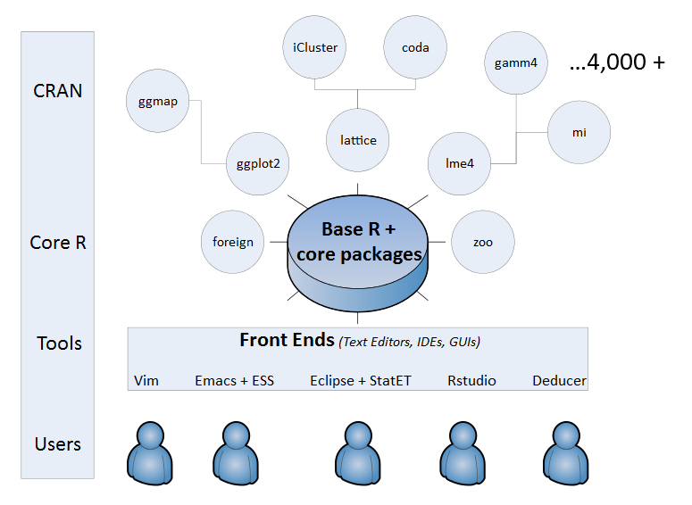
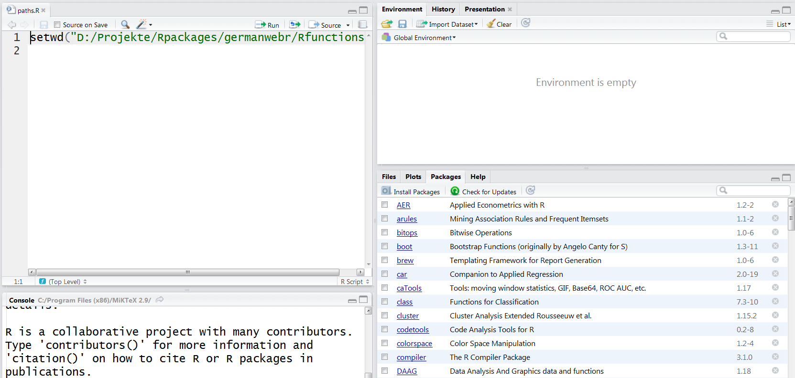
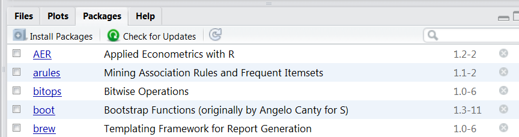
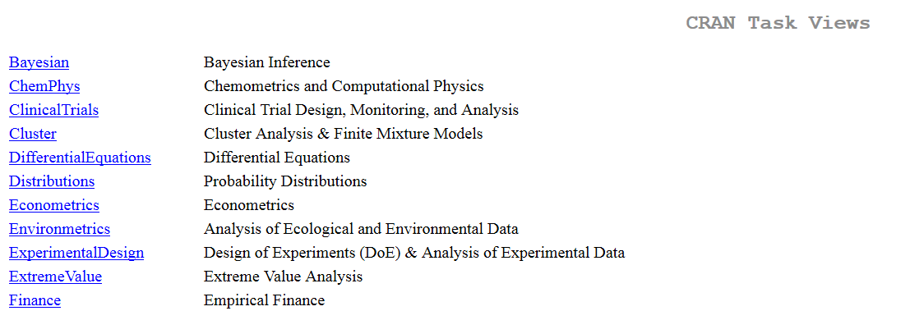

```{r setup, include=FALSE}
knitr::opts_chunk$set(echo = T,warning=F,message=F)
```


---

## [**Where to find routines**](https://stats.idre.ucla.edu/r/seminars/intro/)

```{r,eval=T,echo=F}
# http://blog.revolutionanalytics.com/2015/06/how-many-packages-are-there-really-on-cran.html
CRANmirror <- "http://cran.revolutionanalytics.com"
cran <- contrib.url(repos = CRANmirror, 
                      type = "source")
info <- available.packages(contriburl = cran, type = "source")
# nrow(info)
```


- Many functions are included in basic R 
- Many specific functions are integrated in additional libraries
- R can be modularly extended by so-called packages or libraries
- Most important packages hosted on CRAN (`r nrow(info)` at `r format(Sys.time(), "%a %b %d")`)
- Further packages can be found e.g. at [**bioconductor**](www.bioconductor.org)


### Overview R packages

{ height=60% }


---

## Installation of packages

- The quotes around the package name are necessary for the command `install.packages`.
- They are optional for the command `library`.
- You can also use `require` instead of `library`.

```{r,eval=F}
install.packages("lme4")

library(lme4)
```


---

## Installation of packages with RStudio




---

## Existing packages and installation




---

## Exercise: Download packages

Download and install the following packages from CRAN:

- `tidyverse`
- `nycflights13`
- `cluster`
- `ggplot2`
- `tmap`

Have a look at the package documentation. What are these packages for?


---

## Overview of many useful packages:

- Luhmann - [**Table with many useful packages**](http://www.beltz.de/fileadmin/beltz/downloads/OnlinematerialienPVU/28090_Luhmann/Verwendete%20Pakete.pdf)

### Other interesting packages:

- Package for Import/Export - [**`foreign`**](http://cran.r-project.org/web/packages/foreign/foreign.pdf)

- [**`sampling`-package for survey Sampling**](http://iase-web.org/documents/papers/icots8/ICOTS8_4J1_TILLE.pdf)

- `xtable` Package for  integrating LateX in R ([**xtable Galerie**](http://cran.r-project.org/web/packages/xtable/vignettes/xtableGallery.pdf))

- [**`dummies` package for creating dummies**](http://cran.r-project.org/web/packages/dummies/dummies.pdf)

- [**Package `mvtnorm` for getting a multivariate normal distribution**](http://cran.r-project.org/web/packages/mvtnorm/index.html)

- [**Package `maptools` for creating maps**](http://www.r-bloggers.com/tag/maptools/)


---

## Install packages from various sources

### Install packages from CRAN Server

```{r,eval=F}
install.packages("lme4")
```

### Install packages from Bioconductor Server

```{r,eval=F}
source("https://bioconductor.org/biocLite.R")
biocLite(c("GenomicFeatures", "AnnotationDbi"))
```


### Install packages from Github

```{r,eval=F}
install.packages("devtools")
library(devtools)

install_github("hadley/ggplot2")
```


---

## Packages

```{r,eval=F}
# load the package to use in the current R session
library(tidyverse)

# use a particular function within a package 
# without loading the package
stringr::str_replace()
```

### Getting help on packages

```{r,eval=F}
# provides details regarding contents of a package
help(package = "tidyr")
# list vignettes available for a specific package
vignette(package="tidyr")
# view specific vignette
vignette("tidy-data")
```


---

## How do I get an overview

- [**Discover packages recently uploaded to CRAN**](https://mran.microsoft.com/packages/)

- Look at the Shiny web app that shows the [**packages recently downloaded from CRAN**](https://gallery.shinyapps.io/cran-gauge/)

- Have a look at a [**quick-list of useful packages**](https://support.rstudio.com/hc/en-us/articles/201057987-Quick-list-of-useful-R-packages),...

- ..., or at a list with the [**best packages for data processing and analysis**](http://www.computerworld.com/article/2921176/business-intelligence/great-r-packages-for-data-import-wrangling-visualization.html),...

- ..., or at [**the 50 most used packages**](https://www.r-bloggers.com/the-50-most-used-r-packages/)


---

## CRAN Task Views		
		
- For some topics all possibilities are arranged in R. ([**Overview of Task Views**](https://cran.r-project.org/web/views/))
- Currently there are 35 task views.
- All packages of a task view can be installed with the following [**command:**](https://mran.microsoft.com/rpackages/)

```{r,eval=F}
install.packages("ctv")
library("ctv")
install.views("Bayesian")
```




---

## Exercise:  additional packages 

### Go for example to: 

<https://cran.r-project.org/> 

<https://awesome-r.com/>

### or search for 

```
most interesting r packages
```

### and search for packages ...

- for descriptive data analysis.
- with functions to work with date-times and time-spans.
- to use an interface to `python`.
- to import foreign data (e.g. SPSS data).
- to handle large amounts of data

