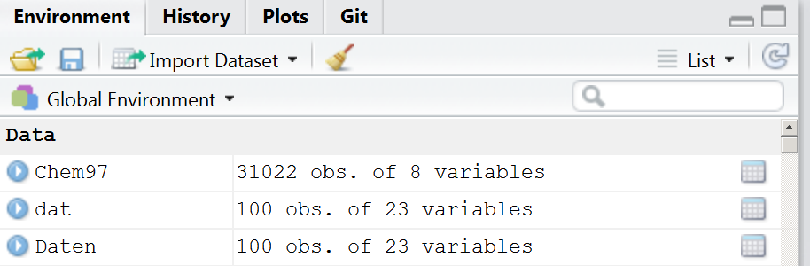
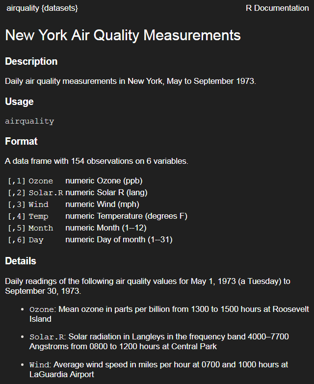
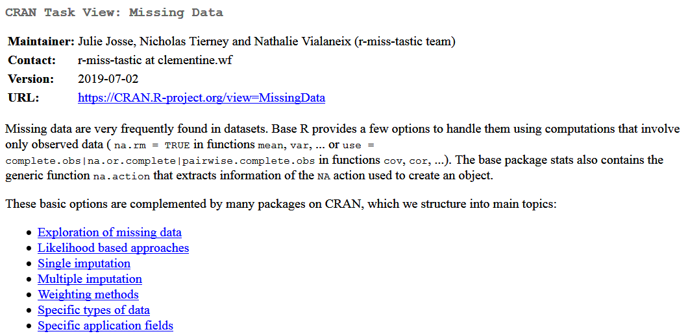

```{r, include=FALSE}
knitr::opts_chunk$set(echo = T,message=F,warning = F,cache=F,size="small")
showSolution=F
```


## [FIRST THINGS TO DO](http://uc-r.github.io/data_wrangling/week-3)

> Don’t try to kiss your data on the first date; rather, you just want to get to know the data:

1. Import the data
2. Review the codebook
3. **Learn about the data**
4. Quick (visual) understanding of the data

---

## [LEARN ABOUT THE DATA](http://uc-r.github.io/data_wrangling/week-3)

### So what are the first things we want to know about our data?

-  dimensions
-  data types (i.e. character, integer, factor, etc.)
-  missing values
-  summary statistics


What are some functions to extract this information?

---

## LEARN ABOUT THE DATA

-  dimensions: `dim()`, `ncol()`, `nrow()`, `names()`
-  data types: `str()`, `class()`, `is.`, `as.`
-  missing values: `is.na()`, `sum(is.na())`, `colSums(is.na())`
-  summary statistics: `summary()`, `quantile()`, `var()`, `sd()`,
`table()`

---

## Data Frames

```{r,echo=F}

sysinf <- Sys.info()

if (sysinf["nodename"]=="MAC14077"){
  oldgitpath <- "D:/Daten/GitLab/IntroDataAnalysis/"  
}else{
  oldgitpath <- "D:/gitlab/IntroDataAnalysis/"
}

```


```{r,echo=F,eval=F}
library("readstata13")
dat <- read.dta13("../data/ZA5666_v1-0-0_Stata14.dta")
dat <- dat[1:100,]
save(dat,file="../data/ZA5666_v1-0-0_medium.RData")

datf <- read.dta13("../data/ZA5666_v1-0-0_Stata14.dta",
                   convert.factors = F)

datf <- datf[1:100,]
save(datf,file="../data/ZA5666_v1-0-0_medium_fac.RData")
```

<!--
## Outline for today

```{r,echo=F,eval=F}
library(knitr)
sched <- xlsx::read.xlsx2("../orga/schedule.xlsx",1)
dats <- sched[9:15,c(1,4,5)]
dats <- dats[-which(dats$Part=="Break"),]

kable(dats,row.names = F)
```
-->


```{r,echo=F,eval=F}
load(paste0(oldgitpath,"/data/ZA5666_v1-0-0_medium.RData"))
load(paste0(oldgitpath,"/data/ZA5666_v1-0-0_medium_fac.RData"))
```


### Example data:

```{r,echo=F,eval=F}
library("readstata13")
gpdat <- read.dta13("../data/ZA5666_v1-0-0_Stata14.dta",
                    convert.factors = F)
```

```{r,eval=F,echo=F}
library(foreign)
gpdat<-read.dta("https://github.com/Japhilko/RSocialScience/
              raw/master/data/GPanel.dta",convert.factors = F)
```


```{r,eval=F}
install.packages("AmesHousing")
```


```{r}
ames_data <- AmesHousing::make_ames()
```


```{r}
typeof(ames_data)
```


```{r,eval=F}
head(names(ames_data))
```

```{r,echo=F}
head(names(ames_data[4:8]))
```

### Transfer to `data.frame` 

- Transfer data to a `data.frame`:

```{r}
ames_df <- data.frame(ames_data)
```

---

## Number of rows/columns

- Find out the number of rows/columns

```{r}
nrow(ames_df) # rows
ncol(ames_df) # columns
```

---

## View the data

- See some lines:

```{r,eval=F}
head(ames_df) # first lines
tail(ames_df) # last lines
```

- Overview with Rstudio:



---

## Indexing

### Accessing Columns with the dollar sign

- The dollar sign can also be used to address individual columns

```{r}
head(ames_df$Lot_Area)

ames_df$Lot_Area[1:6]
```


### Accessing Columns with the number or the name

```{r,eval=F}
head(ames_df[,5])
head(ames_df[,"Street"]) # the same result
```

---

## Subsetting dataset

<!--
-->

```{r}
Street <- ames_df$Street
table(Street)
```

```{r,eval=F}
ames_df[Street=="Grvl",]
# same result:
ames_df[Street!="Pave",]
```


```{r,echo=F,eval=F}
ames_df[Street=="Grvl",]
# same result:
ames_df[Street!="Pave",]
```

---

## Logical operations in indexing

```{r}
head(ames_df[ames_df$Lot_Area>9000,1:4])
```

---

## Exercise: [Vectors and Indexing](http://web.math.ku.dk/~helle/R-intro/exercises.pdf)

Assume that we have registered the height and weight for four people: Heights in cm
are 180, 165, 160, 193; weights in kg are 87, 58, 65, 100. Make two vectors, height
and weight, with the data. The bodymass index (BMI) is defined as

$$
\dfrac{\text{weight in kg}}{\text{(height in m)}^2}
$$

Make a vector with the BMI values for the four people, and a vector with the natural
logarithm to the BMI values. Finally make a vector with the weights for those people
who have a BMI larger than 25.


---

## The `airquality` data

```{r}
data(airquality)
Ozone <- airquality$Ozone
```




---

## Other important options

- save result to an object


```{r,eval=F}
subDat <- airquality[Ozone>30,]
```

- multiple conditions can be linked with &


```{r,eval=F}
airquality[Ozone>18 & airquality$Month==5,]
```

```{r,echo=F,eval=F}
airquality[Ozone>18 & airquality$Month==5,1:4]
```

- the or argument - one of the two conditions must be fullfilled

```{r,eval=F}
airquality[Ozone>18 | airquality$Month==5,]
```

---

## [Missing values](http://faculty.nps.edu/sebuttre/home/R/missings.html)

- Missing values are defined as `NA` in R
- Math functions usually have a way to exclude missing values in their calculations.
- `mean(), median(), colSums(), var(), sd(), min()` and `max()` all take the `na.rm` argument.

```{r}
mean(Ozone)
```

```{r}
mean(Ozone,na.rm=T)
```

---

## Find the missing values:

```{r}
head(is.na(Ozone))
```

```{r}
which(is.na(Ozone))
```

```{r}
table(is.na(Ozone))
```

---

## [Missing Data Visualisations](https://cran.r-project.org/web/packages/naniar/vignettes/naniar-visualisation.html)

```{r,eval=F,echo=F}
install.packages("naniar")
```


```{r}
# Data Structures, Summaries, and Visualisations 
# for Missing Data
library(naniar) 
vis_miss(airquality)
```

---

## The command `complete.cases()`

- returns a logical vector indicating which cases are complete.

```{r,eval=T}
nrow(airquality)
# list rows of data without missing values 
airq_comp <- airquality[complete.cases(airquality),]
nrow(airq_comp)
```

---

## [A shorthand alternative ](http://uc-r.github.io/missing_values)

- An shorthand alternative is to simply use `na.omit()` to omit all rows containing missing values.

```{r}
airq_comp <- na.omit(airquality)
nrow(airq_comp)
```

---

## Very simple imputation 

```{r}
airq <- airquality 
airq$Ozone[is.na(airq$Ozone)] <-mean(airq$Ozone, 
                                     na.rm = T)
```


### Comparing mean and variance

```{r}
mean(airquality$Ozone, na.rm = T)
mean(airq$Ozone)
var(airquality$Ozone, na.rm = T)
var(airq$Ozone)
```

---

## [NAs per column](http://uc-r.github.io/missing_values)

- For data frames, a convenient shortcut to compute the total missing values in each column is to use `colSums()`:

```{r,eval=T}
colSums(is.na(airquality))
colSums(is.na(airq))
```


---

## CRAN Task View: Missing Data



## Exercise: Missing values


1. How many missing values are in the built-in data set airquality?
2. Which variables are the missing values concentrated in?
3. How would you impute the mean or median for these values?
4. How would you omit all rows containing missing values?

---

## Rename the column names

- With the command `colnames` you get the column names

```{r,eval=F}
colnames(airquality)
```

- We can rename the column names:

```{r,eval=F}
colnames(airquality)[1] <- "var1"
```

- The same applies to the row names

```{r,eval=F}
rownames(airquality)
```


---

## The `apply` family

```{r}
apply(airq,2,mean)
```

```{r,eval=F}
# the following is possible but doesn`t make sense
# for this case:
apply(airq,1,mean)
```

---

## The command `apply()`

```{r}
apply(airq,2,var)
apply(airq,2,sd)
apply(X = airq,MARGIN = 2,FUN = range)
```

---

## The arguments of the command `apply()`

- If `MARGIN=1` the function `mean` is applied for rows,

- If `MARGIN=2` the function `mean` is applied for columns,

- Instead of `mean` you could also use `var`, `sd` or `length`.

---

## Example command `tapply()`

```{r}
tapply(airq$Wind, airq$Month,mean)
```

- Other commands can also be used..... also self-scripted commands

---

## Exercise: using the `tapply()` command


- Calculate the average ozone value by month using the airquality dataset and the tapply command.

---

## Links and resources

- [**Tidy data**](https://cran.r-project.org/web/packages/tidyr/vignettes/tidy-data.html) - the package `tidyr`

- Homepage for [**the `tidyverse` collection**](http://tidyverse.org/)

- [**Data wrangling with R and RStudio**](https://www.rstudio.com/resources/webinars/data-wrangling-with-r-and-rstudio/)


```{r,eval=F,echo=F}
# https://github.com/BAAQMD/copydat
devtools::install_github("BAAQMD/copydat")
install.packages("questionr")
devtools::install_github("ThinkR-open/littleboxes") # https://github.com/ThinkR-open/littleboxes
```

- Hadley Wickham - [**Tidy Data**](http://vita.had.co.nz/papers/tidy-data.pdf)
- Hadley Wickham - [**Advanced R**](http://adv-r.had.co.nz/)
- Colin Gillespie and Robin Lovelace [**Efficient R programming**](https://csgillespie.github.io/efficientR/)

- [**Quick-R about missing values**](http://www.statmethods.net/input/missingdata.html)

- [**Recode missing values**](http://uc-r.github.io/na_recode)

<!--
http://biostat.mc.vanderbilt.edu/wiki/pub/Main/Hmisc/Hmisc-refcard.pdf

https://www.r-exercises.com/product/dealing-with-missing-data/

https://www.r-exercises.com/2016/04/14/merging-dataframes-exercises/

https://cran.r-project.org/web/packages/naniar/vignettes/replace-with-na.html

https://stackoverflow.com/questions/8161836/how-do-i-replace-na-values-with-zeros-in-an-r-dataframe

https://stackoverflow.com/questions/18562680/replacing-nas-with-0s-in-r-dataframe

https://statisticsglobe.com/r-replace-na-with-0/

http://www.datasciencemadesimple.com/join-in-r-merge-in-r/

https://cran.r-project.org/web/packages/sjlabelled/vignettes/intro_sjlabelled.html
-->