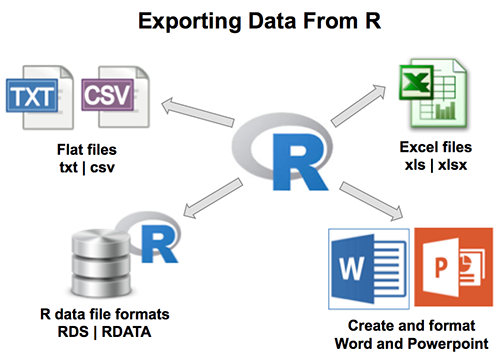
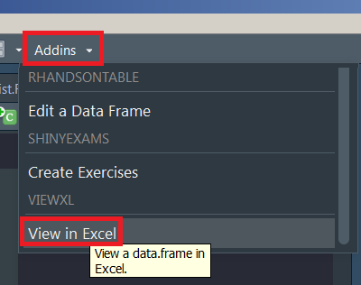
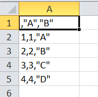
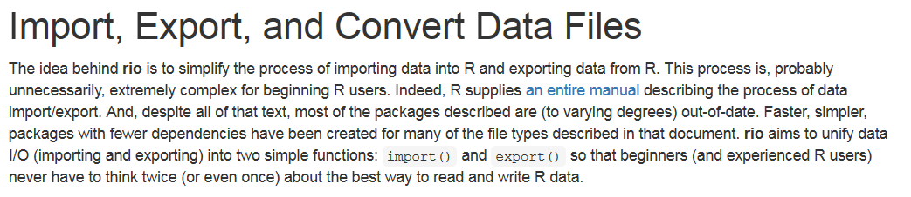
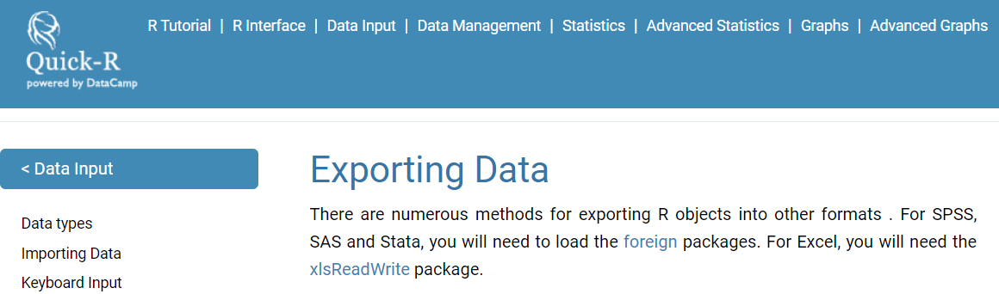

```{r, include=FALSE}
knitr::opts_chunk$set(echo = TRUE, warning = F,message = F)
```

## [Exporting data from R](http://www.sthda.com/english/wiki/exporting-data-from-r)




## Creating an example data record

```{r}
A <- c(1,2,3,4)
B <- c("A","B","C","D")

mydata <- data.frame(A,B)
```

```{r,eval=F}
mydata
```


```{r,eval=T,echo=F}
library(knitr)
kable(mydata)
```


## Overview data import/export

- if you continue working with R, `.RData` or [**`rds`**](https://www.fromthebottomoftheheap.net/2012/04/01/saving-and-loading-r-objects/) format is the best choice:

```{r,eval=F}
save(mydata, file="mydata.RData")
saveRDS(mydata, "mydata.rds")
```

- The data set can be imported with `load`.

```{r,eval=F}
load("mydata.RData")
mydata <- readRDS("mydata.rds")
```

- `saveRDS()` doesn’t save the both the object and its name it just saves a representation of the object

## Export as Excel

```{r,eval=F,echo=F}
install.packages("tibble")
```

- Create an example [**tibble**](https://r4ds.had.co.nz/tibbles.html):

```{r}
library(tibble)
ab <- tibble(a=1:4,b=4:1)
```


```{r,eval=F}
library(xlsx)
setwd("D:/Daten/GitLab/IntroDataAnalysis/data")
write.xlsx(ab,file="ab.xlsx")
```


## [Addin to open dataset in Excel](https://github.com/dreamRs/viewxl)

```{r,eval=F}
devtools::install_github("dreamRs/viewxl")
```

- select a `data.frame` in script -> it is opened in Excel. 

```{r,eval=F,echo=F}
iris
```



## Save data in `.csv` format

```{r,eval=F}
write.csv(mydata,file="mydata.csv") 
```

- If you want to continue working with German Excel, it is better to use `write.csv2` 

```{r,eval=F}
write.csv2(mydata,file="mydata.csv") 
```

- Otherwise, the result looks like this:



## Argument `row.names`

### [**Prevent row names to be written to file when using write.csv**](https://stackoverflow.com/questions/7484325/prevent-row-names-to-be-written-to-file-when-using-write-csv)

```{r,eval=F}
write.csv(mydata,file="mydata.csv", row.names=FALSE)
```

- or for German data:

```{r,eval=F}
write.csv2(mydata,file="mydata.csv", row.names=FALSE)
```


<!--
## Export as `.csv`-file

```{r,eval=F}
write.csv(mydata,file="mydata.csv")
```

- or for German data:

```{r,eval=F}
write.csv2(mydata,file="mydata.csv")
```


-->

## The package `rio`

```{r,eval=F}
install.packages("rio")
```



## [Save data as `.sav` (SPSS)](https://cran.r-project.org/web/packages/rio/vignettes/rio.html)

```{r,eval=F}
library("rio")
# create file to convert

export(mtcars, "data/mtcars.sav")
```


## Convert file formats

```{r,eval=F}
export(mtcars, "data/mtcars.dta")

# convert Stata to SPSS
convert("data/mtcars.dta", "data/mtcars.sav")
```


## Links Export

- [**Quick R**](http://www.statmethods.net/input/exportingdata.html) for the export of data



- Help for exporting on the [**CRAN Server**](http://cran.r-project.org/doc/manuals/r-release/R-data.pdf)

- [**Export data from R**](https://www.stat.ubc.ca/~jenny/STAT545A/block05_getNumbersOut.html)

- Youtube video - [**Export data from R**](https://www.youtube.com/watch?v=WjpcbmcJjjM)
- Quick R - [**Exporting data**](https://www.statmethods.net/input/exportingdata.html)
- dummies - [**How to Get Your Data Out of R**](https://www.dummies.com/programming/r/how-to-get-your-data-out-of-r/)
- R Core Team - [**R Data Import/Export**](https://colinfay.me/r-data-import-export/index.html)
<!--
deutscher Link

https://databraineo.de/ki-training-resources/r-programmierung/daten-export-aus-r/
-->


## Exercise: Export dataset

- Please load the `iris` built-in dataset
- Export the `iris` dataset to Excel
