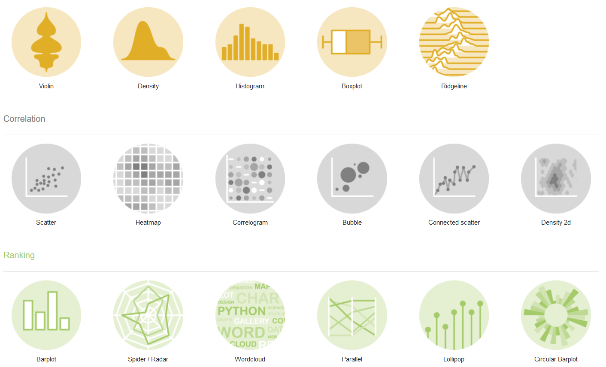
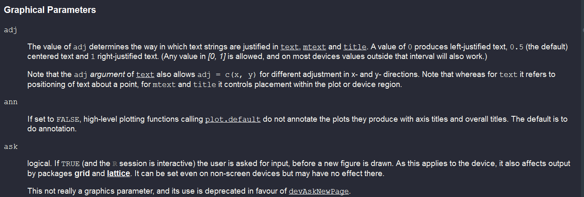
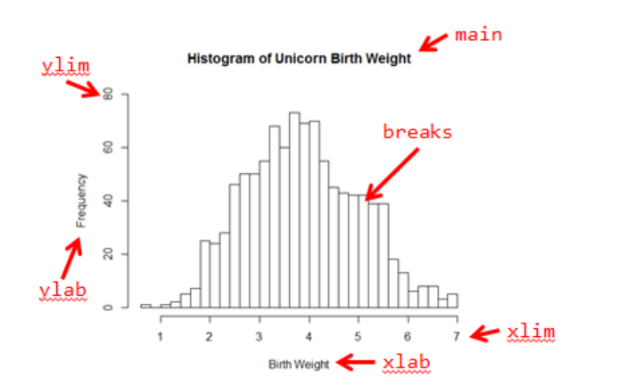
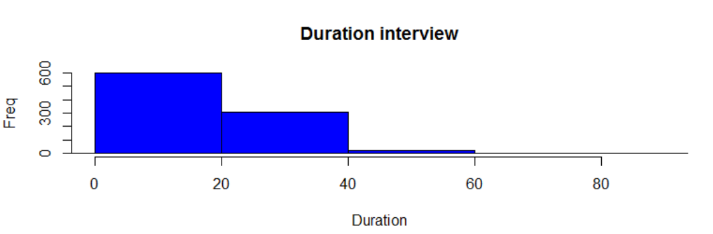
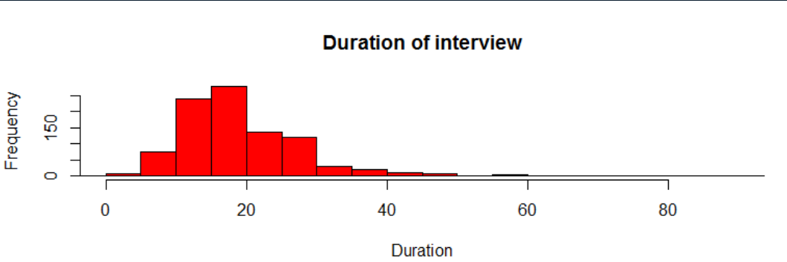
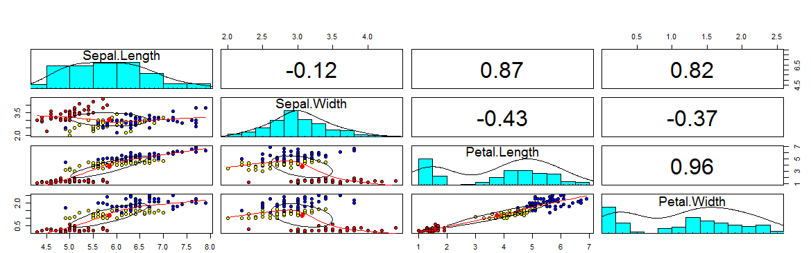

```{r, include=FALSE}
knitr::opts_chunk$set(echo = TRUE,message=F,warning = F,cache=F,fig.width=12, fig.height=4)
```


## [FIRST THINGS TO DO](http://uc-r.github.io/data_wrangling/week-3)

> Don’t try to kiss your data on the first date; rather, you just want to get to know the data:

1. Import the data
2. Review the codebook
3. Learn about the data
4. **Quick visual understanding of the data**

---

## A plot says more than 1000 words

### Statements on graphs in R

- Graphical data analysis is great
- Good plots can contribute to a better understanding
- Generating a plot is easy
- Making a good plot can take very long
- Generating plots with R is fun
- Plots created with R have high quality
- Almost every plot type is supported by R
- A large number of export formats are available in R

```{r,echo=F}
# https://stackoverflow.com/questions/25646333/code-chunk-font-size-in-rmarkdown-with-knitr-and-latex
def.chunk.hook  <- knitr::knit_hooks$get("chunk")
knitr::knit_hooks$set(chunk = function(x, options) {
  x <- def.chunk.hook(x, options)
  ifelse(options$size != "normalsize", paste0("\\", options$size,"\n\n", x, "\n\n \\normalsize"), x)
})
```

---

## [Graphic types](https://www.r-graph-gallery.com/)



---

##  Task View for [graphics](https://cran.r-project.org/web/views/Graphics.html)


https://cran.r-project.org/web/views/Graphics.html

---

## The example dataset


```{r,eval=F}
install.packages("AmesHousing")
```


```{r}
ames_df <- AmesHousing::make_ames()
```

### Variables used in this section

<!--
Lot - Grundstück
Alley - Gässchen / Pfad
Gravel - Kies
Paved - gepflastert
-->

- `Lot_Area`: Lot size in square feet
- `Alley`: Type of alley access to property 
- `Street`: Type of road access to property 

---

## Histogram - The `hist()` function

We create a histogram of the variable `duration`:

```{r,eval=F}
?hist
```


```{r,eval=T}
hist(ames_df$Lot_Area)
```

---

## Histogram

- Command `hist()` plots a histogram
- At least one observation vector must be passed to the function
- `hist()` has many more arguments, which all have (meaningful) default values

```{r,eval=T}
hist(ames_df$Lot_Area,col="blue",
     main="Lot size in square feet",ylab="Frequency", 
     xlab="Lot size")
```

---

## Further arguments:

- Many of the arguments are valid for all base graphics like `main` or `xlab`.
- You can see many of them if you call help on `?par`.

```{r,eval=F}
?plot
# or
?par
```

```{r,echo=F}

```


---

## [Some graphic parameters](https://rpubs.com/SusanEJohnston/7953)




---

## The `xlim` argument

```{r,eval=T,out.height="40%"}
hist(ames_df$Lot_Area,col="blue",
     main="Lot size",ylab="Freq", xlab="Lot size",
     xlim=c(0,50000))

```

<!--

-->

---

## The `breaks` argument

- While the previous arguments are valid for many graphics functions, the following apply mainly to histogrames:

```{r,eval=T,out.height="40%"}
hist(ames_df$Lot_Area,col="red",
     main="Size of Lot", xlab="Lot Area",
     xlim=c(0,50000),breaks=60)
```

- with `breaks` you can control the number of bars...

<!--

-->


---

## A vector for the breaks

```{r,eval=T,out.height="40%"}
hist(ames_df$Lot_Area,col="purple",
     main="Size of Lot", xlab="Lot Area",breaks=c(0,5000,10000,22000,215245))
```


---

## Tabulate and `barplot`


- The command `barplot()` generates a barplot from a frequency table
- We get the frequency table with the following command:

```{r}
tab_alley <- table(ames_df$Alley)
```


```{r,eval=T}
barplot(tab_alley)
```

---

## More colour:

```{r}
barplot(tab_alley,col=rgb(0,0,1))
```

---

## Green colour 

```{r}
barplot(tab_alley,col=rgb(0,1,0))
```

---

## Red colour

```{r}
barplot(tab_alley,col=rgb(1,0,0))
```

---

## Transparent

```{r}
barplot(tab_alley,col=rgb(1,0,0,.3))
```

---

## Rstudio addin `colourpicker`

```{r,eval=F}
install.packages("colourpicker")
```

{height=80%}

---

## Set various colors

```{r}
barplot(tab_alley,col=c(20,"#62D6C8", "darkorange"))
```


---

## A two dimensional table


```{r}
tab2dim <- table(ames_df$Alley,ames_df$Street)
```

- If the passed table object is two-dimensional, a conditional barplot is created

```{r}
tab2dim
```


---

## Conditional `barplot`

```{r,eval=T,out.height="20%"}
barplot(tab2dim,col=1:3)
```

---

## Conditional `barplot` beside

```{r,eval=T,out.height="20%"}
barplot(tab2dim,col=1:3,beside=T)
```


---

## Exercise: simple graphics

- Load the dataset `VADeaths` and create the following plot:

```{r,echo=F}
library(datasets)
data(VADeaths)
barplot(VADeaths, border = "dark blue",beside=T,
        col=c(1,2,3,4,5)) 
```


---

## Horizontal `boxplot`

- A simple [**boxplot**](http://edoc.hu-berlin.de/dissertationen/gruenwald-andreas-2005-01-17/HTML/chapter2.html) can be created with `boxplot()`
- For the command `boxplot()` at least one observation vector must be passed

```{r,eval=F}
?boxplot
```


```{r,eval=T}
boxplot(ames_df$Sale_Price,horizontal=TRUE)
```

---

## Grouped boxplots

- A very simple way to get a first impression of conditional distributions is via so-called grouped notched boxplots
- To do this, a so-called formula object must be passed to the `boxplot()` function.
- The conditional variable is located on the right side of a tilde

```{r,eval=T}
boxplot(ames_df$Sale_Price~ames_df$Alley,horizontal=TRUE)
```

---

## Boxplot alternatives - `vioplot` 

- Builds on Boxplot - additional information about data density 
- Density is calculated using the kernel method.
- The further the expansion, the higher the density at this point. 
- White dot - median

```{r,echo=F,eval=F}
install.packages("vioplot")
```

```{r,eval=T}
library(vioplot)
vioplot(na.omit(ames_df$Sale_Price),col="royalblue")
```


```{r,message=F,eval=F,echo=F}
library(vioplot)
plot(x, y, xlim=c(-5,5), ylim=c(-5,5))
vioplot(x, col="tomato", horizontal=TRUE, at=-4, 
        add=TRUE,lty=2, rectCol="gray")
vioplot(y, col="cyan", horizontal=FALSE, at=-4, 
        add=TRUE,lty=2)
```

---

## Alternatives `boxplot()`

<!--
why you should use violinplots
https://autodeskresearch.com/publications/samestats

interesting example on this page
-->

```{r,echo=F,eval=F}
install.packages("beanplot")
```


```{r}
library(beanplot)
par(mfrow = c(1,2))
boxplot(Sale_Price~Alley,data=ames_df,col="blue")
beanplot(Sale_Price~Alley,data=ames_df,col="orange")
```

---

## Conditional, bi- and multivariate distribution graphics - scatterplots

- A simple two-way scatterplot can be created with the `plot()` function
- To create a scatterplot x and y observation vector must be passed
- Argument `col` to specify the color (color as character or numeric)
- Argument `pch` to specify plot symbols (plotting character) (character or numeric)
- The labels are defined with `xlab` and `ylab`.

```{r,eval=F,echo=F}
install.packages("mlmRev")
```

```{r,eval=T}
plot(ames_df$Sale_Price,ames_df$Lot_Area)
```

---

## Changing the ploting character

```{r,eval=T}
plot(ames_df$Sale_Price,ames_df$Lot_Area,
     pch="*", # changing the plotting symbol
     col=rgb(0,0,1,.2)) # make the points transparent
```

---

## Relationship between variables - `pairs` plot

```{r}
pairs(iris[,1:4])
```

---

## Enhanced multivariate plots

```{r,eval=F}
library("psych")
pairs.panels(iris[,1:4],
             bg=c("red","yellow","blue")[iris$Species],
             pch=21,main="")

```




---

## Tabulating


```{r,eval=T}
(tab2 <- table(ames_df$Sale_Condition,ames_df$Alley))
```

---

## Relationship - categorial variables

```{r,eval=T}
mosaicplot(tab2, color = TRUE,main="")
```


---

## Surfaces are shaded according to the residuals:

```{r}
mosaicplot(tab2, main=F,shade = TRUE)
```

---

## Density plot

```{r}
plot(density(ames_df$Sale_Price))
```

---

## Stem and leaf plot

```{r}
data(airquality)
stem(airquality$Ozone)
```

---

## Export with Rstudio


---

## Command to save graphic

- Alternatively also with the commands `png`, `pdf` or `jpeg` for example

```{r,eval=F}
png("Histogramm.png")
  hist(dat$duration)
dev.off()
```

```{r,eval=F}
pdf("Histogramm.pdf")
  hist(dat$duration)
dev.off()
```

```{r,eval=F}
jpeg("Histogramm.jpeg")
  hist(dat$duration)
dev.off()
```


---

## [Exercise: Advanced Base Graphics](https://www.r-exercises.com/2016/09/23/advanced-base-graphics-exercises/)

<!--
Exercise 1

Solutions:

https://www.r-exercises.com/2016/09/23/advanced-base-graphics/
-->

### Create Scatterplot with cars dataset

a) Load the cars dataset and create a scatterplot of the data.

b) Use the argument lab to create a new scatterplot where more tickmarks are visible on the x and y axis.

### Adjust Scatterplot

<!--
Exercise 2
-->

The previous plot didn’t show all numbers associated to the new tickmarks. Use the argument `cex.axis` to control the size of the numbers. Make them smaller.

### Exercise: Change orientation

<!--
Exercise 3
-->

Use the argument `las` to change the orientation of the labels from vertical to horizontal.

---

## Exercise: Adding things to scatterplot

### The `points` function

<!--
Exercise 4
-->

Suppose you want to add two new observations to the previous plot, and you want to be able to differentiate them. Use the `points` function to add new observations using red to identify them. The values of the new observation are speed = 23, 26 and dist = 60, 61.

### Adjust x-axis range

<!--
Exercise 5
-->

As you could see the previous plot doesn’t show one of the new observations because is out the x-axis range.

a) Create again the plot for the old observations with an x-axis range that includes all the values from 4 to 26.

b) Add the two new observations using the `points` function.

---

## Relationship between variables - `pairs` plot

```{r}
pairs(iris[,1:4])
```

---

## Enhanced multivariate plots

```{r,eval=F}
install.packages("psych")
```


```{r,eval=T}
library("psych")
bgcol <- c("red","yellow","blue")[iris$Species]
pairs.panels(iris[,1:4],bg=bgcol,pch=21,main="")

```

---

## `levelplot`

<!--

-->

```{r,message=F,eval=T}
library("lattice")
levelplot(table(ames_df$MS_Zoning,ames_df$Alley),
          xlab="education",ylab="job")
```

---

## Color palettes

<!--
https://www.datanovia.com/en/blog/top-r-color-palettes-to-know-for-great-data-visualization/
-->


```{r,fig.width=12, fig.height=8}
library(RColorBrewer)
display.brewer.all()
```

---

## A correlation plot

<!--
https://www.r-bloggers.com/variable-importance-plot-and-variable-selection/
-->

```{r,eval=F,echo=F}
install.packages("corrplot")
```


```{r}
library(corrplot)
corrplot(cor(ames_df[,c("Sale_Price",
            "Gr_Liv_Area","TotRms_AbvGrd")]))
```

---

## A wordcloud

The necessary data is on [my github repo ](https://github.com/Japhilko/intror2020/blob/master/data/gp_studytab.RData)

```{r,eval=F,echo=F}
install.packages("wordcloud")
install.packages("tm")
```

```{r}
load("../data/gp_studytab.RData") # load the data 
library(wordcloud) # load the package
wordcloud(studytab$Title) # create the wordcloud
```


---

## Shiny App - R graphs catalogue

### R graphs catalogue


http://shinyapps.stat.ubc.ca/r-graph-catalog/

<!--
More shiny apps


the following apps do not work:
https://www.showmeshiny.com/ggplot-gui/
https://www.showmeshiny.com/ggplot2-theme-builder/
http://www.michalm.net/shiny/easyPlot/

http://www.michalm.net/shiny/easyPlot/
-->


---

## Not all plots are the same

- The base package already includes a large number of plot functions
- Other packages like `lattice`, `ggplot2`, etc extend this functionality

### Manuals that go far beyond this introduction:

- Murrell, P (2006): R Graphics.
- R Development Core Group [**Graphics with R**](https://csg.sph.umich.edu/docs/R/graphics-1.pdf)
- Wiki on [**R Programming/Graphics**](https://en.wikibooks.org/wiki/R_Programming/Graphics)
- Martin Meermeyer [**Creating Reproducible Publication Quality Graphics with R: A Tutorial**](http://elpub.bib.uni-wuppertal.de/edocs/dokumente/fbb/wirtschaftswissenschaft/sdp/sdp15/sdp15006.pdf)
- Institute For Quantitative Social Science at Harvard - [**R graphics tutorial**](https://tutorials.iq.harvard.edu/R/Rgraphics/Rgraphics.html)


---

## Links 

- [**R graph gallery**](https://www.r-graph-gallery.com/)

- [**Bioconductor R manual**](http://manuals.bioinformatics.ucr.edu/home/R_BioCondManual) with an extensive part on graphics

- [**Shiny app**](https://www.showmeshiny.com/ggedit/) for [**interactive plot editing**](https://metrumrg.shinyapps.io/ggedit/)

- [Producing Simple Graphs with R](https://sites.harding.edu/fmccown/r/)


<!--
https://www.ae.be/blog-en/combining-the-power-of-r-and-d3-js/

http://clarkdatalabs.github.io/datavis_r/
-->

