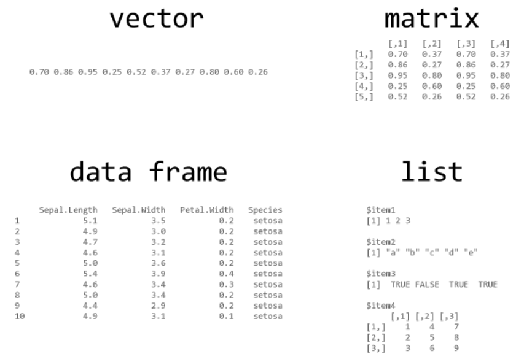
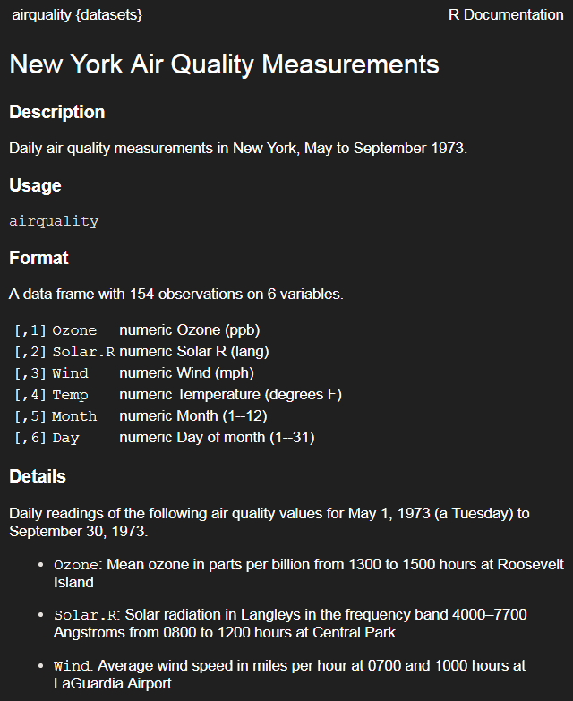

```{r, include=FALSE}
knitr::opts_chunk$set(echo = T,message=F,warning = F,cache=F,size="small")
showSolution=F
```


## [FIRST THINGS TO DO](http://uc-r.github.io/data_wrangling/week-3)

> Don’t try to kiss your data on the first date; rather, you just want to get to know the data:

1. Import the data
2. Review the codebook
3. **Learn about the data**
4. Quick (visual) understanding of the data


## [LEARN ABOUT THE DATA](http://uc-r.github.io/data_wrangling/week-3)

### So what are the first things we want to know about our data?

-  dimensions
-  data types (i.e. character, integer, factor, etc.)
-  missing values
-  summary statistics


What are some functions to extract this information?

## LEARN ABOUT THE DATA
-  So what are the first things we want to know about our data?
-  dimensions: `dim()`, `ncol()`, `nrow()`, `names()`
-  data types: `str()`, `class()`, `is.`, `as.`
-  missing values: `is.na()`, `sum(is.na())`, `colSums(is.na())`
-  summary statistics: `summary()`, `quantile()`, `var()`, `sd()`,
`table()`

## Data Frames

```{r,echo=F}

sysinf <- Sys.info()

if (sysinf["nodename"]=="MAC14077"){
  oldgitpath <- "D:/Daten/GitLab/IntroDataAnalysis/"  
}else{
  oldgitpath <- "D:/gitlab/IntroDataAnalysis/"
}

```


```{r,echo=F,eval=F}
library("readstata13")
dat <- read.dta13("../data/ZA5666_v1-0-0_Stata14.dta")
dat <- dat[1:100,]
save(dat,file="../data/ZA5666_v1-0-0_medium.RData")

datf <- read.dta13("../data/ZA5666_v1-0-0_Stata14.dta",
                   convert.factors = F)

datf <- datf[1:100,]
save(datf,file="../data/ZA5666_v1-0-0_medium_fac.RData")
```

<!--
## Outline for today

```{r,echo=F,eval=F}
library(knitr)
sched <- xlsx::read.xlsx2("../orga/schedule.xlsx",1)
dats <- sched[9:15,c(1,4,5)]
dats <- dats[-which(dats$Part=="Break"),]

kable(dats,row.names = F)
```
-->


```{r,echo=F,eval=F}
load(paste0(oldgitpath,"/data/ZA5666_v1-0-0_medium.RData"))
load(paste0(oldgitpath,"/data/ZA5666_v1-0-0_medium_fac.RData"))
```


### Example data:

```{r,echo=F,eval=F}
library("readstata13")
gpdat <- read.dta13("../data/ZA5666_v1-0-0_Stata14.dta",
                    convert.factors = F)
```

```{r,eval=F,echo=F}
library(foreign)
gpdat<-read.dta("https://github.com/Japhilko/RSocialScience/
              raw/master/data/GPanel.dta",convert.factors = F)
```

```{r}
ames_data <- AmesHousing::make_ames()
```


```{r}
typeof(ames_data)
```


```{r,eval=F}
head(names(ames_data))
```

```{r,echo=F}
head(names(ames_data[4:8]))
```

### Transfer to `data.frame` 

- Transfer data to a `data.frame`:

```{r}
ames_df <- data.frame(ames_data)
```

## Number of rows/columns

- Find out the number of rows/columns

```{r}
nrow(ames_df) # rows
ncol(ames_df) # columns
```

## View the data

- See the some lines:

```{r,eval=F}
head(ames_df) # first lines
tail(ames_df) # last lines
```

- Overview with Rstudio:


## What is the difference?



## [Indexing](http://uc-r.github.io/data_wrangling/week-3)

### The principle of indexing

```{r,eval=F}
vector[element]
data.frame[rows, columns]
matrix[rows, columns]
list[component]
list[[component]]
list$component
```

<!--
- `vector[element]`
- `data.frame[rows, columns]`
- `matrix[rows, columns]`
- `list[component]`
- `list[[component]]`
- `list$component`
-->


## Indexing

### Accessing Columns

- The dollar sign can also be used to address individual columns

```{r}
head(ames_df$Lot_Area)

ames_df$Lot_Area[1:10]
```


- As already described, you can use numbers to access the columns


```{r,eval=F}
head(ames_df[,5])
head(ames_df[,"Street"]) # the same result
```


<!--
## Excursus: Logical operations

```{r}
(a <- 1:7) # Example data - numerical
```

```{r}
a>4
a>=4
a<3
```

## Excursus: Logical operations II 

```{r}
(b <- letters[1:7]) # Example data - strings
b=="e"
b %in% c("e","f")
```
-->

<!--

## The use of sequences in indexing

```{r,eval=T,echo=F}
library("readstata13")
gpdat <- read.dta13("../data/ZA5666_v1-0-0_Stata14.dta",
                   convert.factors = F)
```

```{r}
gpdat[15:23,10:14]
```


-->


## Exercise: [Vectors and Indexing](http://web.math.ku.dk/~helle/R-intro/exercises.pdf)

Assume that we have registered the height and weight for four people: Heights in cm
are 180, 165, 160, 193; weights in kg are 87, 58, 65, 100. Make two vectors, height
and weight, with the data. The bodymass index (BMI) is defined as

$$
\dfrac{\text{weight in kg}}{\text{(height in m)}^2}
$$

Make a vector with the BMI values for the four people, and a vector with the natural
logarithm to the BMI values. Finally make a vector with the weights for those people
who have a BMI larger than 25.


## Subsetting dataset

<!--
-->

```{r}
Street <- ames_df$Street
table(Street)
```

```{r,eval=F}
ames_df[Street=="Grvl",]
# same result:
ames_df[Street!="Pave",]
```


```{r,echo=F,eval=F}
ames_df[Street=="Grvl",]
# same result:
ames_df[Street!="Pave",]
```


## Get stata attributes

```{r,eval=T}
att_dat <- attributes(ames_df)
head(names(att_dat))
```

### Example: the variable names 

```{r}
head(att_dat$names)
```

<!--
## Get variable labels

```{r,eval=F}
ncol(dat)
length(att_dat$names)

att_dat$var.labels[att_dat$names=="a11d054a"]
att_dat$label.table[names(att_dat$label.table)=="a11d054a"]
```


## [Variable labels](https://stackoverflow.com/questions/2151147/using-stata-variable-labels-in-r)

```{r,eval=F,echo=F}
library(foreign)
dat <- read.dta("../data/ZA5666_v1-0-0_Stata12.dta")
```

```{r,eval=F}
attributes(gpdat)
```


```{r,eval=T}
var.labels <- attr(gpdat,"var.labels")
```

- The same applies to the `haven` package

```{r,eval=F,echo=T}
library(haven)
dat_hav <- read_dta("../data/ZA5666_v1-0-0_Stata14.dta")
var.labels2 <- attr(dat_hav,"var.labels")
```


## GESIS Panel Variable - Estimated duration (bazq020a)

### How long did it take you to fill in the questionnaire?

```{r,eval=F}
duration <- as.numeric(gpdat$bazq020a)
```

```{r,eval=F}
summary(duration)
```

-->

<!--
## Recode missing values

```{r,eval=F}
summary(Ozone)
```

```{r}
gpdat$bazq020a[gpdat$bazq020a==-99] <- NA
summary(as.numeric(gpdat$bazq020a))
```
-->


<!--
## [Multiple Logical tests](http://uc-r.github.io/data_wrangling/week-4)


-->

## The `airquality` data

```{r}
data(airquality)
Ozone <- airquality$Ozone
```




## Other important options

- save result to an object


```{r,eval=F}
subDat <- airquality[Ozone>30,]
```

- multiple conditions can be linked with &


```{r,eval=F}
airquality[Ozone>18 & airquality$Month==5,]
```

```{r,echo=F,eval=F}
airquality[Ozone>18 & airquality$Month==5,1:4]
```

- the or argument - one of the two conditions must be fullfilled

```{r,eval=F}
airquality[Ozone>18 | airquality$Month==5,]
```


## [Missing values](http://faculty.nps.edu/sebuttre/home/R/missings.html)

- Missing values are defined as `NA` in R
- Math functions usually have a way to exclude missing values in their calculations.
- `mean(), median(), colSums(), var(), sd(), min()` and `max()` all take the `na.rm` argument.

```{r}
mean(Ozone)
```

```{r}
mean(Ozone,na.rm=T)
```

## Find the missing values:

```{r}
head(is.na(Ozone))
```

```{r}
which(is.na(Ozone))
```

```{r}
table(is.na(Ozone))
```


## [Missing Data Visualisations](https://cran.r-project.org/web/packages/naniar/vignettes/naniar-visualisation.html)

```{r,eval=F,echo=F}
install.packages("naniar")
```


```{r}
# Data Structures, Summaries, and Visualisations 
# for Missing Data
library(naniar) 
vis_miss(airquality)
```


## The command `complete.cases()`

<!--
### Example data

```{r}
mydata <- data.frame(A=c(1,NA,9,6),B=c("A","B",1,NA))
```
-->

### The command `complete.cases()` 

- returns a logical vector indicating which cases are complete.

```{r,eval=F}
nrow(gpdat)
# list rows of data without missing values 
gpdat_comp <- gpdat[complete.cases(gpdat),]
nrow(gpdat_comp)
```

## [An shorthand alternative ](http://uc-r.github.io/missing_values)

- An shorthand alternative is to simply use `na.omit()` to omit all rows containing missing values.

```{r}
gpdat_comp <- na.omit(gpdat)
nrow(gpdat_comp)
```


## Very simple imputation 

```{r}
# data frame with missing data
df <- data.frame(col1 = c(1:3, NA),
                 col2 = c("this", NA,"is", "text"), 
                 col3 = c(TRUE, FALSE, TRUE, TRUE), 
                 col4 = c(2.5, 4.2, 3.2, NA),
                 stringsAsFactors = FALSE)
                 
(df$col4[is.na(df$col4)] <- mean(df$col4, na.rm = TRUE))
```


## [NAs per column](http://uc-r.github.io/missing_values)

- For data frames, a convenient shortcut to compute the total missing values in each column is to use `colSums()`:

```{r,eval=T}
colSums(is.na(df))
```

## CRAN Task View: Missing Data


## Exercise: Missing values


1. How many missing values are in the built-in data set airquality?
2. Which variables are the missing values concentrated in?
3. How would you impute the mean or median for these values?
4. How would you omit all rows containing missing values?


<!--
## [Specify different types of missing value](https://stackoverflow.com/questions/16074384/specify-different-types-of-missing-values-nas)

```{r,eval=F,echo=F}
install.packages("memisc")
```

- Specify different types of missings with the package `memisc` 
- Use the command `include.missings()` to do so

```{r}
library(memisc)
```


```{r,eval=F}
?include.missings
```

```{r}
x <- rep(c(1:4,8,9),2,length=60)
labels(x) <- c(a=1,b=2,c=3,d=4,dk=8,refused=9)
```
-->


## [Codebook entries](https://github.com/tidyverse/tibble/issues/90)

- It is also possible to create stata like codebook entries with `memisc`.

```{r,eval=F}
codebook(gpdat$a11c019a)
```

<!--
## Another function

```{r}
name1 <- tolower(c("DEEPAYAN","SARKAR"))
```

```{r}
firstup <- function(x) {
   substr(x, 1, 1) <- toupper(substr(x, 1, 1))
    return(x)
}
```

```{r}
firstup(name1)
```
-->

<!--
## Restrict with the `tidyverse` package

```{r,eval=F}
head(gpdat[duration>20,1:4])
```

- the same with a command from `tidyverse` package

```{r,eval=F}
library(tidyverse)
filter(gpdat, duration>20)
```

```{r,echo=F,eval=F}
library(tidyverse)
head(filter(gpdat, duration>20))
```


```{r,eval=F,echo=F}
install.packages("tidyverse")
```
-->


## Rename the column names

- With the command `colnames` you get the column names

```{r,eval=F}
colnames(airquality)
```

- We can rename the column names:

```{r,eval=F}
colnames(airquality)[1] <- "var1"
```

- The same applies to the row names

```{r,eval=F}
rownames(airquality)
```

## Private internet usage (a11c034a)

> The Internet is constantly growing in significance for society. Therefore, we
are interested whether you yourself use the Internet at least occasionally
for private purposes?

```{r}
table(gpdat$a11c034a)
```


```{r,eval=T,echo=T}
ind <- which(names(att_dat$label.table)=="a11c034a")
att_dat$label.table[ind]
```


<!--
## Excursus: factors

- IDRE R LEARNING MODULES - [FACTOR VARIABLES](https://stats.idre.ucla.edu/r/modules/factor-variables/)
-->


## Levels of a factor

```{r,eval=T}
let <- as.factor(c(LETTERS[1:5],LETTERS[1:3]))
str(let)
levels(let)
levels(let)[2:4] <- c("first","second","third")
levels(let)
```


## Factor
A factor- type vector contains a set of numeric codes with character-valued levels.

### Example

- a family of two girls (1) and four boys (0),

```{r}
(kids <- factor(c(1,0,1,0,0,0),levels= c(0,1),
                labels= c("boy","girl")))
class(kids)
mode(kids)
```


## A factor

<!--
Regardless of the levels/labels of the factor,  the numeric storage is an integer with 1 corresponding to the
first level (in alph-order).
-->

```{r,warning=T}
kids + 1
as.numeric(kids)
1 + as.numeric(kids)
```


## Excursus - how to use labels 

> Tools for Working with Categorical Variables (Factors) 

```{r}
library("forcats") 
```

- `fct_collapse` -  to summarize factor levels
- `fct_count` - to count the entries in a factor
- `fct_drop`	- Take out unused levels

## The command `fct_count`

### Leisure time frequency: Read books (a11c026a)

```{r,echo=F,eval=F}
dat$a11c026a<-as.factor(dat$a11c026a)
```


```{r}
fct_count(f = let)
```

## The command `fct_collapse`

```{r}
letb <- fct_collapse(.f = let,
    important=c("first","second"))
```

```{r}
fct_count(letb)
```

## [`recode`](https://www.r-bloggers.com/recoding-variables-in-r-pedagogic-considerations/) command in package `car`

```{r,echo=F,eval=F}
install.packages("car")
```


```{r}
library(car)
```

```{r,eval=T}
head(let)
head(recode(let,"'first'='A';else='B'"))
```

<!--

## Exercise: recode value labels

- Translate the German value labels of the variable `bbzc022a` to english (You can use https://www.deepl.com/ for that)
- Recode that GESIS Panel variable that you end up with the English value lasbels.

-->


## The `apply` family

```{r}
(ApplyDat <- cbind(1:4,runif(4),rnorm(4))) # Example data set
```

```{r}
apply(ApplyDat,1,mean)
apply(ApplyDat,2,mean)
```


## The command `apply()`

```{r}
apply(ApplyDat,1,var)
apply(ApplyDat,1,sd)
apply(X = ApplyDat,MARGIN = 1,FUN = range)
```

## The arguments of the command `apply()`

- If `MARGIN=1` the function `mean` is applied for rows,

- If `MARGIN=2` the function `mean` is applied for columns,

- Instead of `mean` you could also use `var`, `sd` or `length`.

## The command `tapply()`

```{r}
ApplyDat <- data.frame(Income=rnorm(5,1400,200),
                       Sex=sample(c(1,2),5,replace=T))
```


### Example command `tapply()`

```{r}
tapply(ApplyDat$Income,
       ApplyDat$Sex,function(x)x)
```

- Other commands can also be used..... also self-scripted commands


## Exercise: using the `tapply()` command


- Calculate the average ozone value by month using the airquality dataset and the tapply command.

<!--
```{r,echo=showSolution,eval=showSolution}
dat <- readstata13::read.dta13("../data/ZA5666_v1-0-0_Stata14.dta")
```

- Calculate the average duration (variable `bfzq020a`) by age group


```{r,echo=showSolution,eval=showSolution}
dat$Dauer <- as.numeric(dat$bfzq020a)
dat$Dauer[dat$bfzq020a %in% c(-77,-22,-33,-77.-99)] <- NA
tapply(dat$Dauer,dat$bfzh070z,mean,na.rm=T)
```
-->

## [The `reshape` package](https://www.statmethods.net/management/reshape.html)

```{r,echo=F,eval=F}
install.packages("reshape")
```


### Example dataset 

```{r}
(mydata <- data.frame(id=rep(1:2,each=2), # sample dataset
                     time=rep(c(1,2),2),
                     x1 = c(5,3,6,2),
                     x2 = c(6,5,1,4)))
```


## Example of command `melt`

```{r}
library(reshape)
melt(mydata, id=c("id","time")) #  
```


## Merge data


```{r,eval=T,echo=F}
authors <- data.frame(
    ## I(*) : use character columns of names to get sensible sort order
    surname = I(c("Tukey", "Venables", "Tierney", "Ripley", "McNeil")),
    nationality = c("US", "Australia", "US", "UK", "Australia"),
    deceased = c("yes", rep("no", 4)))
authorN <- within(authors, { name <- surname; rm(surname) })
books <- data.frame(
    name = I(c("Tukey", "Venables", "Tierney",
             "Ripley", "Ripley", "McNeil", "R Core")),
    title = c("Exploratory Data Analysis",
              "Modern Applied Statistics ...",
              "LISP-STAT",
              "Spatial Statistics", "Stochastic Simulation",
              "Interactive Data Analysis",
              "An Introduction to R"),
    other.author = c(NA, "Ripley", NA, NA, NA, NA,
                     "Venables & Smith"))
```

```{r,eval=F,echo=F}
save(authorN,books,file="../data/merge_example_data.RData")
```

```{r,eval=F}
load("../data/merge_example_data.RData")
```


## `merge` data

- these two give the same results:

```{r}
(m0 <- merge(authorN, books))
```

```{r}
(m1 <- merge(authors, books, by.x = "surname", 
             by.y = "name"))
```


<!--
## The package `tibble`

```{r,eval=F,echo=F}
install.packages("tibble")
```

### Difference between tibble and data.frame

- There are three key differences between tibbles and data frames: printing, subsetting, and recycling rules.


```{r,eval=F}
library(tibble)
(gpanel1 <- as_tibble(dat))
```
-->

<!--
## Exercise: make a interactive table

- Download the dataset `dat_cf2.RData` from ILIAS
- Import dataset into R 
- Create an interactive table using the following commands

```{r,eval=F}
library(DT)
DT::datatable(dat_cf2)
```

- See which additional arguments of the function `datatable` are valuable

-->

## Links and resources

- [**Tidy data**](https://cran.r-project.org/web/packages/tidyr/vignettes/tidy-data.html) - the package `tidyr`

- Homepage for [**the `tidyverse` collection**](http://tidyverse.org/)

- [**Data wrangling with R and RStudio**](https://www.rstudio.com/resources/webinars/data-wrangling-with-r-and-rstudio/)


```{r,eval=F,echo=F}
# https://github.com/BAAQMD/copydat
devtools::install_github("BAAQMD/copydat")
install.packages("questionr")
devtools::install_github("ThinkR-open/littleboxes") # https://github.com/ThinkR-open/littleboxes
```

- Hadley Wickham - [**Tidy Data**](http://vita.had.co.nz/papers/tidy-data.pdf)
- Hadley Wickham - [**Advanced R**](http://adv-r.had.co.nz/)
- Colin Gillespie and Robin Lovelace [**Efficient R programming**](https://csgillespie.github.io/efficientR/)

- [**Quick-R about missing values**](http://www.statmethods.net/input/missingdata.html)

- [**Recode missing values**](http://uc-r.github.io/na_recode)

<!--
http://biostat.mc.vanderbilt.edu/wiki/pub/Main/Hmisc/Hmisc-refcard.pdf

https://www.r-exercises.com/product/dealing-with-missing-data/

https://www.r-exercises.com/2016/04/14/merging-dataframes-exercises/
-->