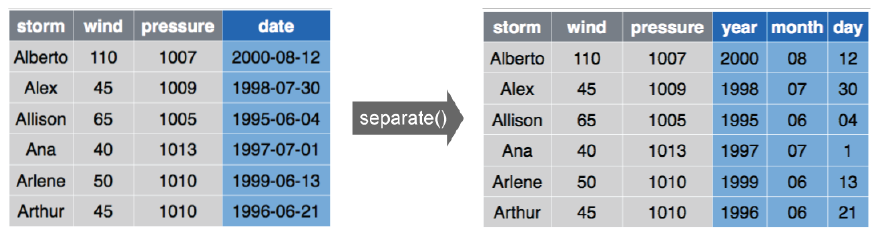

```{r setup, include=FALSE}
knitr::opts_chunk$set(echo = T,message=F,warning = F,size="small")
```

## 

<!--
https://datacarpentry.org/R-ecology-lesson/03-dplyr.html
-->


"Unless the data is something I’ve analyzed a lot before, I usually feel like
the blind men and the elephant."

[Jeff Leek](http://uc-r.github.io/data_wrangling/week-3)

---

## [WE WANT TIDY DATA?](http://uc-r.github.io/data_wrangling/week-3)

### What is tidy data?

- One variable per column
- One observation per row

```{r,echo=F,out.height="40%"}

```

---

## The tidyverse

The tidyverse is a coherent system of packages for data manipulation, exploration and visualization that share a common design philosophy.

[Joseph Rickert](https://rviews.rstudio.com/2017/06/08/what-is-the-tidyverse/)


---

## What is [tidyverse](https://rviews.rstudio.com/2017/06/08/what-is-the-tidyverse/)

```{r}
library(tidyverse)
```


---

## Basics: the pipe


### The package `magrittr`

```{r}
library(magrittr)
```


The pipe is used in many tidyverse packages

---

## Exercise: [random numbers](https://www.datacamp.com/community/tutorials/pipe-r-tutorial)

```{r,echo=F}
x <- c(0.109, 0.359, 0.63, 0.996, 0.515, 0.142, 0.017, 
       0.829, 0.907)
x <- runif(8)
```

1) Draw 8 random numbers from the uniform distribution (`rnorm`) and save them in a vector `x`

2) Compute the natural logarithm of `x`,  

3) and round the result

<!--
https://www.math.ucla.edu/~anderson/rw1001/library/base/html/diff.html
-->

```{r,echo=F,eval=F}
round(log(x), 1)
```

```{r,eval=F,echo=F}
x <- runif(1000)
summary(x)
summary(diff(x))

y <- c(1,4,5)
log(exp(5))
```


---

## [The pipe operator](https://www.datacamp.com/community/tutorials/pipe-r-tutorial)


```{r}
library(magrittr)

# Perform the same computations on `x` as above
x %>% log() %>%
    round(1)
```

---

## Four key tidyr functions

You'll learn four key `tidyr` functions that allow you to solve
the vast majority of your data tidying challenges:

-  `gather`: transforms data from wide to long
-  `spread`: transforms data from long to wide
-  `separate`: splits a single column into multiple columns
-  `unite`: combines multiple columns into a single column


---

## How `gather` function works


---

## The `gather` function

```{r}
load("../data/tidy_data.RData")
cases %>% gather(Year,n,2:4)
```

---

## [The gather function](http://uc-r.github.io/data_wrangling/week-3)

### Code alternatives:

```{r,eval=F}
# These all produce the same results:
cases %>% gather(Year, n, "2011":"2013")
cases %>% gather(Year, n, "2011", "2012", "2013")
cases %>% gather(Year, n, 2:4)
cases %>% gather(Year, n, -country)
```

- Also note that if you do not supply arguments for `na.rm` or convert values then the defaults are used

---

## The seperate function

```{r}
storms <- storms %>% 
  separate(date, c("year", "month", "day"))
```

- By default, if no separator is specified, will separate by any regular expression that matches any sequence of non-alphanumeric values


```{r,eval=F}
storms %>% 
  separate(date, c("year", "month", "day"), sep = "-")
```



---

## The unite function

```{r,eval=F}
# same results:
storms %>% unite(date, year, month, day, sep = "_")
storms %>% unite(date, year, month, day)
# If no separator is identified, 
# "_" will automatically be used
```


---

## The R-package `data.table`

### Get an overview

```{r}
data(airquality)
head(airquality)
```

---

## Overview with `data.table`

```{r}
library(data.table)
(airq <- data.table(airquality))
```

---

## The `dplyr` package

```{r}
library(dplyr)
```


---

## Important functions of `dplyr`

- `filter`: pick observations based on values
- `arrange`: reorder data
- `select`: pick variables
- `mutate`: create new variables
- `summarize`: summarize data by functions of choice
- `group_by`: group data by categorical levels

---

## PACKAGE and data

```{r,eval=F,echo=F}
install.packages("nycflights13")
```


```{r}
library(nycflights13)
```

```{r,eval=F}
flights
```


---

## Exercise: Vignette and additional documentation

- Are there vignettes for the `dplyr` package?
- Can you find additional documentation explaining the `flights`
data set?

---

## the `filter` command

### Filter values based on defined conditions

Filter based on one or more variables

```{r,eval=F}
filter(flights,month==1)
```


---

## BASIC FILTERING

### Filter based on one or more variables

```{r,eval=F}
filter(flights,month==1,day==1)
```


---

## Filter based on one or more variables

```{r,eval=F}
filter(flights,month==1,day==1,dep_delay > 0)
```


---

## Comparison

### What will these operations produce?

```{r,eval=F}
filter(flights,month==12)
filter(flights,month!=12)
filter(flights,month %in% c(11,12))
filter(flights,arr_delay <= 120)
filter(flights,!(arr_delay <= 120))
filter(flights,is.na(tailnum))
```

---

## [MULTIPLE COMPARISONS](http://uc-r.github.io/data_wrangling/week-4)

### Using comma is same as using & 

```{r,eval=F}
filter(flights,month==12, day==25)
filter(flights,month==12 & day==25)
```


### Use `%in%` as a shortcut for `|`

```{r,eval=F}
filter(flights,month==11 | month==12)
filter(flights,month %in% c(11,12))
```

---

## Are these the same?

```{r,eval=F}
filter(flights, !(arr_delay > 120 | dep_delay > 120))
filter(flights, arr_delay <= 120,dep_delay <= 120)
```

---

## Exercise: `dplyr` and `flights` dataset

### Find the number of flights that:

(a) Had an arrival delay of two or more hours

(b) Flew to Houston (IAH or HOU)

(c) Arrived more than two hours late, but didn’t leave
late


---

## `arrange` - reorder data

### Order data based on one or more variables

```{r,eval=F}
arrange(flights, dep_delay)
```


---

## ORDERING YOUR DATA

### Order data based on one or more variables

```{r,eval=F}
arrange(flights, dep_delay, arr_delay)
```


---

## Reverse ordering

### Reverse the order by using `desc()`

```{r,eval=F}
arrange(flights, desc(dep_delay))
```


---

## Ordering and missing values

- Note that missing values are always sorted at the end:


---

## Exercise: Sorting `flights` data

### Sort and find flights

(a) Sort flights to find those with largest departure delays.

(b) Find the flights that left earliest based on departure time.

(c) Which flights traveled the longest distance?

(d) Which traveled the shortest?

---

## `select` - select variables of concern

### SELECTING VARIABLES

Select one or more variables

```{r,eval=F}
select(flights, year, month, day)
```


---

## Deselect one or more variables

```{r,eval=F}
select(flights, -(year:day))
```


<!--

-->

---

## USEFUL `select` FUNCTIONS

### Blue functions come in `dplyr`


---

## SELECTING VARIABLES

### Select variables based on name patterns


---

## [RENAMING VARIABLES]()

Other times we just want to rename our variables:

```{r,eval=F}
rename(flights, ANNOYING = dep_delay)
```


---

## Exercises: the commands `select` and `one_of()` 

(a) What happens if you include the name of a variable multiple times in a `select` call?
(b) What does the `one_of()` function do? Why might it be helpful in conjunction with this vector?

```{r}
vars <- c("MONTH","month","day","dep_delay","arr_delay")
```


(c) Does the result of running the following code surprise you? How do the select helpers deal with case by default? How can you change that default?

```{r,eval=F}
select(flights,contains("TIME"))
```


---

## [REDUCE OUR DATA](http://uc-r.github.io/data_wrangling/week-4)

Lets work with a smaller data set

```{r,eval=F}
(flights_sml <- select(flights,year:day,
                      ends_with("delay"),
                      distance,air_time))
```

---

## [CREATE NEW VARIABLES](http://uc-r.github.io/data_wrangling/week-4)

`mutate` creates new variables with functions of existing variables:

```{r,eval=F}
mutate(flights_sml,gain=arr_delay - dep_delay,
       speed = distance/air_time * 60)
```


---

## CREATE NEW VARIABLES

Note: you can create variables based on columns that you’ve just created:

```{r,eval=F}
mutate(flights_sml,gain=arr_delay - dep_delay,
       hours = air_time / 60, gain_per_hour = gain / hours)

```


---

## MANY USEFUL CREATION FUNCTIONS

There are a wide variety of functions you can use with `mutate()`

{height=80%}

---

## Exercise: `tidyverse` convert

(a) Create a new variable `distance_km` that converts
distance in miles to kilometers.

(b) Create a `time_per_km` variable based on `air_time` and `distance_km`.

<!--
## Command `mutate` - create or transform variables

```{r,eval=F}
?dplyr::mutate
```

```{r}
airq %>%
  mutate(Temp / max(Temp, na.rm = TRUE)) 
```
-->

---

## [Convert all columns of a vector to character](https://stackoverflow.com/questions/43789278/convert-all-columns-to-characters-in-a-data-frame)

```{r}
library(dplyr)
mtcars %>%  mutate_all(as.character)
```

---

## `summarise` - Collapse many values down to a single summary statistic

We can create summary statistics of one or more variables:


---

## [Get summary statistics by group](http://www.sthda.com/english/wiki/one-way-anova-test-in-r)

```{r}
library(dplyr)
group_by(iris, Species) %>%
  summarise(
    count = n(),
    mean = mean(Sepal.Length, na.rm = TRUE),
    sd = sd(Sepal.Length, na.rm = TRUE)
  )
```

---

## Links and resources

- UC Business Analytics R Programming Guide  - [**Course: Data Wrangling with R**](http://uc-r.github.io/data_wrangling/week-3)
- [**Manipulating, analyzing and exporting data with tidyverse**](https://datacarpentry.org/R-ecology-lesson/03-dplyr.html)
[**Pipes in R Tutorial For Beginners**](https://www.datacamp.com/community/tutorials/pipe-r-tutorial)
- [**Convert all columns** to characters in a data.frame](https://stackoverflow.com/questions/43789278/convert-all-columns-to-characters-in-a-data-frame)

<!--
http://people.duke.edu/~ccc14/duke-hts-2018/cliburn/R_tidyyverse_Exercise_Solutions.html
http://cbdm-01.zdv.uni-mainz.de/~galanisl/danalysis/import-and-the-tibble.html#the-tibble
https://b-rodrigues.github.io/modern_R/getting-to-know-rstudio.html#panes

https://www.tiq-solutions.de/tidyverse-ein-moderner-ansatz-fuer-datenanalysen-in-r/

http://uc-r.github.io/data_wrangling/week-3

-->