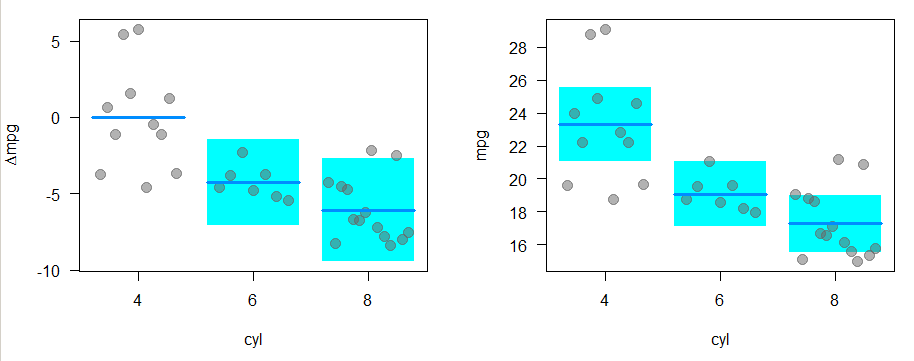
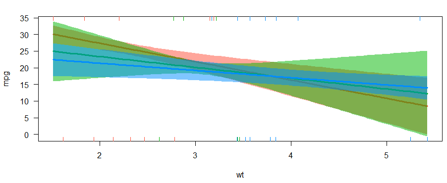

```{r setupregression, include=FALSE}
knitr::opts_chunk$set(echo = T,warning = F,message = F)
pres=T
```

## Variables of the `mtcars` dataset

Help for the `mtcars` dataset:

```{r,eval=F}
?mtcars
```
<!--
displacement - Hubraum
-->
-	 mpg -	 Miles/(US) gallon
-	 cyl -	 Number of cylinders
-	 disp	- Displacement (cu.in.)
-	 hp	- Gross horsepower
-	 drat -	 Rear axle ratio
- wt	- Weight (1000 lbs)
-	 qsec	- 1/4 mile time
-	 vs	- Engine (0 = V-shaped, 1 = straight)
-	 am	-  Transmission (0 = automatic, 1 = manual)
-	 gear	-  Number of forward gears
-	 carb -	 Number of carburetors


---

## Dataset `mtcars`

```{r,echo=F}
library(knitr)
kable(mtcars,"html")
```


---

## Distributions of two variables of `mtcars`

```{r}
par(mfrow=c(1,2))
plot(density(mtcars$wt)); plot(density(mtcars$mpg))
```

---

## A simple regression model

### Dependent variable - miles per gallon (mpg)

### Independent variable - weight (wt)

```{r}
m1 <- lm(mpg ~ wt,data=mtcars)
m1
```

---

## Get the model summary 

```{r}
summary(m1) 
```

---

## The model formula

### Model without intercept

```{r}
m2 <- lm(mpg ~ - 1 + wt,data=mtcars)
summary(m2)$coefficients
```

### Adding further variables

```{r}
m3 <- lm(mpg ~ wt + cyl,data=mtcars)
summary(m3)$coefficients
```

---

## [Estimation based on a subsample ](https://www.schmidheiny.name/teaching/rguide.pdf)

```{r}
lm(mpg~wt+disp, data=mtcars, subset=(wt>3))
```

- where only cars heavier than 3000 lb are considered.

---

## The command `as.formula`

### Creating a formula object

```{r,eval=F}
?as.formula
```

```{r}
fo <- mpg ~ wt + cyl
```


```{r}
class(fo)
```

```{r}
# The formula object can be used in the regression:
m3 <- lm(fo,data=mtcars)
```

---

## [Further possibilities to specify the formula](https://cran.r-project.org/web/packages/Formula/vignettes/Formula.pdf)

### Take all available predictors

```{r}
m3_a<-lm(mpg~.,data=mtcars) 
```

### Interaction effect

```{r}
# effect of cyl and interaction effect:
m3a<-lm(mpg~wt*cyl,data=mtcars) 

# only interaction effect:
m3b<-lm(mpg~wt:cyl,data=mtcars) 
```


```{r,eval=F,echo=F}
m3c<-lm(mpg~cyl|wt,data=mtcars)

m3c<-lm(mpg~cyl/wt,data=mtcars)

summary(m3b)
summary(m3c)
```


### Take the logarithm

```{r}
m3d<-lm(mpg~log(wt),data=mtcars) 
```

<!--
https://www.r-bloggers.com/r-tutorial-series-regression-with-interaction-variables/

https://www.r-bloggers.com/interpreting-interaction-coefficient-in-r-part1-lm/
-->

---

## [Further transformations](https://www.schmidheiny.name/teaching/rguide.pdf)

### Further transformations:

Tranformations of variables are directly included with the $I()$ function:

```{r}
fo2 <- I(log(mpg))~wt+I(wt^2)+disp
lm(fo2, data=mtcars)
```

---

## The command `setdiff`

- We can use the command to create a dataset with only the features, without the dependent variable

```{r}
names(mtcars)
features <- setdiff(names(mtcars), "mpg")
features
```

```{r}
featdat <- mtcars[,features]
```

---

## The command `model.matrix`

<!--
- Construct Design Matrices

https://genomicsclass.github.io/book/pages/expressing_design_formula.html
-->

- With `model.matrix` the qualitative variables are automatically dummy encoded 

```{r,eval=F}
?model.matrix
```


```{r}
model.matrix(m3d)
```

---

## Model matrix (II)

- [We can also create a model matrix directly from the formula and data arguments](http://pages.stat.wisc.edu/~st849-1/Rnotes/ModelMatrices.html)
- See `Matrix::sparse.model.matrix` for increased efficiency on large dimension data.

```{r}
ff <- mpg ~ log(wt):cyl
m <- model.frame(ff, mtcars)
```

```{r}
(mat <- model.matrix(ff, m))
```


---

## A model with interaction effect

<!--
drat - Hinterachsenübersetzung
disp - Hubraum
-->

```{r}
# disp	-  Displacement (cu.in.)
m3d<-lm(mpg~wt*disp,data=mtcars) 
m3dsum <- summary(m3d)
m3dsum$coefficients
```

---

## Residual plot - model assumptions violated? 


- We have model assumptions violated if points deviate with a pattern from the line 

```{r,eval=pres}
plot(m3,1)
```


---

## Residual plot

```{r}
plot(m3,2)
```

- If the residuals are normally distributed, they should be on the same line.

---

## Another example for object orientation

- `m3` is now a special regression object
- Various functions can be applied to this object

```{r,eval=F}
predict(m3) # Prediction
resid(m3) # Residuals
```

```{r,echo=F}
head(predict(m3)) # Prediction
head(resid(m3)) # Residuals
```

---

## Make model prediction

```{r}
pre <- predict(m1)
head(mtcars$mpg)
head(pre)
```

---

## Regression diagnostic with base-R

### Visualizing residuals

```{r,eval=F}
plot(mtcars$wt,mtcars$mpg)
abline(m1)
segments(mtcars$wt, mtcars$mpg, mtcars$wt, pre, col="red")
```


---

## [The bias-variance tradeoff](https://en.wikipedia.org/wiki/Bias%E2%80%93variance_tradeoff) (I)

The bias–variance tradeoff is the property of a set of predictive models whereby models with a lower bias in parameter estimation have a higher variance of the parameter estimates across samples, and vice versa. 

### The bias error 

... is an error from erroneous assumptions in the learning algorithm. High bias can cause an algorithm to miss the relevant relations between features and target outputs (underfitting).

### The variance 

... is an error from sensitivity to small fluctuations in the training set. High variance can cause an algorithm to model the random noise in the training data, rather than the intended outputs (overfitting).


---

## The bias-variance tradeoff (II)

<!--
xxxxtodo: the source is missing
-->

{height=80%}


---

## The mean squared error (mse)

- The [**MSE**](https://en.wikipedia.org/wiki/Mean_squared_error) measures the average of the squares of the errors
- [**The lower the better**](http://r-statistics.co/Linear-Regression.html)

```{r}
(mse5 <- mean((mtcars$mpg -  pre)^2)) # model 5
(mse3 <- mean((mtcars$mpg -  predict(m3))^2)) 
```

<!--
https://stats.stackexchange.com/questions/107643/how-to-get-the-value-of-mean-squared-error-in-a-linear-regression-in-r
-->

### Package `Metrics` to compute mse

```{r,eval=F,echo=F}
install.packages("Metrics")
```

```{r}
library(Metrics)
mse(mtcars$mpg,predict(m3))
```

---

## The `visreg`-package

```{r,eval=F}
install.packages("visreg")
install.packages("Metrics")
```

```{r}
library(visreg)
```


---

## The `visreg`-package

- The default-argument for `type` is `conditional`.
- Scatterplot of `mpg` and `wt` plus regression line and confidence bands

```{r,eval=F}
visreg(m1, "wt", type = "conditional")
```

```{r,eval=F,echo=F}
visreg(m1, "wt", type = "conditional",
      line=list(col="red"),
       fill=list(col="#473C8B"),points=list(cex=1.5,col=rgb(0,1,0,.5)))
```


---

## Regression with factors

- The effects of factors can also be visualized with `visreg`:

```{r}
mtcars$cyl <- as.factor(mtcars$cyl)
m4 <- lm(mpg ~ cyl + wt, data = mtcars)
# summary(m4)
```

```{r,echo=F}
sum_m4 <- summary(m4)
sum_m4$coefficients
```

---

## Effects of factors


```{r,eval=F}
par(mfrow=c(1,2))
visreg(m4, "cyl", type = "contrast")
visreg(m4, "cyl", type = "conditional")
```

```{r,eval=F,echo=F}
par(mfrow=c(1,2))
visreg(m4, "cyl", type = "contrast",fill=list(col=c("#00FFFF")),points=list(cex=1.5,col=rgb(.4,.4,.4,.5)))
visreg(m4, "cyl", type = "conditional",fill=list(col=c("#00FFFF")),points=list(cex=1.5,col=rgb(.4,.4,.4,.5)))
```




---

## The package `visreg` - Interactions

```{r}
m5 <- lm(mpg ~ cyl*wt, data = mtcars)
# summary(m5)
```

```{r,echo=F}
sum_m5 <- summary(m5)
sum_m5$coefficients
```

---

## Control of the graphic output with `layout`.

```{r,eval=pres}
visreg(m5, "wt", by = "cyl",layout=c(3,1))
```


```{r,eval=pres,echo=F}
visreg(m5, "wt", by = "cyl",layout=c(3,1),fill=list(col=c("#00FFFF")),points=list(cex=1.5,col=rgb(.4,.4,.4,.5)))
```


---

## The package `visreg` - Interactions overlay

```{r}
m6 <- lm(mpg ~ hp + wt * cyl, data = mtcars)
```


```{r,eval=pres}
visreg(m6, "wt", by="cyl", overlay=TRUE, partial=FALSE)
```



---

## The package `visreg` - `visreg2d`

```{r}
visreg2d(m6, "wt", "hp", plot.type = "image")
```


---

## Exercise: regression Ames housing data

1) Install the package `AmesHousing` and create a [**processed version**](https://cran.r-project.org/web/packages/AmesHousing/AmesHousing.pdf) of the Ames housing data with (at least) the variables `Sale_Price`, `Gr_Liv_Area` and `TotRms_AbvGrd`
2) Create a regression model with `Sale_Price` as dependent and `Gr_Liv_Area` and `TotRms_AbvGrd` as independent variables. Then create seperated models for the two independent variables. Compare the results. What do you think?


---

## [The Ames Iowa Housing Data](http://ww2.amstat.org/publications/jse)

```{r}
ames_data <- AmesHousing::make_ames()
```

### Some Variables

- `Gr_Liv_Area`: Above grade (ground) living area square feet
- `TotRms_AbvGrd`: Total rooms above grade (does not include bathrooms
- `MS_SubClass`: Identifies the type of dwelling involved in the sale.
- `MS_Zoning`: Identifies the general zoning classification of the sale.
- `Lot_Frontage`: Linear feet of street connected to property
- `Lot_Area`: Lot size in square feet
- `Street`: Type of road access to property
- `Alley`: Type of alley access to property
- `Lot_Shape`: General shape of property
- `Land_Contour`: Flatness of the propert

---

## Multicollinearity

- As p increases we are more likely to capture multiple features that have some multicollinearity. 
- When multicollinearity exists, we often see high variability in our coefficient terms. 
- E.g. we have a correlation of 0.801 between `Gr_Liv_Area` and `TotRms_AbvGrd` 
- Both variables are strongly correlated to the response variable (`Sale_Price`).

```{r,echo=F}
library(AmesHousing) 
ames_data <- AmesHousing::make_ames()
```


```{r}
ames_data <- AmesHousing::make_ames()
cor(ames_data[,c("Sale_Price","Gr_Liv_Area","TotRms_AbvGrd")])
```


---

## Multicollinearity

```{r}
lm(Sale_Price ~ Gr_Liv_Area + TotRms_AbvGrd, data = ames_data)
```

- When we fit a model with both these variables we get a positive coefficient for `Gr_Liv_Area` but a negative coefficient for `TotRms_AbvGrd`, suggesting one has a positive impact to Sale_Price and the other a negative impact.

---

## Seperated models

- If we refit the model with each variable independently, they both show a positive impact. 
- The `Gr_Liv_Area` effect is now smaller and the `TotRms_AbvGrd` is positive with a much larger magnitude.

```{r}
lm(Sale_Price ~ Gr_Liv_Area, data = ames_data)$coefficients
```

```{r}
lm(Sale_Price ~ TotRms_AbvGrd, data = ames_data)$coefficients
```

- This is a common result when collinearity exists. 
- Coefficients for correlated features become over-inflated and can fluctuate significantly. 


---

## Consequences

- One consequence of these large fluctuations in the coefficient terms is [**overfitting**](https://en.wikipedia.org/wiki/Overfitting), which means we have high variance in the bias-variance tradeoff space. 
- We can use tools such as [**variance inflaction factors**](https://en.wikipedia.org/wiki/Variance_inflation_factor) (Myers, 1994) to identify and remove those strongly correlated variables, but it is not always clear which variable(s) to remove. 
- Nor do we always wish to remove variables as this may be removing signal in our data.

---

## Links - linear regression


<!--
https://www.dataquest.io/blog/statistical-learning-for-predictive-modeling-r/

https://www.r-bloggers.com/example-of-overfitting/

https://blog.minitab.com/blog/adventures-in-statistics-2/the-danger-of-overfitting-regression-models


https://statisticsbyjim.com/regression/overfitting-regression-models/

https://towardsdatascience.com/overfitting-vs-underfitting-a-complete-example-d05dd7e19765

https://www.analyticsvidhya.com/blog/2016/12/practical-guide-to-implement-machine-learning-with-caret-package-in-r-with-practice-problem/


https://statisticsbyjim.com/regression/overfitting-regression-models/
-->


-  Regression - [**r-bloggers**](http://www.r-bloggers.com/r-tutorial-series-simple-linear-regression/)

-  The complete book of [**Faraway**](http://cran.r-project.org/doc/contrib/Faraway-PRA.pdf)- very intuitive

-  Good introduction on [**Quick-R**](http://www.statmethods.net/stats/regression.html)

- [**Multiple regression**](https://www.r-bloggers.com/multiple-regression-part-1/)

- [**15 Types of Regression you should know**](https://www.r-bloggers.com/15-types-of-regression-you-should-know/)

- [**`ggeffects` - Create Tidy Data Frames of Marginal Effects for ‘ggplot’ from Model Outputs**](https://strengejacke.github.io/ggeffects/)


- [**Machine learning iteration**](https://elitedatascience.com/machine-learning-iteration)


---

## Nice table output with [`stargazer`](https://cran.r-project.org/web/packages/stargazer/vignettes/stargazer.pdf)


```{r,eval=F,echo=F}
install.packages("stargazer")
```

```{r,eval=F}
library(stargazer)
stargazer(m3, type="html")
```

### Example HTML output:


---

## Shiny App - Diagnostics for linear regression

<!--
https://gallery.shinyapps.io/slr_diag/
-->

- Shiny App - [**Simple Linear Regression**](https://gallery.shinyapps.io/simple_regression/)

- Shiny App - [**Multicollinearity in multiple regression**](figure/https://gallery.shinyapps.io/collinearity/)

<!--
[](https://gallery.shinyapps.io/slr_diag/)
-->

<!--
https://www.r-bloggers.com/elegant-regression-results-tables-and-plots-in-r-the-finalfit-package/
https://www.r-bloggers.com/regression-analysis-essentials-for-machine-learning/
https://www.r-bloggers.com/15-types-of-regression-you-should-know/
https://www.r-bloggers.com/marginal-effects-for-regression-models-in-r-rstats-dataviz/
http://pbreheny.github.io/visreg/contrast.html
-->

<!--
ToDo:

How to compute the mean squared error:
https://stats.stackexchange.com/questions/107643/how-to-get-the-value-of-mean-squared-error-in-a-linear-regression-in-r

http://r-statistics.co/Linear-Regression.html

Colinearity
https://journal.r-project.org/archive/2017/RJ-2017-048/RJ-2017-048.pdf
-->

<!--
http://r-statistics.co/Linear-Regression.html
https://machinelearningmastery.com/linear-regression-in-r/
https://journal.r-project.org/archive/2017/RJ-2017-048/RJ-2017-048.pdf
https://cran.r-project.org/web/packages/Metrics/Metrics.pdf
-->


<!--
ToDo Liste

Den Effekt von cross validation zeigen
-->