```{r setupregression, include=FALSE}
knitr::opts_chunk$set(echo = T,warning = F,message = F)
pres=T
```

## Variables of the `mtcars` dataset

Help for the `mtcars` dataset:

```{r,eval=F}
?mtcars
```
<!--
displacement - Hubraum
-->
-	 mpg -	 Miles/(US) gallon
-	 cyl -	 Number of cylinders
-	 disp	- Displacement (cu.in.)
-	 hp	- Gross horsepower
-	 drat -	 Rear axle ratio
- wt	- Weight (1000 lbs)
-	 qsec	- 1/4 mile time
-	 vs	- Engine (0 = V-shaped, 1 = straight)
-	 am	-  Transmission (0 = automatic, 1 = manual)
-	 gear	-  Number of forward gears
-	 carb -	 Number of carburetors


---

## Dataset `mtcars`

```{r,echo=F}
library(knitr)
kable(mtcars,"html")
```


---

## Distributions of two variables of `mtcars`

```{r}
par(mfrow=c(1,2))
plot(density(mtcars$wt)); plot(density(mtcars$mpg))
```

---

## A simple regression model

### Dependent variable - miles per gallon (mpg)

### Independent variable - weight (wt)

```{r}
m1 <- lm(mpg ~ wt,data=mtcars)
m1
```

---

## Get the model summary 

```{r}
summary(m1) 
```

---

## The model formula

### Model without intercept

```{r}
m2 <- lm(mpg ~ - 1 + wt,data=mtcars)
summary(m2)$coefficients
```

### Adding further variables

```{r}
m3 <- lm(mpg ~ wt + cyl,data=mtcars)
summary(m3)$coefficients
```

---

## [Estimation based on a subsample ](https://www.schmidheiny.name/teaching/rguide.pdf)

```{r}
lm(mpg~wt+disp, data=mtcars, subset=(wt>3))
```

- where only cars heavier than 3000 lb are considered.

---

## The command `as.formula`

### Creating a formula object

```{r,eval=F}
?as.formula
```

```{r}
fo <- mpg ~ wt + cyl
```


```{r}
class(fo)
```

```{r}
# The formula object can be used in the regression:
m3 <- lm(fo,data=mtcars)
```

---

## [Further possibilities to specify the formula](https://cran.r-project.org/web/packages/Formula/vignettes/Formula.pdf)

### Take all available predictors

```{r}
m3_a<-lm(mpg~.,data=mtcars) 
```

### Interaction effect

```{r}
# effect of cyl and interaction effect:
m3a<-lm(mpg~wt*cyl,data=mtcars) 

# only interaction effect:
m3b<-lm(mpg~wt:cyl,data=mtcars) 
```


```{r,eval=F,echo=F}
m3c<-lm(mpg~cyl|wt,data=mtcars)

m3c<-lm(mpg~cyl/wt,data=mtcars)

summary(m3b)
summary(m3c)
```


### Take the logarithm

```{r}
m3d<-lm(mpg~log(wt),data=mtcars) 
```

<!--
https://www.r-bloggers.com/r-tutorial-series-regression-with-interaction-variables/

https://www.r-bloggers.com/interpreting-interaction-coefficient-in-r-part1-lm/
-->

---

## [Further transformations](https://www.schmidheiny.name/teaching/rguide.pdf)

### Further transformations:

Tranformations of variables are directly included with the $I()$ function:

```{r}
fo2 <- I(log(mpg))~wt+I(wt^2)+disp
lm(fo2, data=mtcars)
```

---

## The command `setdiff`

- We can use the command to create a dataset with only the features, without the dependent variable

```{r}
names(mtcars)
features <- setdiff(names(mtcars), "mpg")
features
```

```{r}
featdat <- mtcars[,features]
```

---

## The command `model.matrix`

<!--
- Construct Design Matrices

https://genomicsclass.github.io/book/pages/expressing_design_formula.html
-->

- With `model.matrix` the qualitative variables are automatically dummy encoded 

```{r,eval=F}
?model.matrix
```


```{r}
model.matrix(m3d)
```

---

## Model matrix (II)

- [We can also create a model matrix directly from the formula and data arguments](http://pages.stat.wisc.edu/~st849-1/Rnotes/ModelMatrices.html)
- See `Matrix::sparse.model.matrix` for increased efficiency on large dimension data.

```{r}
ff <- mpg ~ log(wt):cyl
m <- model.frame(ff, mtcars)
```

```{r}
(mat <- model.matrix(ff, m))
```


---

## A model with interaction effect

<!--
drat - Hinterachsenübersetzung
disp - Hubraum
-->

```{r}
# disp	-  Displacement (cu.in.)
m3d<-lm(mpg~wt*disp,data=mtcars) 
m3dsum <- summary(m3d)
m3dsum$coefficients
```

---

## Residual plot - model assumptions violated? 


- We have model assumptions violated if points deviate with a pattern from the line 

```{r,eval=pres}
plot(m3,1)
```

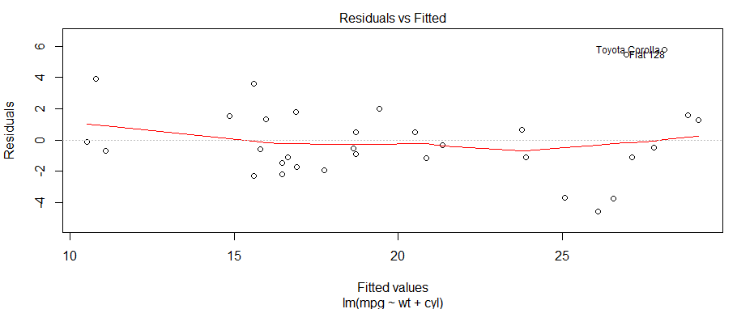

---

## Residual plot

```{r}
plot(m3,2)
```

- If the residuals are normally distributed, they should be on the same line.

---

## Another example for object orientation

- `m3` is now a special regression object
- Various functions can be applied to this object

```{r,eval=F}
predict(m3) # Prediction
resid(m3) # Residuals
```

```{r,echo=F}
head(predict(m3)) # Prediction
head(resid(m3)) # Residuals
```

---

## Make model prediction

```{r}
pre <- predict(m1)
head(mtcars$mpg)
head(pre)
```

---

## Regression diagnostic with base-R

### Visualizing residuals

```{r,eval=F}
plot(mtcars$wt,mtcars$mpg)
abline(m1)
segments(mtcars$wt, mtcars$mpg, mtcars$wt, pre, col="red")
```

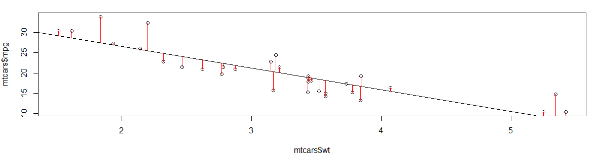


---

## [The bias-variance tradeoff](https://en.wikipedia.org/wiki/Bias%E2%80%93variance_tradeoff) (I)

The bias–variance tradeoff is the property of a set of predictive models whereby models with a lower bias in parameter estimation have a higher variance of the parameter estimates across samples, and vice versa. 

### The bias error 

... is an error from erroneous assumptions in the learning algorithm. High bias can cause an algorithm to miss the relevant relations between features and target outputs (underfitting).

### The variance 

... is an error from sensitivity to small fluctuations in the training set. High variance can cause an algorithm to model the random noise in the training data, rather than the intended outputs (overfitting).


---

## [The bias-variance tradeoff (II)](https://elitedatascience.com/bias-variance-tradeoff)

<!--
xxxxtodo: the source is missing
-->


```{r,echo=F,out.width="70%"}
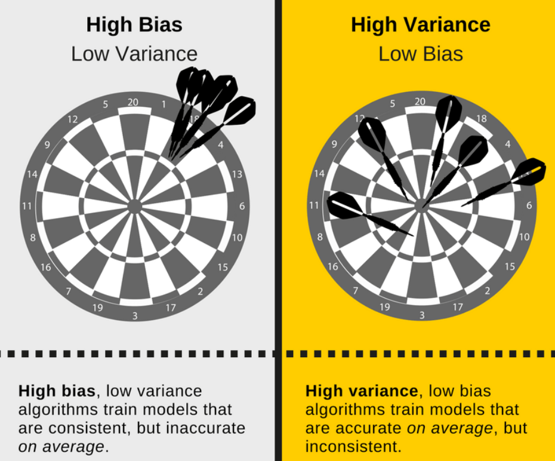
```


---

## The mean squared error (mse)

- The [**MSE**](https://en.wikipedia.org/wiki/Mean_squared_error) measures the average of the squares of the errors
- [**The lower the better**](http://r-statistics.co/Linear-Regression.html)

```{r}
(mse5 <- mean((mtcars$mpg -  pre)^2)) # model 5
(mse3 <- mean((mtcars$mpg -  predict(m3))^2)) 
```

<!--
https://stats.stackexchange.com/questions/107643/how-to-get-the-value-of-mean-squared-error-in-a-linear-regression-in-r
-->

### Package Metrics to compute mse

```{r,eval=F,echo=F}
install.packages("Metrics")
```

```{r}
library(Metrics)
mse(mtcars$mpg,predict(m3))
```

---

## The `visreg`-package

```{r,eval=F,echo=F}
install.packages("visreg")
install.packages("Metrics")
```

```{r}
library(visreg)
```


---

## The `visreg`-package

- The default-argument for `type` is `conditional`.
- Scatterplot of `mpg` and `wt` plus regression line and confidence bands

```{r,eval=F}
visreg(m1, "wt", type = "conditional")
```

```{r,eval=F,echo=F}
visreg(m1, "wt", type = "conditional",
      line=list(col="red"),
       fill=list(col="#473C8B"),points=list(cex=1.5,col=rgb(0,1,0,.5)))
```

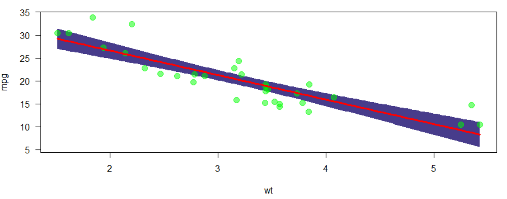


---

## Regression with factors

- The effects of factors can also be visualized with `visreg`:

```{r}
mtcars$cyl <- as.factor(mtcars$cyl)
m4 <- lm(mpg ~ cyl + wt, data = mtcars)
# summary(m4)
```

```{r,echo=F}
sum_m4 <- summary(m4)
sum_m4$coefficients
```

---

## Effects of factors


```{r,eval=F}
par(mfrow=c(1,2))
visreg(m4, "cyl", type = "contrast")
visreg(m4, "cyl", type = "conditional")
```

```{r,eval=F,echo=F}
par(mfrow=c(1,2))
visreg(m4, "cyl", type = "contrast",fill=list(col=c("#00FFFF")),points=list(cex=1.5,col=rgb(.4,.4,.4,.5)))
visreg(m4, "cyl", type = "conditional",fill=list(col=c("#00FFFF")),points=list(cex=1.5,col=rgb(.4,.4,.4,.5)))
```

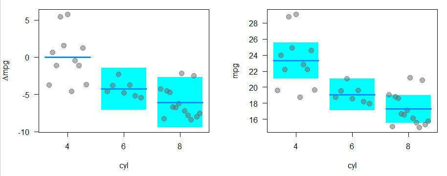


---

## The package `visreg` - Interactions

```{r}
m5 <- lm(mpg ~ cyl*wt, data = mtcars)
# summary(m5)
```

```{r,echo=F}
sum_m5 <- summary(m5)
sum_m5$coefficients
```

---

## Control of the graphic output with `layout`.

```{r,eval=pres}
visreg(m5, "wt", by = "cyl",layout=c(3,1))
```


```{r,eval=pres,echo=F}
visreg(m5, "wt", by = "cyl",layout=c(3,1),fill=list(col=c("#00FFFF")),points=list(cex=1.5,col=rgb(.4,.4,.4,.5)))
```

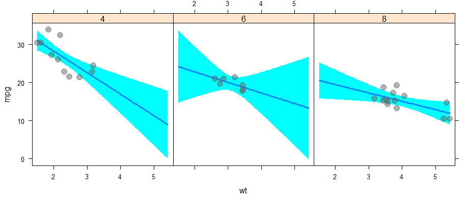

---

## The package `visreg` - Interactions overlay

```{r}
m6 <- lm(mpg ~ hp + wt * cyl, data = mtcars)
```


```{r,eval=pres}
visreg(m6, "wt", by="cyl", overlay=TRUE, partial=FALSE)
```

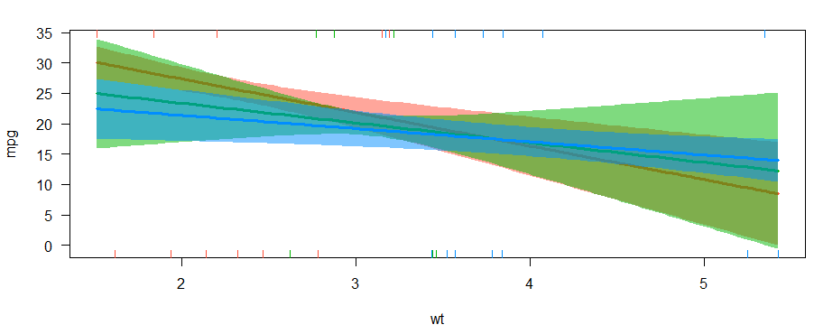

---

## The package `visreg` - `visreg2d`

```{r}
visreg2d(m6, "wt", "hp", plot.type = "image")
```


---

## Exercise: regression Ames housing data

1) Install the package `AmesHousing` and create a [**processed version**](https://cran.r-project.org/web/packages/AmesHousing/AmesHousing.pdf) of the Ames housing data with (at least) the variables `Sale_Price`, `Gr_Liv_Area` and `TotRms_AbvGrd`

2) Create a regression model with `Sale_Price` as dependent and `Gr_Liv_Area` and `TotRms_AbvGrd` as independent variables. Then create seperated models for the two independent variables. Compare the results. What do you think?


---

## [The Ames Iowa Housing Data](http://ww2.amstat.org/publications/jse)

```{r}
ames_data <- AmesHousing::make_ames()
```

### Some Variables

- `Gr_Liv_Area`: Above grade (ground) living area square feet
- `TotRms_AbvGrd`: Total rooms above grade (does not include bathrooms
- `MS_SubClass`: Identifies the type of dwelling involved in the sale.
- `MS_Zoning`: Identifies the general zoning classification of the sale.
- `Lot_Frontage`: Linear feet of street connected to property
- `Lot_Area`: Lot size in square feet
- `Street`: Type of road access to property
- `Alley`: Type of alley access to property
- `Lot_Shape`: General shape of property
- `Land_Contour`: Flatness of the propert

---

## Multicollinearity

- As p increases we are more likely to capture multiple features that have some multicollinearity. 
- When multicollinearity exists, we often see high variability in our coefficient terms. 
- E.g. we have a correlation of 0.801 between `Gr_Liv_Area` and `TotRms_AbvGrd` 
- Both variables are strongly correlated to the response variable (`Sale_Price`).

```{r,echo=F}
library(AmesHousing) 
ames_data <- AmesHousing::make_ames()
```


```{r}
ames_data <- AmesHousing::make_ames()
cor(ames_data[,c("Sale_Price","Gr_Liv_Area","TotRms_AbvGrd")])
```


---

## Multicollinearity

```{r}
lm(Sale_Price ~ Gr_Liv_Area + TotRms_AbvGrd, data = ames_data)
```

- When we fit a model with both these variables we get a positive coefficient for `Gr_Liv_Area` but a negative coefficient for `TotRms_AbvGrd`, suggesting one has a positive impact to Sale_Price and the other a negative impact.

---

## Seperated models

- If we refit the model with each variable independently, they both show a positive impact. 
- The `Gr_Liv_Area` effect is now smaller and the `TotRms_AbvGrd` is positive with a much larger magnitude.

```{r}
lm(Sale_Price ~ Gr_Liv_Area, data = ames_data)$coefficients
```

```{r}
lm(Sale_Price ~ TotRms_AbvGrd, data = ames_data)$coefficients
```

- This is a common result when collinearity exists. 
- Coefficients for correlated features become over-inflated and can fluctuate significantly. 


---

## Consequences

- One consequence of these large fluctuations in the coefficient terms is [**overfitting**](https://en.wikipedia.org/wiki/Overfitting), which means we have high variance in the bias-variance tradeoff space. 
- We can use tools such as [**variance inflaction factors**](https://en.wikipedia.org/wiki/Variance_inflation_factor) (Myers, 1994) to identify and remove those strongly correlated variables, but it is not always clear which variable(s) to remove. 
- Nor do we always wish to remove variables as this may be removing signal in our data.

---


```{r,echo=F}
path <- "figure/logreg.PNG"
path <- "figure/logReg2.PNG"
# https://www.youtube.com/watch?v=yIYKR4sgzI8
# https://stats.stackexchange.com/questions/140447/why-logistic-regression-cannot-be-solved-by-ols
# https://www.educba.com/linear-regression-vs-logistic-regression/
```

class: center, inverse
background-image: url(`r path`)

---


```{r,echo=F}
dat <- readstata13::read.dta13("../data/ZA5666_v1-0-0_Stata14.dta")
datf <- readstata13::read.dta13("../data/ZA5666_v1-0-0_Stata14.dta",
                  convert.factors = F)

```


## Agresti - [Categorical Data Analysis (2002)](https://mathdept.iut.ac.ir/sites/mathdept.iut.ac.ir/files/AGRESTI.PDF)

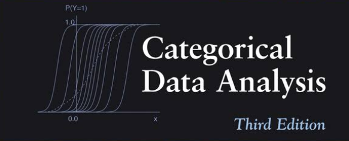

- Very intuitively written book
- Very detailed accompanying script by [**Laura A. Thompson**](http://statweb.stanford.edu/~owen/courses/306a/Splusdiscrete2.pdf)
- The paper deals with categorical data analysis in general.

---

## Faraway books on regression with R


-  Logistic regression intuitively explained
-  Examples with R-code
    - Faraway - [**Extending the linear model with R**](http://www.maths.bath.ac.uk/~jjf23/ELM/scripts2/index.html)
    - Faraway - [**Practical Regression and Anova using R**](https://cran.r-project.org/doc/contrib/Faraway-PRA.pdf)
    
---
    
## Import the GESIS Panel dataset again

```{r,eval=F}
library(readstata13)
datf <- read.dta13("../data/ZA5666_v1-0-0_Stata14.dta",
                  convert.factors = F)
```

The argument `convert.factors`:

- logical. If TRUE, factors from Stata value labels are created.

---

## A function to recode the missing values

```{r,echo=T}
transform_missings <- function(var){
  misvals <- c(-11,-22,-33,-44,-55,-66,-77,-88,-99,-111)
  var[var %in% misvals] <- NA
  return(var)
}
```

---

## Variables for `glm`'s

- a11d056z: age group 

```{r}
table(datf$a11d056z)
```


```{r}
age <- transform_missings(datf$a11d056z)
```


```{r}
table(age)
```

---

## GP variable a11d094a: Children under 16 years

Does your household include children under 16?

- 1 Yes
- 2 No

```{r}
children <- as.factor(transform_missings(datf$a11d094a))
table(children)
```

---

## Conditional Density Plot (GESIS Panel)

```{r}
cdplot(children ~ age, data = dat)
```

---

## Binary independent variables with `glm`

-  The [logistic regression](http://data.princeton.edu/R/glms.html) belongs to the class of generalized linear models (GLM)
-  The function for estimating a model of this class in is called `glm()`
-  `glm()` 

### Specifying a `glm`

- formula object 
- the class (binomial, gaussian, gamma) 
- including link function (logit, probit, cauchit, log, cloglog)

must be specified 

---

## [Logistic regression](http://ww2.coastal.edu/kingw/statistics/R-tutorials/logistic.html) with R

```{r}
glm_1 <- glm(children ~ age, 
                    family = binomial())
```

```{r}
sum_glm1 <- summary(glm_1)
sum_glm1$coefficients
```


---

## [Interpreting the coefficients](https://www.sfu.ca/~jackd/Stat302/Wk12-2_Full.pdf)

Consider the logistic model of children in household as a function of age.

```{r}
sum_glm1$coefficients
```

- The estimates and standard errors are given in terms of log 
odds, not in terms of probability.

- The p-values mean the same thing they always have.

---

## The inverse logit

```{r}
sum_glm1$coefficients
```

```{r,echo=F}
library(faraway)
```


- The coefficients can’t be interpreted as simply as ‘the children in household at age group 0’. 
We have to use the inverse logit in order to find that.

Log-odds of `r sum_glm1$coefficients[1,1]`  is the same as probability 
`r ilogit(sum_glm1$coefficients[1,1])`.

```{r}
library(faraway)
ilogit(sum_glm1$coefficients[1,1])
```

---

## About the intercept in a logistic model

- It is possible to get an intercept of less than 0.
- This means that the log-odds are negative, NOT the probability.
- E.g. a log-odds of 0 translates to a probability of 
0.5.

---

## Log-odds and the probability

- Log-odds always increases as probability increases. 

Therefore...

- A positive slope coefficient means that the response increases 
with the associated explanatory variable.

- In this case, the probability of children in the household increases with age.

---

## Plotting the result


```{r,eval=F,echo=F}
fit_prob <- exp(predict(glm_1))/(1+exp(predict(glm_1)))

library(ggplot2)
dfex <- data.frame(age,fit_prob)
ggplot(aes(x=age, y=fit_prob))  +
  geom_line(aes(x=age, y=fit_prob))
```

but it increases by the sigmoid curve, not at a constant rate.

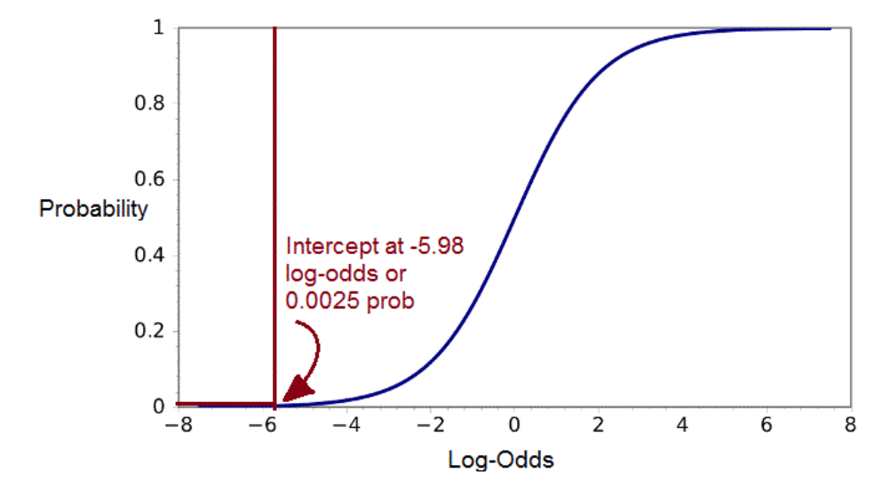

<!--
http://www.shizukalab.com/toolkits/plotting-logistic-regression-in-r
-->

---

## Logistic regression model formula

Logistic models have regression formulas. This model’s formula is:

Log-Odds( Children) =  `r sum_glm1$coefficients[1,1]` + `r sum_glm1$coefficients[2,1]`(Age) + error

We can plug age values into this formula to get predicted log-odds at different ages.

Log-odds for age group 5

```{r,echo=F}
res1 <- sum_glm1$coefficients[1,1] + sum_glm1$coefficients[2,1]*5
```


`r sum_glm1$coefficients[1,1]` + `r sum_glm1$coefficients[2,1]`*(5) =  `r res1`


Children probability in age group 5

```{r}
ilogit(0.3935251)
```

---


## [Interpreting the results](https://www.r-bloggers.com/how-to-perform-a-logistic-regression-in-r/)

- The difference between the null deviance and the residual deviance shows how our model is doing against the null model (a model with only the intercept). The wider this gap, the better.

```{r}
anova(glm_1, test="Chisq")
```

---

## [Mc Fadden’s $R^2$](https://www.r-bloggers.com/evaluating-logistic-regression-models/)

```{r}
library(pscl)
pR2(glm_1) 
```

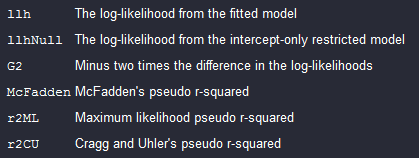

<!--
- llh	
The log-likelihood from the fitted model
- llhNull	
The log-likelihood from the intercept-only restricted model
- G2	
Minus two times the difference in the log-likelihoods
- McFadden	
McFadden's pseudo r-squared
- r2ML	
Maximum likelihood pseudo r-squared
- r2CU	
Cragg and Uhler's pseudo r-squared
-->

<!--
## Deviance residuals

- [Pearson VS Deviance Residuals in logistic regression](https://stats.stackexchange.com/questions/166585/pearson-vs-deviance-residuals-in-logistic-regression)

```{r}
summary(sum_glm1$deviance.resid)
```
-->

<!--
https://www.stat.ubc.ca/~rollin/teach/536w10/lec16.pdf
-->
<!--
## Place of living and satisfaction
-->

---

## Distance between residential area and large city

### How far is it from where you live to the center of the nearest large city?

- 1 - In the center of a big city
- 6 - 60 km and more

```{r}
region <- transform_missings(datf$bczd001a)
table(region)
```

---

## Satisfaction life in place of residence

### How satisfied are you - all in all - with your life in [place of residence] at the moment?

- 1 - Very satisfied
- 5 - Very dissatisfied

```{r}
satisfactionplace <- datf$a11c019a
table(satisfactionplace)
```

---

## Another model

```{r,eval=T,echo=T}
glm_2 <- glm(children ~ age + satisfactionplace*region, 
                    family = binomial())
```

```{r,eval=F,echo=F}
# https://www.r-bloggers.com/evaluating-logistic-regression-models/
anova(glm_2, test="Chisq")
```

```{r}
pseudor2 <- pR2(glm_2) 
pseudor2["McFadden"]
```

---

## Exercise: logistic regression with `Smarket` data

- load the `Smarket` data from the `ISLR` package
- create a `pairs` plot of the data
- check if there are missing values in the data
- have a look at the correltations between variables
- create a `corrplot`   
- run a logistic model and look at the deviance

---

## Another variable in the Gesis Panel data

- Number of tattoos:

```{r}
Tatoos <- transform_missings(datf$bdao067a)
Tatoos[Tatoos==97]<-0
```

```{r}
table(Tatoos)
```


```{r,eval=F,echo=F}
table(datf$bczd001a)
```

---


## Generalized regression with R - more functions

- Logistic model with Probit link:

```{r}
probitmod <- glm(children ~ age, 
	family=binomial(link=probit))
```

- Regression with count data:

```{r}
modp <- glm(Tatoos ~ age,family=poisson)
```

- Proportional odds logistic regression in library `MASS`:

```{r}
library("MASS")
mod_plr<-polr(a11c020a ~ a11d096b ,data=dat)
```

<!--
## [B4A Exercise logistic regression](https://www.r-exercises.com/2017/10/30/logistic-regression-in-r/)

- Load the `MASS` package and combine `Pima.tr` and `Pima.tr2` to a data.frame called train and save Pima.te as test. Change the coding of our variable of interest to (type) to 0 (non-diabetic) and 1 (diabetic). Check for and take note of any missing values.

-->

---

## Exercise: [logistic regression](https://www.r-exercises.com/2017/10/30/logistic-regression-in-r/)

We will use a data on containing health-related measurements on women and whether they can be (or will be at a future point?) classified as diabetic. The data was collected by the US National Institute of Diabetes and is contained in the MASS package.

<!--
Exercise 1
-->

### Load dataset and create test and train dataset

Load the `MASS` package and combine `Pima.tr` and `Pima.tr2` to a `data.frame` called train and save Pima.te as test. Change the coding of our variable of interest to (type) to 0 (non-diabetic) and 1 (diabetic). Check for and take note of any missing values.


<!--
Exercise 2
-->
 
### Plotting using `pairs()` and `jitter`
Take a look at the data. Plot a scatterplot matrix between all the explanatory variables using `pairs()`, and color code the dots according to diabetic classification. Furthermore, try to plot type as a function of age. Use `jitter` to make your graph more informative. Bonus: Can you add a logistic fit based on age on top of your plot?

<!--
Exercise 3
-->

---


## Exercise: [logistic regression](https://www.r-exercises.com/2017/10/30/logistic-regression-in-r/) II

### Coefficients and p-values

Using the `glm()` and the train data fit a logistic model of type on `age` and `bmi`. Print out the coefficients and their p-value.

<!--
Exercise 4
-->

### Prediction

What does the model fitted in exercise 3 predict in terms of probability for someone age 35 with bmi of 32, what about bmi of 22?

<!--
Exercise 5
-->

### Odds ratios
According to our model what are the odds that a woman in our sample is diabetic given age 55 and a bmi 37? Remember that odds in this context have a very precise definition which is different from probability.

<!--
Exercise 6
-->

---

## Exercise: Confusion matrix

Build the confusion matrix, a table of actual diabetic classification against model prediction. Use a cutoff value of 0.5, meaning that women who the model estimates to have at least 0.5 chance of being diabetic are predicted to be diabetic. What is the prediction accuracy?

<!--
Exercise 7
-->
<!--
## Exercise: [logistic regression](https://www.r-exercises.com/2017/10/30/logistic-regression-in-r/) III


###
Apply the fitted model to the test set. Print the confusion matrix and prediction accuracy.
-->
<!--
Exercise 8
-->
<!--
###
Draw up the ROC curve and calculate the AUC.
-->
<!--
Exercise 9
-->

<!--
###
Add number of pregnancies and age squared as an explanatory variables and redraw the ROC curve on the test set and calculate its AUC.

-->
<!-- 
Exercise 10
-->
<!--
###
For a woman aged 35 and mother of 2 children, by how much does the probability of diabetes increase, if her bmi was 35 instead of 25 according to the model? What about the marginal effect at bmi = 25?
-->

---


---

## Links - regression


<!--
https://www.dataquest.io/blog/statistical-learning-for-predictive-modeling-r/

https://www.r-bloggers.com/example-of-overfitting/

https://blog.minitab.com/blog/adventures-in-statistics-2/the-danger-of-overfitting-regression-models


https://statisticsbyjim.com/regression/overfitting-regression-models/

https://towardsdatascience.com/overfitting-vs-underfitting-a-complete-example-d05dd7e19765

https://www.analyticsvidhya.com/blog/2016/12/practical-guide-to-implement-machine-learning-with-caret-package-in-r-with-practice-problem/


https://statisticsbyjim.com/regression/overfitting-regression-models/
-->


-  Regression - [**r-bloggers**](http://www.r-bloggers.com/r-tutorial-series-simple-linear-regression/)

-  The complete book of [**Faraway**](http://cran.r-project.org/doc/contrib/Faraway-PRA.pdf)- very intuitive

-  Good introduction on [**Quick-R**](http://www.statmethods.net/stats/regression.html)

- [**Multiple regression**](https://www.r-bloggers.com/multiple-regression-part-1/)

- [**15 Types of Regression you should know**](https://www.r-bloggers.com/15-types-of-regression-you-should-know/)

- [**`ggeffects` - Create Tidy Data Frames of Marginal Effects for ‘ggplot’ from Model Outputs**](https://strengejacke.github.io/ggeffects/)


- [**Machine learning iteration**](https://elitedatascience.com/machine-learning-iteration)


---

## Nice table output with [`stargazer`](https://cran.r-project.org/web/packages/stargazer/vignettes/stargazer.pdf)


```{r,eval=F,echo=F}
install.packages("stargazer")
```

```{r,eval=F}
library(stargazer)
stargazer(m3, type="html")
```

### Example HTML output:


```{r,echo=F,out.width="40%"}
knitr::include_graphics("figure/stargazertabex.PNG")
```

---

## Links - logistic regression

-  Introduction to [**logistic regression**](http://ww2.coastal.edu/kingw/statistics/R-tutorials/logistic.html)


-  [**Code for the book of Faraway**](http://www.maths.bath.ac.uk/~jjf23/ELM/scripts/binary.R)

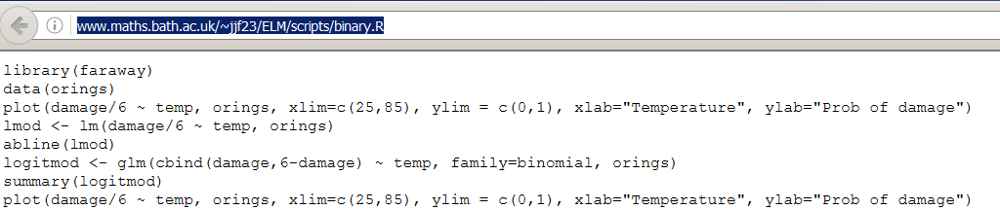

- [**Categorical data:**](http://homepage.univie.ac.at/herbert.nagel/KategorialeDaten.pdf) - [**How to perform a Logistic Regression in R**](https://www.r-bloggers.com/how-to-perform-a-logistic-regression-in-r/)

- [Logistic Regression in R Tutorial](https://www.datacamp.com/community/tutorials/logistic-regression-R)


<!--
https://www.r-bloggers.com/how-to-perform-a-logistic-regression-in-r/


https://www.datacamp.com/community/tutorials/logistic-regression-R
-->


---

## Links and resources

### Shiny Apps - Diagnostics for linear regression


- [**Simple Linear Regression**](https://gallery.shinyapps.io/simple_regression/)

- [**Multicollinearity in multiple regression**](figure/https://gallery.shinyapps.io/collinearity/)

- [Diagnostics for simple linear regression](https://gallery.shinyapps.io/slr_diag/)

<!--
[](https://gallery.shinyapps.io/slr_diag/)
-->

### Further resources

- [Elegant regression results](https://www.r-bloggers.com/elegant-regression-results-tables-and-plots-in-r-the-finalfit-package/)

- [Regression analysis essentials](https://www.r-bloggers.com/regression-analysis-essentials-for-machine-learning/)

<!--


https://www.r-bloggers.com/15-types-of-regression-you-should-know/
https://www.r-bloggers.com/marginal-effects-for-regression-models-in-r-rstats-dataviz/
http://pbreheny.github.io/visreg/contrast.html
-->

<!--
ToDo:

How to compute the mean squared error:
https://stats.stackexchange.com/questions/107643/how-to-get-the-value-of-mean-squared-error-in-a-linear-regression-in-r

http://r-statistics.co/Linear-Regression.html

Colinearity
https://journal.r-project.org/archive/2017/RJ-2017-048/RJ-2017-048.pdf
-->

<!--
http://r-statistics.co/Linear-Regression.html
https://machinelearningmastery.com/linear-regression-in-r/
https://journal.r-project.org/archive/2017/RJ-2017-048/RJ-2017-048.pdf
https://cran.r-project.org/web/packages/Metrics/Metrics.pdf
-->


<!--
ToDo Liste

Den Effekt von cross validation zeigen
-->