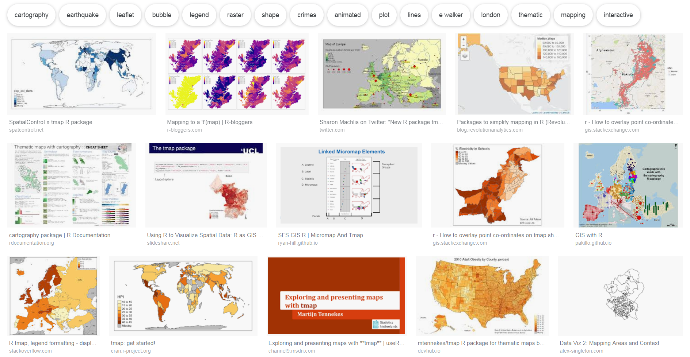
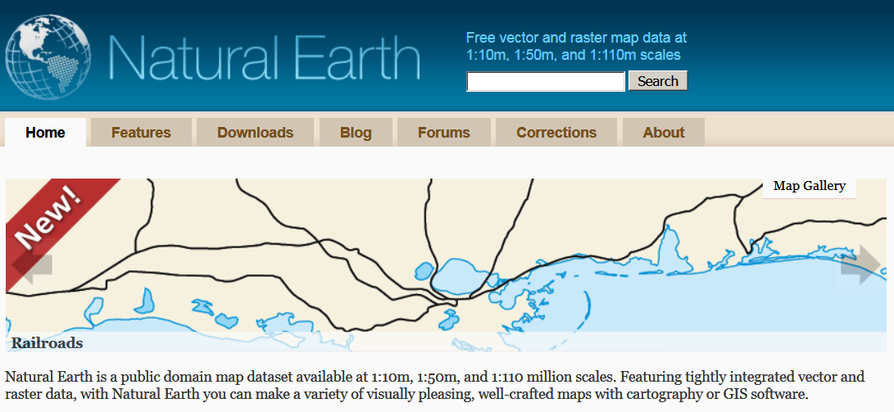
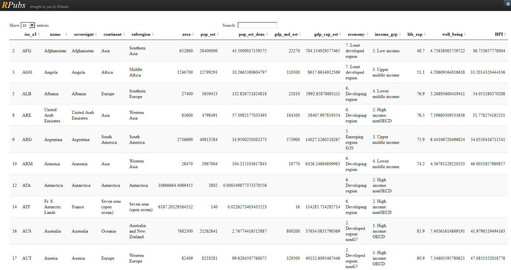

## The package `tmap`


```{r setup, include=FALSE}
knitr::opts_chunk$set(echo = T,warning=F,message=F)
```


```{r}
library(tmap)
```




```{r,echo=F,warning=F,message=F}
library(knitr)
library(DT)
```


---

## The `World` dataset

### Natural Earth

- Dataset contains information from [**Natural Earth**](http://www.naturalearthdata.com/)

```{r}
data(World)
```



---

## The `qtm` command from the `tmap` package

### Fast thematic map

- With the command [**qtm**](https://cran.r-project.org/web/packages/tmap/vignettes/tmap-nutshell.html) you can create a fast thematic map

- Example from the [**Vignette**](https://cran.r-project.org/web/packages/tmap/vignettes/tmap-nutshell.html) for the `tmap` package

```{r}
qtm(World)
```

---

## The World-Dataset


```{r,echo=F,eval=F}
# http://rstudio.github.io/DT/
datatable(World, class = 'cell-border stripe',rownames = FALSE,
          options = list(pageLength = 10, autoWidth = TRUE)
          )
# to see the options http://datatables.net/reference/option/
```

### [**The World Dataset in Package `tmap`**](http://rpubs.com/Japhilko82/tmap_europe_dataset)
<!--
```{r,echo=F,eval=F}
kable(Europe@data[1:10,1:4])
```
-->



---

## To get more color in the map

### economic development status

<!--
<http://www.naturalearthdata.com/>
-->
```{r}
qtm(World, fill="economy")
```

---

## A map with text

### Population

```{r}
qtm(World, fill="pop_est", text="iso_a3")
```

---

## This Scheme is better:

### [**GDP**](https://en.wikipedia.org/wiki/Population_density)

```{r}
qtm(World, fill="gdp_cap_est", text="iso_a3", 
    text.size="AREA", root=5, fill.title="GDP per capita", 
    fill.textNA="Non-European countries", theme="Europe")
```

---

## Topics of the World dataset

### Available variables in the data set

- [**ISO classification**](http://userpage.chemie.fu-berlin.de/diverse/doc/ISO_3166.html)
- country name
- Area, population, population density, 
- [**Gross Domestic Product**](https://en.wikipedia.org/wiki/Gross_domestic_product)
- Gross domestic product [**at purchasing power parities**](https://en.wikipedia.org/wiki/List_of_countries_by_GDP_%28PPP%29_per_capita)
- Economy, income group

---

## The World Dataset - Variables and what's behind


```{r,echo=F}
library(XML)
info <- colnames(World)

info_df <- data.frame(World)
kable(info_df[1:8,1:5])
```

---

## The variable `continent`

```{r}
qtm(World, fill="continent")
```

---

## The variable `area`

```{r}
qtm(World, fill="area") # Russia is huge
```

---

## Population

```{r}
qtm(World, fill="pop_est",fill.title="Population") 
```

---

## Two maps

### Population and level of development

```{r,eval=T}
tm_shape(World) + tm_fill(c("pop_est", "economy"), 
        title=c("Population", "Economy"))
```


```{r dataland,echo=F,eval=F}
data(land)
datatable(info_df)
```

```{r}
data(land)
data(World)
```


```{r,echo=F,eval=T}
data(land)
info_df <- land[sample(1:length(land),10,replace=T),]
kable(info_df[,c(2,3)])
```

```{r,eval=F,echo=F}
?land
```


```{r}
tm_shape(land,  relative=FALSE) +
    tm_raster("trees", title="prop. wooded area")
```

---

## Visualize only one country

```{r}
tm_shape(World[World$name=="Austria", ]) +
    tm_polygons()
```

---

## Load example data

### Data source Eurostat

- Data about unemployment in Europe

```{r}
url1<-"https://raw.githubusercontent.com/Japhilko/GeoData/"
url2<-"master/2015/data/Unemployment07a13.csv"
url <-paste0(url1,url2)
Unemp <- read.csv(url) 
```

---

## An overview of the data

```{r,warning=F,echo=F}
kable(Unemp[1:10,])
```

---

## Excursus: the command `match`

### Create two example vectors

```{r}
vec_a <- c("A",2,6,1,"C")
vec_b <- c(1,"C",2)
```

### Bringing the two vectors together

- With the function `match` you can see which element of the first vector matches the second vector.

```{r}
match(vec_a,vec_b)
```


---

## Use the package `tmap` with your data

```{r,warning=F}
library("tmap")
```

### Match the data

```{r}
iso_a2<- substr(World$iso_a3,1,2)
ind <- match(iso_a2,Unemp$GEO)
World$Val2007M12 <- Unemp$Val2007M12[ind]
World$Val2013M01 <- Unemp$Val2013M01[ind]
```

---

## Plot a map

```{r}
qtm(World,c("Val2007M12","Val2013M01"))
```

---

## Exercise: Visualisation of Eurostat data

### First part - plot a map

- Download and import the data `unemprate_by_sex.csv` from ILIAS.
- Link the data with map data .
- Visualise the linked data in a map.

### If you have that:

- Search for example [**here**](https://ec.europa.eu/eurostat/web/euro-indicators) for datasets containing the country name and visualize the data with `tmap`.

---


## The first law of geography (TFLG)


> "All things are related, but nearby things are more related than distant things"
[Tobler, 1970]

---

## A map of Africa

```{r,warning=F,message=F}
library(maptools)
data(wrld_simpl)
Africa <- wrld_simpl[wrld_simpl@data$REGION==2,]
plot(Africa)
```

---

## The center of a polygon 

```{r,warning=F,message=F}
library(sp)
Af <- coordinates(Africa)
plot(Africa)
points(x=Af[1,1],y=Af[1,2],col="red",pch=20)
```

---

## Find the nearest neighbours

```{r,warning=F,message=F}
library(spdep)
Af_nb <- tri2nb(Af)
```

Neighbours for the first country:

```{r,warning=F,message=F}
Af_nb[1]
```

---

## Find the neighbours

```{r,warning=F,message=F}
plot(Africa)
plot(Africa[1,],col="red",add=T)
plot(Africa[Af_nb[1][[1]],],col="orange",add=T)
```

---

## Find ten next neighbours

```{r,warning=F,message=F}
IDs <- row.names(as(Africa, "data.frame"))
Af10_nb <- knn2nb(knearneigh(Af, k = 10), row.names = IDs)
plot(Africa)
plot(Africa[1,],col="red",add=T)
plot(Africa[Af10_nb[1][[1]],],col="orange",add=T)
```

---

## Compute the distance

```{r,warning=F,message=F}
Af <- coordinates(Africa) # get centroid
library(raster)
pointDistance(Af[1:4,], lonlat=TRUE) # compute distance
```

---

## Calculate/draw a distance matrix

```{r Africa Distance,warning=F,message=F}
Dist_Af <- pointDistance(Af, lonlat=TRUE)
Af_color <- Dist_Af[,1]
Af_color <- Af_color/max(Af_color)
Af_color <- rgb(Af_color,0,0)
plot(Africa,col=Af_color)
```

---

## Links to read on

- [Raster, CMSAF and solaR](https://procomun.wordpress.com/2011/06/17/raster-cmsaf-and-solar/)

<https://procomun.wordpress.com/2011/06/17/raster-cmsaf-and-solar/>

- [Getting rasters into shape from R](https://johnbaumgartner.wordpress.com/2012/07/26/getting-rasters-into-shape-from-r/)

<https://johnbaumgartner.wordpress.com/2012/07/26/getting-rasters-into-shape-from-r/>


<!--
Interactive documents

https://davidgohel.github.io/ggiraph/

creating dashboards
https://www.kaggle.com/dhruvesh/beautiful-dashboards-in-r

-->
